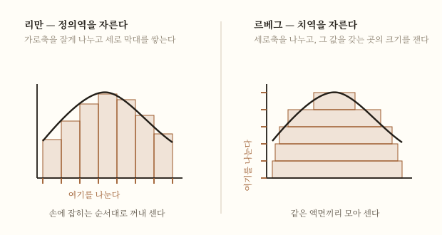

## TL;DR

- **[[19세기]]가 되물었다면, 20세기는 되묻기를 그만두는 방식으로 답했다.** 실수가 무엇인지, 확률이 무엇인지 정의하는 대신 **무엇을 만족해야 하는지**를 적었다.
- **1900년 힐베르트**가 실수를 유리수에서 쌓아 올리는 대신 **18개 공리로 규정한다**[12] — **다만 그런 체계가 존재한다는 증명은 없었다**[12]. 같은 해 파리에서 목록을 내놓는다[2][14].
- **1933년 콜모고로프**가 같은 동작을 확률에 한다 — **유클리드의 기하 서술에 비할 만한 방식**으로 공리에서 확률론을 세웠다[4].
- **1931년 괴델**이 그 방향의 한계를 증명한다. MacTutor의 표현으로 이 결과는 **수학 전체를 공리 위에 놓으려는 100년의 시도를 끝냈다**[1].
- 그런데 이 세기는 **19세기가 몰아낸 것을 되찾기도 했다.** 1961년 로빈슨이 **라이프니츠가 원한 대로** 무한소를 되살린다[5].
- 한국에서는 **수학과가 없는 대학**을 나온 사람이 **쓰레기 더미에서 주운 학술지**로 최초의 국제 논문을 썼다[7][8].

---

## 1. 세기가 열릴 때의 상태

19세기는 숙제를 남기고 끝났다. 실수가 무엇인지 데데킨트와 칸토어가 답했지만, 그 답이 **모순 없는 체계를 낳는지**는 아무도 보이지 못했다([[해석학의 엄밀화 (확장편)]]).

그리고 답이 나오자마자 새로운 문제가 나왔다. 집합론으로 수학의 기초를 다시 세울 수 있으리라는 기대가 **러셀의 역리**로 흔들린 것이다[6]. 칸토어의 집합론은 특정 성질을 공통으로 갖는 원소들의 집합이 **항상 존재한다**고 전제하는데, 자기 자신을 원소로 갖지 않는 것들을 모으면 그 집합이 자기 자신의 원소인지 아닌지가 모순이 된다[6].

국내 수학산책은 당시 분위기를 이렇게 적는다 — 과학의 근간이 되는 수학의 도구로 각광받던 집합론에 근본적 결함이 발견됐고, **자료 스스로 "조금 과장되게 표현하면"이라 단서를 달아** **"인류의 역사와 더불어 시작된 과학성과 전체가 송두리째 무너질 수도 있다는 위기감"**과 새로운 학문적 인식이 태동해야 한다는 절박감이 감돌던 시기라 **말할 수 있다**고 쓴다[6].

| 세기가 열릴 때 물려받은 것 | 상태 |
|---|---|
| 실수의 정의 | 데데킨트·칸토어가 답했으나 **무모순성은 미해결**([[해석학의 엄밀화]]) |
| 집합론 | 기초의 도구로 기대됐으나 **역리가 발견됨**[6] |
| 연속체 가설 | 칸토어가 남긴 채 1918년 죽음([[게오르크 칸토어]]) |
| 확률 | 오래 쓰였으나 **엄밀한 기초가 없음**[4][11] |
| 적분 | 리만의 정의가 미치지 못하는 함수들이 알려짐[3] |

## 2. 시대 배경 — 수학자들이 대륙을 옮기다

19세기의 수학자 지도는 유럽 대학의 지도였다([[19세기]]). 20세기의 지도는 **옮겨 다닌 경로**로 그려진다.

괴델은 1906년 브륀(현 체코 브르노)에서 태어나 빈에서 공부했고[1], **1930년대 후반의 정치 상황에서 오스트리아를 떠나**[6] 1940년 미국에 도착해 1948년 시민이 된다[1]. 로빈슨은 1918년 발덴부르크(현 폴란드 바우브지흐)에서 태어나 예루살렘에서 공부하고 1939년 소르본에 있다가, 전쟁 기간 **영국 파른버러 왕립항공연구소에서 델타익과 초음속 유동을 연구했다**[5]. 그가 비표준해석학을 내놓은 것은 파른버러를 떠나고 16년 뒤인 1961년이다[5].

이 세기에는 **수학자의 이력에 전쟁과 국적이 들어온다.** 로빈슨의 이력서에는 항공역학이 있고, 이임학의 이력서에는 비행기 공장과 무국적이 있다(§8).

## 3. 정의하기를 그만두고 공리를 적다

이 세기의 가장 특징적인 동작은 **질문을 바꾼 것**이다.

19세기는 "실수란 무엇인가"를 물었고 데데킨트가 절단으로 답했다. **1900년 힐베르트는 다른 길을 간다** — 유리수에서 쌓아 올리는 대신 **18개의 공리로 실수를 규정한 것**이다[12]. 무엇인지 말하지 않고, 무엇을 만족하는지만 적는다.

같은 동작이 세 번 더 일어난다.

| 대상 | 누가·언제 | 무엇을 그만뒀나 | 무엇을 적었나 |
|---|---|---|---|
| 기하 | 힐베르트 1899 | 유클리드의 직관적 정의 | **21개 공리**로 형식적 체계에 놓았다[2] |
| 실수 | 힐베르트 1900 | 유리수에서 구성하기 | **18개 공리**[12] |
| 집합 | 체르멜로(오늘날 체르멜로-프랭켈 공리) | 성질만 있으면 집합이 존재한다는 전제 | 모순이 없을 것으로 예상되는 **공리들**[6] |
| 확률 | 콜모고로프 1933 | 확률이 무엇인지 정의하기 | 확률이 만족해야 할 **성질**[4][11] |

**콜모고로프의 경우가 특히 분명하다.** MacTutor는 1933년의 『확률론의 기초 개념』이 **"유클리드의 기하 서술에 비할 만한 방식으로 근본 공리에서 확률론을 엄밀하게 세웠다"**고 적는다[4]. 유클리드를 다시 공리화한 것이 힐베르트였으니, 이것은 힐베르트가 기하에 한 일을 확률에 한 셈이다.

그리고 이것은 우연이 아니다. **힐베르트가 1900년 목록에서 요구한 것**이 바로 그것이었다. MacTutor는 콜모고로프의 공리적 접근이 **힐베르트의 여섯 번째 문제 해결에 큰 기여를 했다**고 적는다[4]. 물음이 나오고 33년 뒤의 일이다. 다만 출처는 이것을 여섯 번째 문제 가운데 **확률 부분에 대한 큰 기여**라고 적지 '완전히 풀었다'고는 적지 않는다 — 그 표현은 같은 자료가 1957년의 열세 번째 문제에만 쓴다[4].

**왜 이 방향이 이겼는가.** 확률에서 다투던 것은 "확률의 정체"였는데, 수학이 필요로 한 것은 정체가 아니라 **계산 규칙**이었기 때문이다([[확률론 확장편]]). 위키백과는 콜모고로프의 공리를 **논리적 역설을 피하면서 확률을 순수수학과 물리과학에 적용하기 위한 기본 가정**으로 정리하고, 이 공리가 **특정 해석을 전제하지 않는다**고 적는다[11].

## 4. 1900년 파리 — 목록이라는 형식

1900년 파리 제2회 국제수학자대회에서 힐베르트가 「수학의 문제들」을 강연한다[2]. MacTutor는 그의 **파리 문제들이 오늘까지도 수학자들에게 근본적인 물음을 풀라고 도전한다**고 적는다[2].

여기서 숫자를 정확히 해 둔다. MacTutor는 **강연에서 23개 중 10개를 소개했고, 23개 전체는 학회 논문집에 실린 논문에서 나왔다**고 적는다[14]. 초고에는 24번째 문제가 있었으나 힐베르트가 지웠다는 것도 같은 자료에 있다[14]. 흔히 말하는 **23개**는 출판된 목록의 수다[2][14].

목록이라는 형식 자체가 이 세기의 것이다. **무엇을 증명해야 하는지 미리 적어 두고 세기 전체가 그것을 향해 일한다.** 여섯 번째 문제의 확률 부분은 33년 뒤 콜모고로프가[4][14], 첫 번째 문제인 연속체 가설[14]은 괴델과 코헨이 두 조각으로 나눠 답한다(§5).

## 5. 1931년 — 계획이 불가능함이 증명되다

힐베르트의 계획은 이런 것이었다. 국내 수학산책의 요약으로, **인간의 언어가 가지는 결함을 제거하기 위해 모든 수학의 명제를 형식적 기호의 나열로 바꾸고**, 모순이 생성되는 요소를 피해 공리를 세우고, 거기서 새 명제를 유도하는 법칙을 세운다[6]. 그러면 **모순이 절대로 유도되지 않는 것을 보일 수 있으리라** 예상한 것이다[6]. 이것을 **힐베르트 프로그램**이라 부른다[6].

1930년 쾨니히스베르크 은퇴 연설에서 그가 한 말이 남아 있다.

> **"우리는 알아야 한다, 우리는 알게 될 것이다."**(Wir müssen wissen, wir werden wissen)[2]

**이듬해 괴델이 그것이 불가능함을 증명한다.**

| | 제1 불완전성 정리 | 제2 불완전성 정리 |
|---|---|---|
| 무엇을 말하나 | 수학에서 **증명도 부정도 되지 않는 명제가 반드시 존재한다**[6] | 체계가 정말 모순이 없다면, **모순이 없다는 사실 자체를 그 체계 안에서 증명할 수 없다**[6] |
| 무엇을 뜻하나 | 참인 명제의 범위가 **증명으로 확인할 수 있는 범위를 넘어선다**[6] | **힐베르트 프로그램이 성취될 수 없다**[6] |

MacTutor는 이 결과를 **"공리를 세워 수학 전체를 공리적 기초 위에 놓으려는 100년의 시도를 끝냈다"**고 적는다[1].

**앞 세기와 나란히 놓아 볼 만하다.** [[19세기]]는 엄밀화가 **"그 후 100년의 대부분을 차지할 만큼 어려운 일"**이었다는 서술을 축으로 삼은 세기였다. 그것은 **해석학을 엄밀하게 다시 쓰는 일**의 100년이고, 여기 MacTutor가 말하는 100년은 **수학 전체를 공리 위에 올리려는 시도**의 100년이다[1]. **두 100년은 같은 100년이 아니다.** 다만 한 세기가 걸린 일이 다음 세기에 한계에 부딪혔다는 모양은 겹치고, 이번 것은 완성으로 끝난 것이 아니라 **끝날 수 없음이 밝혀지는 방식으로** 끝났다[1].

**그런데 무너진 것이 아니다.** 두 출처가 같은 취지를 적는다. MacTutor는 이 정리가 힐베르트의 형식주의에 심대한 타격을 주었으나 **형식주의의 근본 착상을 파괴하지는 않았고, 다만 어떤 체계든 힐베르트가 구상한 것보다 더 포괄적이어야 함을 보였다**고 적는다[1]. 국내 수학산책은 더 나아가, 불완전성 정리가 **"문제의 본질을 드러내고 한계 속에서도 계속 작업을 해야 함을 알려 준 것"**이며 그 덕에 초기 수리논리학의 역사가 안정되고 급속한 진보를 이뤘다고 적는다[6].

**연속체 가설이 그 실례다.** 칸토어가 남긴 이 물음([[게오르크 칸토어]])을 괴델은 제1 불완전성 정리에 나오는 것과 같은 종류의 명제이리라 추측했고, **1930년대 중반에 그것이 '부정되지 않는 명제'임을 증명한다**[6]. 나머지 절반은 **1960년대에 코헨이 '증명도 되지 않는 명제'임을 밝히면서** 채워지고, 코헨은 그 업적으로 필즈상을 받는다[6].

## 6. 되찾은 것들 — 무한소와 기본정리

이 세기를 "공리로 물러선 세기"로만 읽으면 절반을 놓친다. **19세기가 몰아낸 것들이 이 세기에 돌아온다.**

**무한소.** 라이프니츠의 계산은 답이 맞는데 이유를 대지 못했고, 19세기는 그것을 극한으로 갈아치우며 무한소를 쫓아냈다([[미분법 (확장편)]]). 그런데 **1961년 로빈슨이 무한소를 되살린다**[5] — 위키백과는 **"1960년대 초"**로 적는다[13]. MacTutor가 인용한 크라이젤의 평가는 **1966년 저서 『비표준해석학』**에 대한 것이다 — 그 책은 **"라이프니츠가 원한 대로, 보통 수와 같은 법칙을 따르는 무한소에 대한 엄밀하고 효율적인 이론"**을 제시하며, **라이프니츠 사후 꼭 250년 만에** 나왔다[5].

**되살린 방식이 이 세기답다.** 로빈슨은 무한소가 무엇인지 새로 정의한 것이 아니라 **모형이론의 도구로 실수 체계를 확장했다**[13]. 그리고 이전 원리(transfer principle)에 의해 **유계 한정사로 쓸 수 있는 명제에 관한 한** 두 체계는 **같은 것을 증명한다**[13] — 더 많지도 더 적지도 않다([[미분법 (확장편)]]).

**미적분의 기본정리.** 리만의 적분으로는 모든 도함수를 적분할 수 없었다. **1960년대 헨스톡과 커즈와일의 게이지 적분에서는 기본정리가 조건 없이 성립한다**[10].

| 19세기가 처리한 방식 | 20세기가 되찾은 방식 |
|---|---|
| 무한소를 극한으로 대체 | 무한소를 **확장된 수 체계의 원소로** 정당화(로빈슨 1961)[5][13] |
| 기본정리에 연속성 조건을 붙임 | **조건 없이 성립하는 적분**을 세움(게이지 적분)[10] |
| 그릴 수 없는 함수를 예외로 취급 | 그 함수들을 **적분 가능한 것으로 포함**(르베그 1901년 논문·1902년 학위논문)[3] |

세 줄이 같은 모양이다. **19세기가 "이건 다루지 말자"로 처리한 것을 20세기가 "다룰 수 있게 만들자"로 바꿨다.**

## 7. 넓힌 정의가 다시 저항을 받다

1902년 르베그가 학위논문 『적분·길이·넓이』에서 적분을 다시 세운다[3]. 리만이 정의역을 쪼갠 자리에서 **르베그는 함숫값을 쪼갠다**[9].

<figure>

<figcaption>같은 함수를 리만은 정의역으로, 르베그는 치역으로 자른다[9]</figcaption>
</figure>

르베그 본인의 말로 전해지는 비유가 잘 알려져 있다 — **손에 잡히는 순서대로 돈을 꺼내 주면 리만 적분이고, 전부 꺼내 같은 액면끼리 쌓아 세면 르베그 적분**이라는 것이다[15]([[적분법 (확장편)]]).

MacTutor는 이 논문이 **측도론과 적분에 관한 것이며 푸리에 해석의 범위를 크게 넓혔다**고 적고, 그의 적분이 **곡선 아래 넓이 개념을 불연속 함수를 다수 포함하도록 확장해 리만 적분을 일반화한다**고 적는다[3].

**그런데 반응이 좋지 않았다.** MacTutor는 르베그의 연구가 **고전 해석학자들, 특히 프랑스에서 적대적인 반응을 받았다**고 적는다[3].

무엇이 두려웠는지도 기록에 있다. 당시 대가들의 반응은 유보적이었고, **많은 이가 "함수의 기형학(teratology)이 자리 잡는 것"을 두려워했다**[15]. 1875년 불연속 함수 논문을 쓴 다르부조차 적대적이었고, **부시네스크는 "함수는 도함수를 가질 때에만 흥미롭다"고 말했다고 전해진다**[15]. **피카르만이 르베그의 연구를 옹호했다**[15].

이것이 19세기의 되풀이다. [[19세기]]에서 정의가 넓어져 괴물 함수가 들어왔을 때도 저항이 있었다. **넓어진 정의가 들여보내는 것을 사람들이 반기지 않는다는 것이 두 세기에 걸쳐 같다.** 다만 결과도 같다 — 넓힌 쪽이 이겼다.

## 8. 같은 시기, 한국에서는

19세기의 조선은 두 전통을 견주고 있었다([[19세기]]). 20세기의 한국에서는 그 전통이 끊긴 자리에서 다시 시작한다.

### 수학과가 없는 대학

**이임학은 1922년 12월 18일 함경남도 함흥에서 태어났다**[8]. 1939년 경성제국대학 예과에 들어가 수학에 열정을 갖게 되지만, 한국민족문화대백과는 이렇게 적는다 — **"경성제국대학교에는 수학과가 없었기 때문에"** 물리학을 전공으로 선택했고, **학창 시절 수학을 거의 독학으로 공부했다**[8].

1944년 물리학과를 제2회로 졸업하고 조선비행기공업주식회사에 기술자로 취직해 만주로 파견돼 제품 검사를 하다가 해방을 맞는다[7][8].

### 쓰레기 더미에서 주운 학술지

해방 후 일본인 교수들이 떠나 교수 요원이 부족한 상황에서 그는 경성대학 수학과 교수로 선출되지만[7], **1946년 8월 국립 서울대학교 안이 확정되자 사직하고** 김일성종합대학으로 갔다가 다시 남으로 내려온다[7][8]. 그 사이 그랜빌의 책을 옮겨 **1948년 『미분학』과 1949년 『적분학』**을 냈는데, 이것이 **영어를 한국어로 번역한 최초의 고등 수학 교재**다[8].

그리고 1947년의 일이 이 절의 중심이다.

> 그는 **1947년 남대문 시장의 쓰레기 더미에서 발견한** 『Bulletin of American Mathematical Society』에서 **막스 아우구스트 초른**의 논문을 읽고 **미완의 문제를 풀었다**. 자신의 해답을 초른에게 보냈고, **초른이 이를 대신 투고해 주어** 논문이 세상의 빛을 보게 됐다[8].

1949년에 실린 이 논문이 **수학 분야 국제 학술지에 한국인이 실은 최초의 논문**이다[7].

### 여권이 없어지다

1953년 브리티시컬럼비아대학교로 유학해 1955년 학위를 받는다[8]. 그해 브라운대학교에서 교수직을 제안받아 미국 입국을 위해 샌프란시스코 한국영사관에 여권 갱신을 신청했는데, **영사관은 그가 학위를 마치고 당연히 귀국할 것으로 여기고 그의 여권을 없애 버렸다**[8]. 수학백과는 같은 일을 **"이승만 정권에서 이임학의 여권을 압수하였다"**고 적는다[7] — 두 자료의 표현이 다르므로 병기해 둔다.

그는 **귀국을 거부하고 무국적자의 삶을 택했다**[8]. 캐나다가 영주권과 시민권을 주었다[8].

### 만든 사람도 모르던 것을 밝히다

이임학이 한 일은 이 세기의 주제와 맞물린다.

슈발레가 유한체마다 유한 단순군을 구성하는 방법을 제시했는데, 수학백과는 이렇게 적는다 — **"자신이 구성한 유한 단순군이 기존에 알려진 유한 단순군과 무슨 관계가 있는지는 알지 못하였다"**[7]. **이임학이 그 단순군들이 '리 군을 유한화한 것'임을 증명해** 유한 단순군의 분류로 가는 초석을 단단하게 만든다[7].

스즈키가 리 대수와 무관해 보이는 방식으로 새 단순군을 만들었을 때도 같은 일을 한다. 이임학은 그것이 슈발레-스타인버그 구성의 변형으로 만들어질 수 있음을 밝히고, **이를 일반화해 그때까지 알려지지 않은 새 단순군을 얻는다**[7]. 이것이 **이임학군**이다.

이임학군은 **비가환 단순군의 위수가 3의 배수라는 예측을 깬 반례**이기도 하다[7].

| 이임학의 자리 | |
|---|---|
| 1949 | 국제 학술지에 실린 **최초의 한국인 수학 논문**[7] |
| 1959~60 | 유한 단순군의 두 수열 발견, **1961년 두 편의 논문**으로 발표[8] |
| 1964 | 캐나다 왕립학회 정회원[7][8] |
| 이후 | **2018년 아벨상 수상자 랭글랜즈가 학부 시절 그의 지도를 받았다**[8] |
| 평가 | 평생 아틴의 추측을 풀고자 했으나 **실패했다고 스스로 평가했다**[8] |
| 기림 | 2006년 과학기술인 명예의 전당, 2017년 과학기술유공자[8] — 수학백과는 헌정을 2017년으로 적는다[7] |

**19세기의 조선이 두 전통을 견주다 끊겼다면, 20세기의 한국은 아무것도 물려받지 못한 자리에서 다시 시작했다.** 수학과가 없는 대학, 쓰레기 더미의 학술지, 없어진 여권이 그 조건이었다.

## 9. 이 세기의 인물 지도

| 인물 | 한 일 | 어디서 |
|---|---|---|
| **[[다비트 힐베르트]]** | 기하와 실수를 공리로 규정(1899·1900)[2][12] | 괴팅겐[2] |
| **앙리 르베그** | 치역을 쪼개는 적분(1902)[3][9] | 렌 → 소르본 → 콜레주드프랑스[3] |
| **[[쿠르트 괴델]]** | 불완전성 정리(1931)[1][6] | 빈 → 프린스턴[1][6] |
| **[[안드레이 콜모고로프]]** | 확률의 공리(1933)[4][11] | 모스크바[4] |
| **에이브러햄 로빈슨** | 비표준해석학(1961)[5][13] | 파른버러 → 토론토 → 예일[5] |
| **이임학** | 이임학군(1961)[7][8] | 함흥 → 서울 → 밴쿠버[8] |

19세기가 **대학마다 흩어진 지도**였다면([[19세기]]), 20세기는 **대륙을 건넌 경로의 지도**다.

## 10. 세기 연표

| 연도 | 일 |
|---|---|
| 1899 | 힐베르트 『기하학의 기초』 — 유클리드 기하를 형식적 공리 체계에 놓다[2] |
| 1900 | 파리 국제수학자대회, 「수학의 문제들」[2] · 실수를 18개 공리로 규정[12] |
| 1902 | 르베그 『적분·길이·넓이』[3] |
| 1909년 무렵 | 힐베르트의 적분방정식 연구 — 뒤에 힐베르트 공간이라 불릴 것의 바탕[2] |
| 1929 | 괴델, 1차 술어논리의 완전성으로 학위[1] |
| 1930 | 힐베르트 쾨니히스베르크 은퇴 연설 — "우리는 알아야 한다"[2] |
| **1931** | **괴델의 불완전성 정리** — 공리적 기초를 세우려는 100년의 시도가 끝나다[1] |
| 1933 | 콜모고로프 『확률론의 기초 개념』[4] |
| 1930년대 중반 | 괴델, 연속체 가설이 부정되지 않음을 증명[6] |
| 1940 | 괴델 미국 도착[1] · 선택공리와 일반연속체가설의 무모순성[1] |
| 1944 | 이임학, 경성제국대학 물리학과 졸업 — 수학과가 없어 물리를 택했다[8] |
| 1947 | 이임학, 남대문 시장에서 Bulletin of AMS를 줍다[8] |
| 1949 | 한국인 최초의 국제 수학 논문[7] |
| 1955 | 이임학의 여권이 없어지다 — 무국적자가 되다[8] |
| 1961 | 로빈슨의 비표준해석학[5] · 이임학군 논문 두 편[8] |
| 이후 | **리 꼴 단순군이 거의 대부분을 차지하고, 가환 단순군·교대군과 26개 산재 단순군이 나머지**라는 것이 입증되면서 유한 단순군의 분류가 완성되다[7] |
| 1960년대 | 코헨이 연속체 가설의 나머지 절반을 밝히다[6] · 게이지 적분[10] |

## 11. 이 세기가 남긴 것

**첫째, 질문을 바꾸는 것이 답이 될 수 있다는 것.** 확률이 무엇인지 오래도록 아무도 답하지 못했는데([[확률론 확장편]]), 콜모고로프는 정의 대신 공리를 적어 문제를 지웠다[4][11].

힐베르트가 실수에 한 것도 같은 동작이다 — **다만 그 대가로 존재성 증명이 사라졌다.** 출처는 그런 체계가 실제로 존재한다는 증명이 없었고, 존재하더라도 **프레게가 지적한 무모순성 물음이 그대로 남는다**고 적는다[12]. 저장소의 [[해석학의 엄밀화 (확장편)]]과 [[19세기]]도 같은 유보를 달아 두었다.

**둘째, 한계가 증명될 수 있다는 것.** 19세기까지 수학은 **무엇이 참인지**를 증명했다. 괴델은 **무엇이 증명될 수 없는지**를 증명했다[1][6]. 국내 수학산책은 이를 두고 **인간 인식을 형식화 또는 기계화하는 것에 근본적인 한계가 있음을 분명하게 보여준 세기적 사건**이라 적는다[6].

**셋째, 한계가 끝이 아니라는 것.** 불완전성 정리는 형식주의를 없애지 않았고, 오히려 **한계 속에서도 계속 작업해야 함을 알려 줬다**[6]. 현대 수학은 힐베르트 형식주의의 발전 위에 서 있다[6].

**넷째, 버린 것이 돌아올 수 있다는 것.** 로빈슨의 무한소[5]와 게이지 적분[10]은 앞 세기가 처리해 치운 것을 다시 정당한 대상으로 만들었다.

**다섯째, 수학이 기계로 이어졌다는 것.** 괴델이 증명을 위해 **계산 가능하다는 개념을 제안**했고, 튜링과 폰 노이만이 그것을 발전시켜 **최초의 현대적 컴퓨터 설계를 위한 이론 배경**이 됐다[6].

## 12. 남은 문제 — 다음 세기로

| 물음 | 이 세기가 남긴 상태 |
|---|---|
| 어떤 공리 체계를 쓸 것인가 | 체르멜로가 모순이 없을 것으로 예상되는 공리들을 제안했고 오늘날 체르멜로-프랭켈 공리라 불린다[6]. 다만 **어떤 체계든 힐베르트가 구상한 것보다 포괄적이어야 한다**[1] |
| 연속체 가설은 어떻게 되는가 | 참도 거짓도 증명되지 않는다는 것이 밝혀졌다[6]. **그래서 무엇을 참으로 볼 것인가**는 남는다 |
| 공리로 규정한 실수 체계는 **존재하는가** | 힐베르트의 18개 공리에는 **존재성 증명이 없었고**, 존재하더라도 프레게가 지적한 무모순성 물음이 그대로 남는다[12] |
| 아틴의 추측 | 이임학이 평생 풀고자 했으나 실패했다고 스스로 평가했다[8] |
| 기계가 증명할 수 있는가 | 괴델의 계산가능성 개념이 튜링을 거쳐 컴퓨터로 갔다[6] |

## 13. 수업에서 쓸 만한 대목

- **"확률이 무엇인지 묻기를 그만뒀다"** — 정의를 못 내려 오래 미룬 문제를 질문을 바꿔 푼 사례. 학생이 "정의가 뭐냐"에 막혔을 때 쓸 만하다[4][11].
- **르베그의 동전 비유** — 순서대로 세느냐, 액면끼리 모아 세느냐[15]([[적분법 (확장편)]]).
- **"우리는 알아야 한다, 우리는 알게 될 것이다"와 이듬해** — 1930년의 선언[2]과 1931년의 증명[1]을 나란히 놓으면 한 세기의 전환이 두 문장에 담긴다.
- **남대문 시장의 학술지** — 수학을 하는 데 필요한 것이 무엇인지 다시 생각하게 하는 이야기[8].
- **버린 것이 돌아온다** — 라이프니츠가 쓴 무한소가 두 세기 반이 지나 정당한 대상이 된 것[5]. 지금 "틀렸다"고 배우는 것이 영원히 틀린 것은 아니다.

## 이어서 읽을 것

- [[19세기]] — 이 세기가 물려받은 숙제가 만들어진 곳
- [[해석학의 엄밀화 (확장편)]] — 실수의 무모순성 물음과 힐베르트의 공리
- [[적분법 (확장편)]] — 르베그와 게이지 적분을 자세히
- [[확률론 확장편]] — 콜모고로프의 공리에 이르는 길
- [[미분법 (확장편)]] — 로빈슨의 초실수
- [[게오르크 칸토어]] — 연속체 가설을 남긴 사람
