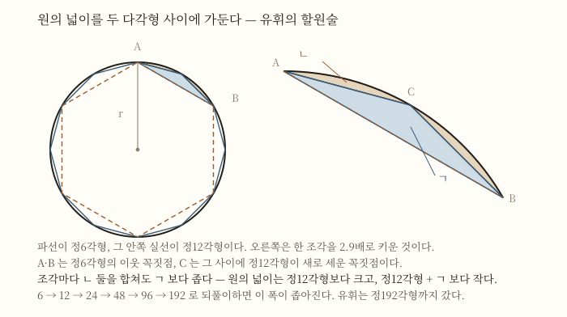

# 3세기

## TL;DR

- **이 세기의 두 정점은 서로를 몰랐다.** 알렉산드리아에서 디오판토스가 『산술』을 쓰고, 중국 위나라에서 유휘가 『구장산술』에 주석을 붙였다 [10][12]. 두 작업 사이에 오간 것은 아무것도 없다.
- **유휘가 한 일은 답을 늘린 것이 아니라 「왜 그런가」를 붙인 것이다.** 그는 원의 넓이를 두 다각형 사이에 가두는 절차를 세웠고 [2], 자기가 못 푼 문제는 못 풀었다고 적었다 [9].
- **「중국 수학에는 증명이 없다」는 평가는 잣대를 잘못 댄 것이다.** 컬런은 그 점수 매기기를 「야구와 축구를 섞은 것」이라 부른다 [12].
- ⚠ **연대가 양쪽에서 다 흔들린다.** 디오판토스가 3세기 사람인지부터 논쟁이 있고 [10], 유휘를 위나라 사람으로 볼지 서진 사람으로 볼지도 자료마다 다르다 [1][5].

## 1. 세기가 열릴 때의 상태 — 두 정점과 그 사이의 침묵

3세기를 한 줄로 줄이면 이렇게 된다. **두 곳에서 각각 최고 수준의 수학이 나왔는데, 두 곳은 서로의 존재를 몰랐다.**

한쪽은 알렉산드리아다. [[기원전 3세기]]에 유클리드와 아르키메데스가 세운 그리스 수학의 전통이 오백 년을 지나 여기까지 왔고, 이 세기에 디오판토스가 『산술』을 쓴다 [10]. 다른 한쪽은 중국이다. 기원전에 이미 엮여 있던 실용 문제집 『구장산술』에 263년 유휘가 주석을 붙인다 [4][6].

두 쪽이 다룬 문제가 겹치지 않는 것도 아니다. 둘 다 이차방정식을 풀었고, 둘 다 직각삼각형의 세 변 관계를 썼다. **그런데 푸는 방식도, 적는 방식도, 무엇을 「끝났다」고 부르는지도 달랐다.** 이 세기가 흥미로운 이유가 거기 있다.

## 2. 시대 배경 — 두 제국이 같은 세기에 흔들렸다

수학이 조용해질 법한 세기였다.

로마에서는 **235년부터 284년까지 반세기 동안 군대가 황제를 마음대로 세우고 갈아치웠다.** 많은 황제가 암살당했고 원로원은 제 역할을 못 했으며, 번창하던 상공업이 쇠퇴하고 화폐 남발로 인플레이션이 일어났다 [7]. 디오판토스에게 매겨진 생몰 200~284는 이 반세기를 통째로 품는다 [10].

중국에서는 **220년에 후한이 멸망하고 위·촉·오 삼국 시대가 시작됐다.** 다시 하나가 되는 것은 280년 사마염의 진(晉)에 이르러서다 [8]. 유휘가 주석을 완성한 263년은 그 갈라진 한복판이다 [1].

이 세기가 남긴 것이 **새 책보다 주석과 문제집인 데에는 그런 사정이 겹친다.** 다만 이것은 배경이지 원인이 아니다 — 어느 자료도 정치의 혼란이 주석이라는 형식을 낳았다고 말하지 않는다.

## 3. 알렉산드리아 — 디오판토스와 『산술』

디오판토스에 대해 **생애로 알려진 것은 사실상 없다** [10]. 남은 것은 책이다.

『산술』은 **확정방정식과 부정방정식의 수치해를 다루는 130문제의 모음**이다 [10]. 오늘 우리가 「디오판토스 방정식」이라 부르는 갈래가 여기서 나왔다. 자세한 것은 [[디오판토스]] 쪽에 있고, 여기서는 이 세기의 자리만 짚는다.

핵심은 이것이다. **그리스 수학은 기하였는데, 이 책은 수를 다룬다.** 도형을 그려 놓고 그 위에서 논증하는 대신, 조건을 만족하는 수를 실제로 찾아낸다. 그리고 그 답으로 **양의 유리수만 받는다** — 음수나 무리수로 가는 답은 쓸모없는 것으로 물리쳤다 [10].

## 4. 그런데 그가 3세기 사람인지부터 흔들린다

이 노트가 그를 3세기에 세워 놓았지만, **그 자리 자체가 확정된 것이 아니다.**

MacTutor 는 그가 산 시기를 두고 **논쟁이 많았다**고 적으며 약 200~약 284 라는 값을 준다 [10]. 이 값의 뿌리는 두 겹의 추정이다. 하나는 11세기 프셀루스의 편지에 나오는 아나톨리오스를 3세기 라오디케아의 주교로 보는 해석이고, 다른 하나는 500년 무렵 메트로도로스가 엮은 수수께끼 시에서 나오는 84세라는 수명이다 [10].

> **그래서 이 세기 개관에서 디오판토스의 자리는 「관행상 여기」라고 읽어야 한다.** 확실한 것은 그가 히프시클레스(기원전 150년 이후)와 테온(350년 이전) 사이에 있었다는 것뿐이고, 그 폭은 오백 년이다 [10].

## 5. 낱말과 기호 사이 — 줄임말이라는 중간 단계

『산술』이 수학사에서 한 자리를 차지하는 이유는 답이 아니라 **적는 방식**에 있다.

디오판토스는 미지수와 그 거듭제곱에 **줄임말을 도입했다** [10]. 완전한 문장도 아니고 완전한 기호도 아닌 중간 단계다. MacTutor 는 이를 두고 그가 **언어적 대수에서 기호적 대수로 가는 근본적인 한 걸음을 뗐다**고 적는다 [10].

다만 그 걸음은 거기서 멈춘다.

| 그가 가진 것 | 그가 못 가진 것 |
|---|---|
| 미지수 하나에 대한 줄임말 | 둘째·셋째 미지수의 기호 |
| 「같다」에 대한 줄임말 | 일반적인 수 n 에 대한 기호 |
| 거듭제곱의 줄임말 | 일반 공식을 적을 자리 |

미지수가 둘 이상이면 「첫째 미지수」·「둘째 미지수」라고 **말로 적어야 했고**, 그래서 그의 책은 일반적 방법보다 개별 문제에 매인다 [10]. 이 한계가 왜 문제인지는 [[대수 기호법]] 쪽이 자세하다.

## 6. 중국 — 263년, 한 사람이 이미 있는 책에 주석을 붙이다

같은 세기의 다른 쪽에서 벌어진 일은 성격이 아주 다르다.

『구장산술』은 **토목·측량·교역·조세의 일상 문제를 풀 방법을 주려고 엮은 246문제의 실용 편람**이다 [9]. 편찬 시기는 전한(기원전 206~서기 8)으로 추정되고 [4], 유휘 자신은 원본이 기원전 1000년쯤 것이라 믿었지만 오늘날 대부분의 사학자는 기원전 200년 무렵으로 본다 [9].

아홉 장은 이렇게 나뉜다 [5][9]. ⚠ 셋째 장의 이름은 자료에 따라 **쇠분**과 **최분**으로 갈리는데 한자는 같은 衰分 이고, 원래 구수의 이름은 차분(差分)이었다 [4].

| 장 | 이름 | 다루는 것 |
|---|---|---|
| 1 | 방전(方田) | 밭의 넓이 · 분수 계산 · 최대공약수 |
| 2 | 속미(粟米) | 곡물 교환 비율 · 비례 |
| 3 | 쇠분(衰分) | 등급에 따른 분배 · 등차와 등비 |
| 4 | 소광(少廣) | 제곱근과 세제곱근 · 구의 부피 |
| 5 | 상공(商功) | 토목 공사와 입체의 부피 |
| 6 | 균수(均輸) | 세금과 운송의 비례 배분 |
| 7 | 영부족(盈不足) | 두 번 어림해 정답을 얻는 이중가정법 |
| 8 | 방정(方程) | 연립일차방정식 · 음수 계산 |
| 9 | 구고(句股) | 직각삼각형과 닮음 |

**8장이 특히 눈에 띈다.** 계수를 행이 아니라 열로 놓았을 뿐, 첨가행렬을 삼각형꼴로 줄여 푸는 오늘날의 가우스 소거법과 다르지 않고, 그 과정에 필요한 **음수 계산 규칙까지 들어 있다** [9].

유휘가 263년에 한 일은 이 책에 주석을 붙인 것이다 [1][4][6]. 그런데 그 주석이 무엇이었는가가 이 세기의 핵심이다. 컬런의 표현으로는, **원본의 「술(術)」 진술을 낱낱이 뜯어 독자가 그것이 어떻게 작동하는지 훤히 보도록 재구성하는 일**이다 [12].

## 7. 할원술 — 값이 아니라 절차를 준 것

가장 잘 알려진 대목이 원주율이다.

『구장산술』은 일관되게 **원주율을 3으로 잡았고**, 이를 고법(古法)이라 불렀다 [2]. 고법으로 계산하면 반지름 r 인 원의 둘레가 6r 이 되는데 이것은 내접 정6각형의 둘레이고, 넓이는 3r² 이 되는데 이것은 내접 정12각형의 넓이다 — **둘 다 실제보다 작다** [2].

유휘는 제1권 방전의 31·32번 문제 주석에서 **원주율을 얼마든지 정확하게 구할 수 있는 일반적인 방법**을 내놓는다 [2]. 정6각형의 변으로 정12각형의 넓이를 구하고, 정12각형의 변으로 정24각형을 구하고, 그렇게 48·96·192각형까지 간다 [2].

> 왼쪽이 원에 함께 내접시킨 정6각형(파선)과 정12각형이고, 오른쪽은 그중 한 조각을 키운 것이다. **ㄱ 은 정12각형이 정6각형에 더한 삼각형이고, ㄴ 은 원이 정12각형보다 아직 더 넓은 활꼴 둘이다.** 확대해 보면 ㄴ 이 ㄱ 보다 눈에 띄게 얇은데, 유휘가 원의 넓이를 위아래로 가두는 데 쓴 것이 바로 이 부등호다 [2].

정리하면 원의 넓이는 정12각형보다 크고, 정12각형에 ㄱ 을 더한 것보다 작다. 정192각형까지 가면 이 위아래 폭이 그만큼 좁아진다 [2]. **눈여겨볼 것은 그가 답을 하나 준 것이 아니라 원하는 만큼 좁힐 수 있는 절차를 준 것이다.** 이 방법은 뒤에 **할원술(割圓術)**이라 불린다 [2].

## 8. 3.14 는 얻은 값이 아니라 고른 값이다

여기서 자료가 갈린다. 그리고 그 갈라짐이 오히려 사실을 잘 보여 준다.

| 자료 | 유휘의 원주율로 적는 값 |
|---|---|
| 네이버 「산학의 원주율」 [2] | 정192각형까지 간 뒤 **편의에 따라 3.14 = 157/50 을 취했다** |
| 조선 『구장술해』 [5] | 유휘의 값으로 **157/50** 을 소개 |
| MacTutor 원주율 연표 [11] | 263년 · 소수 **다섯 자리 · 3.14159** |

⚠ **이 노트는 어느 값이 맞는지 판정하지 않는다.** 다만 세 자료를 나란히 놓으면 읽히는 것이 있다. 국내 자료가 「**취했다**」고 적은 것이 요점이다 — 3.14 는 절차가 뱉어 낸 최종값이 아니라 **쓰기 편하라고 골라 멈춘 자리**다 [2]. 절차 자체는 멈출 곳이 없으니, 더 간 값이 함께 전해지는 것도 이상한 일이 아니다.

참고로 조충지(429~500)가 뒤에 소수 여섯째 자리까지 맞는 밀률 355/113 과 소수 둘째 자리까지 맞는 약률 22/7 을 얻는다 [2][11]. 조선의 남병길은 『구장술해』에서 이 값들을 나란히 소개한 뒤 **3.14159265 가 가장 정밀한 값**이라고 적었다 [5].

## 9. 못 푼 것을 못 풀었다고 적다 — 구의 부피

이 세기에서 가장 인상적인 대목은 성공이 아니라 실패의 기록이다.

『구장산술』은 지름 d 인 구의 부피를 **9/16 d³** 으로 구한다 [3]. 유휘는 이 공식이 부정확함을 지적했다. 그리고 대안으로 **모합방개(牟合方蓋)** — 정육면체에 내접해 수직으로 교차하는 두 원기둥의 공통부분 — 를 도입해, 구와 그것의 부피비가 π 대 4 라고 주장했다 [3].

**그런데 모합방개 자체의 부피를 구하지 못했다** [3]. 그는 그 자리에서 이렇게 적는다.

> 진실을 말할 수 있는 이에게 이 문제를 남겨 두자 [9].

이 한 줄이 왜 중요한가. **자기가 어디까지 왔고 어디서 멈췄는지를 적는다는 것은, 그 문제에 「끝났다/안 끝났다」의 기준이 있다는 뜻이다.** 답을 아는 척하지 않는 태도가 곧 논증의 기준이다.

250년 뒤 조충지 부자가 지금 [[적분법]] 쪽에서 카발리에리의 원리라 부르는 방법으로 그 자리를 메운다 [3]. 유휘가 남긴 문제를 유휘가 세운 도형으로 닫은 셈이다.

## 10. 「중국 수학에는 증명이 없다」는 오래된 오독

이 세기를 서술할 때 가장 흔한 오류가 여기 있다.

MacTutor 는 이렇게 적는다 — 중국 저작에서 그리스식 엄밀 증명이 보이지 않는다는 이유로 사학자들이 **중국인은 정당화 없이 공식만 줬다**고 믿어 왔는데, 이는 **그리스 수학에서 파생한 수학에 익숙한 사학자들이 「다르다」를 「열등하다」로 읽은 것**이며, 최근 연구가 이 인상을 바로잡고 있다는 것이다. 셰믈라는 중국 수학자들이 자기 방법이 옳다는 **설득력 있는 논증을 할 줄 알았음**을 보였다 [9].

컬런은 더 세게 말한다. 그의 논문에서 옮기면 이렇다 [12].

> 고대 중국은 수학적 사고를 구조화하는 데 근본적으로 다른 접근을 바탕으로 자기 수학 문화를 발전시켰다. 불행히도 서양뿐 아니라 중국의 수학사가들조차 이 점을 자주 놓쳤다. 그 결과 초기 중국 수학자들은 유클리드와 같은 일을 하되 — 노골적으로 말하면 — 훨씬 못하는 사람처럼 그려졌다 [12].

> 역사에서도 다른 분야에서와 마찬가지로, 일에 맞지 않는 연장을 쓰면 고치려던 것을 부수기 일쑤다 [12].

그리고 점수판에 대해서는 이렇게 적는다 — **「그리스 10 대 중국 0」이라는 결과는 야구와 축구를 섞을 때 나오는 것**이라고 [12].

무엇이 다른가. 컬런의 정리는 명확하다. **유클리드는 적은 수의 공리에서 많은 참인 명제를 연역해 보이려 했고, 『구장산술』의 익명 저자는 반대 방향으로 갔다** — 거의 무한한 문제들에서 출발해 그것들을 아홉 범주와 아홉 방법으로 줄이려 했다. 그리고 그것은 **덜 합리적인 길이 아니었다** [12].

유휘의 구고 설명에는 「증명」이나 「정리」에 해당하는 낱말이 **하나도 나오지 않는다.** 그런 것이 그의 관심사가 아니었기 때문이다 [12]. 낱말이 없다는 것과 일이 없다는 것은 다르다.

## 11. ⚠ 유휘를 찾아보려는 사람에게 — 참고서 한 곳이 지금 고장 나 있다

이 노트를 쓰면서 만난 일을 적어 둔다.

**MacTutor 의 유휘 전기 페이지(`Biographies/Liu_Hui/`)는 2026-09-10 확인 시점에 본문이 유휘의 것이 아니다.** Quick Info 상자(약 220년 위 중국 출생, 약 280년 사망)와 요약 한 줄, 그리고 참고문헌 목록(셰믈라·바그너·볼코프·컬런 등)까지는 유휘의 것인데, **그 아래 Biography 본문이 통째로 디오판토스 전기다** — 프셀루스의 편지, 크노르의 연대 재검토, 『산술』의 130문제, 바셰의 1621년 라틴어판, 페르마까지 [13]. 추출 과정의 사고가 아니라 페이지 자체가 그렇다(캐시를 끄고 다시 받아 확인했다).

**이 세기의 두 사람이 한 페이지에 겹쳐 있는 셈인데, 이것은 역사가 아니라 참고서의 고장이다.** 그러니 유휘의 수학 — 할원술, 부피, 263년 주석 — 을 저 페이지에서 인용하면 안 된다. 이 노트도 저기서는 생몰과 요약 한 줄만 가져왔고 [13], 수학은 [2][3][9][12] 에서 가져왔다.

## 12. 두 곳을 나란히 놓을 때 조심할 것

3세기를 「동서 비교」로 쓰고 싶은 유혹이 크다. 그런데 비교에는 조건이 있다.

| 알렉산드리아 (디오판토스) | 중국 (유휘) |
|---|---|
| 새 책을 썼다 | 이미 있는 책에 주석을 붙였다 |
| 수를 기호로 줄여 적기 시작했다 [10] | 절차를 말과 도형으로 풀어 보였다 [12] |
| 답으로 양의 유리수만 받았다 [10] | 8장에서 음수 계산 규칙을 썼다 [9] |
| 일반 공식을 적을 표기가 없었다 [10] | 일반 공식보다 범주와 방법을 노렸다 [12] |

⚠ **이 표는 누가 앞섰는지를 말하지 않는다.** 두 쪽은 서로를 몰랐으므로 경쟁 관계가 아니고, 잣대를 한쪽 것으로 통일하는 순간 10절에서 본 오독이 그대로 되풀이된다. 나란히 놓는 이유는 등수를 매기기 위해서가 아니라, **「수학을 한다」는 말에 하나 이상의 뜻이 있었다는 것**을 보기 위해서다.

한 가지 더. **이 세기의 중국 쪽 인물은 유휘 혼자가 아니다.** 컬런은 3세기의 주석가 **조상(趙爽)**이 『주비산경』에 이른바 「현도(弦圖)」를 덧붙였다고 적는다 [12]. 같은 호의 표지 해설은 그 그림이 2002년 베이징 세계수학자대회 로고의 원천이라고 적는다 [12]. 이 노트는 그를 이름만 적어 두고 넘어간다.

## 13. 한반도로 — 신라의 교재에서 조선의 주해서까지

이 세기의 산물이 한반도에 남긴 자취는 길다.

- **신라.** 7~8세기 국학에서 「산학박사 또는 조교 1인을 가려 철경·삼개·구장·육장을 교재로 삼아 그들을 가르쳤다」는 기록이 『삼국사기』에 있고, 그 '구장'이 『구장산술』이다 [6].
- **고려.** 『고려사』는 경제 관료인 산사를 뽑는 시험에서 **『구장산술』의 아홉 장 열 조를 접어서 암송시켰다**고 적는다 [6].
- **조선.** 남병길(1820~1869)이 『구장술해』를 냈다 [5][6]. 원본의 아홉 장 체재는 그대로 따르되 **유휘가 붙인 설명은 삭제하거나 자기 해설로 바꾸었고**, 「면적」·「직각삼각형」·「구체」 같은 근대적 표현을 썼다 [5].

마지막 대목이 재미있다. 『구장술해』 끝에 남병길은 「『구장산술』은 가히 수학의 시조라 할 수 있는데 처음에 유휘가 주석을 하였고 이순풍이 해설하였으나 **미흡한 점이 많아** 해설서를 내게 된 것」이라 적었다 [5]. **1600년 뒤의 주석가가 3세기의 주석가를 고쳐 쓴 것이다.**

## 14. 세기 연표

| 연도 | 일 | 근거 |
|---|---|---|
| 220 | 후한 멸망, 위·촉·오 삼국 시대 시작 | [8] |
| 235 | 로마 군인 황제 시대 시작 | [7] |
| 약 260 | 유휘가 활동한 무렵 | [12] |
| 263 | 유휘, 『구장산술』 주석 완성 (위원제 경원 4년) | [1][2][4][6] |
| 280 | 사마염의 진(晉)이 삼국 통일 | [8] |
| 약 280 | 유휘 사망 추정 | [3][13] |
| 284 | 디오클레티아누스 즉위, 군인 황제 시대 수습 | [7] |
| 약 284 | 디오판토스 사망 추정 | [10] |

## 15. 남긴 것

- **줄임말로 적는 대수.** 언어에서 기호로 가는 중간 단계가 여기서 시작해 [[대수 기호법]]으로 이어진다 [10].
- **정수해라는 조건.** 「디오판토스 방정식」이라는 이름이 이 세기에서 나왔다 [10].
- **원하는 만큼 좁히는 절차.** 할원술은 값이 아니라 방법이었고, 조충지가 그 방법으로 더 갔다 [2].
- **주석이라는 형식.** 유휘(263)에서 이순풍(640년 무렵)을 거쳐 남병길(19세기)까지, 이 책에 붙는 주석의 계보가 천육백 년을 간다 [5][9].
- **잘못 매긴 점수 하나.** 「증명이 없다」는 평가가 20세기까지 살아남았다가 최근에야 교정되고 있다 [9][12].

## 16. 남은 문제

- **디오판토스의 연대.** 오백 년 폭 안에서 3세기로 좁힌 근거는 두 겹의 해석이고, 그 해석에 반론이 있다 [10].
- **유휘의 소속.** 국내 인명 항목은 그를 「서진 초기 사람」이라 하면서 주석 완성을 「위원제 경원 4년(263)」이라 적는다 [1]. 263년은 아직 위(魏)이고, 다른 자료들은 그를 위나라 사람으로 적는다 [2][5][6][13]. 두 서술이 서로를 배제하지는 않지만, 어느 쪽으로 부를지는 자료마다 다르다.
- **원주율 값.** 8절의 표대로 자료가 갈린다 [2][5][11].
- **1600년경의 우연.** 유럽에서 널리 쓰인 여러 공식과 규칙이 『구장산술』의 것과 사실상 같은데, 유럽 것이 중국에서 곧바로 왔는지는 **사학자들에게 아직 설득력 있는 답이 없다** [9].

## 17. 수업에서 쓸 만한 대목

- **고법이 왜 정6각형인가.** 원주율을 3으로 잡으면 원의 둘레가 그대로 내접 정6각형의 둘레가 된다 [2]. 반지름 r 인 원에 정6각형을 그리면 한 변이 r 이라는 것만 알면 되는 계산이고, 「근삿값이 실제보다 작다」는 것을 눈으로 보여 준다.
- **위·아래로 가두기.** 7절의 그림 한 장이면 「참값을 모르는 채로 참값의 범위를 좁힌다」는 발상을 설명할 수 있다. 극한을 배우기 전에 극한의 감각을 주는 자리다.
- **못 푼다고 적기.** 9절의 한 줄은 「모른다고 쓰는 것도 수학의 일부」라는 이야기를 꺼낼 만한 대목이다 [9].
- **문제로 배우기.** 컬런은 『구장산술』식 문제 중심 학습을 쿤이 말한 「닮은 문제를 알아보는 능력」과 이어 붙인다 [12]. 왜 유형 학습이 통하는가를 역사 쪽에서 설명할 재료가 된다.

## 이어서 읽을 것

- [[디오판토스]] — 이 세기 알렉산드리아 쪽의 인물 노트. 묘비 문제와 『산술』의 사라진 절반.
- [[대수 기호법]] — 줄임말이 어떻게 문자식이 되는지, 그 세 단계.
- [[기원전 3세기]] — 디오판토스가 물려받은 전통이 만들어진 세기.
- [[9세기]] — 『산술』이 아랍어로 옮겨지고 절차를 책으로 만든 대수가 나오는 세기.
- [[적분법]] — 유휘가 남긴 구의 부피 문제를 조충지가 닫을 때 쓴 원리가 어디로 이어지는가.
