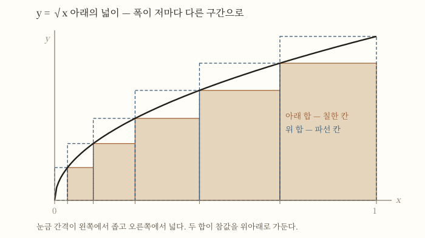

# 9세기

## TL;DR

- **이 세기는 「번역의 세기」로 불리지만, 번역이 연구와 갈라져 있지 않았다.** 옮긴 사람이 곧 고친 사람이고 이어 쓴 사람이었다 [9][10].
- **절차를 책으로 만든 대수가 여기서 시작한다.** 알콰리즈미가 이차방정식을 여섯 유형으로 갈라 각각의 푸는 법을 적었고, 그것이 수학을 기하로 보던 그리스적 관념에서 벗어나는 이동이었다 [9][12].
- **인도에서 온 자리값 기수법이 아랍어로 정리되어 뒤에 유럽으로 건너간다** [1][5][13].
- ⚠ **이 세기의 상징인 「지혜의 집」은 사료가 흔들리는 이름이다.** 그 기관이 무엇이었는지에 대해 학자들의 판단이 갈린다 [2][3][11].

## 1. 세기가 열릴 때의 상태 — 책은 있는데 읽을 수가 없었다

8세기 말 바그다드에는 문제가 하나 있었다. **읽을 가치가 있는 책들이 아랍어로 되어 있지 않았다.**

유클리드도 아르키메데스도 아폴로니오스도 프톨레마이오스도 그리스어였고, 천문 계산에 쓸 표들은 산스크리트와 페르시아어에 흩어져 있었다. 750년에 아바스 왕조가 열리고 2대 칼리프 알 만수르가 다마스쿠스에서 티그리스 강가의 새 계획도시로 수도를 옮기면서 [1], 그 도시에는 사람과 돈이 모였지만 **지식은 아직 다른 언어에 잠겨 있었다.**

우마이야 왕조는 다마스쿠스에 **키자낫**(khizanat)을 두고 있었다. 책을 보관하는 창고를 가리키는 말이고, 천문학에 관한 페르시아 책들의 번역본이 거기 모여 있었다 [1]. 9세기가 하는 일은 그 창고를 **작업장으로 바꾸는 것**이다.

## 2. 시대 배경 — 후원이 곧 제도였다

이 세기에는 대학이 없다. 학자를 움직인 것은 **후원**이다.

786년에 즉위한 하룬 알 라시드의 통치기에 그리스어 문헌의 첫 아랍어 번역이 이루어졌고, 알 하자즈가 유클리드 『원론』을 옮겼다 [9]. 같은 시기 황실 도서관 키자낫이 크게 성장해, 중세 이슬람 과학사학자 이븐 알 키프티가 그곳을 **'지혜의 책들의 보고'**라 불렀다 [1].

813년부터 833년까지 통치한 그의 아들 알 마문에 이르러 후원의 규모가 달라진다. 그는 학문 연구와 그리스어 학술서의 아랍어 번역을 장려했고, 바그다드에 학술원을 세웠으며 그곳은 **천문대까지 갖추고 있었다** [3]. 콘스탄티노플에서 인도에 이르는 넓은 범위의 책을 옮기게 하면서 알 콰리즈미, 바누 무사 형제, 알 킨디 같은 이름들을 불러 모았다 [1].

그리고 부유한 귀족들이 그 정책에서 밀려나지 않으려고 **앞다투어 도서관을 짓고 천문대를 세워 천문학자를 고용했다** [1]. 연구를 떠받친 것은 제도가 아니라 이 경쟁이었다.

## 3. 번역은 연구와 갈라져 있지 않았다

이 세기를 오해하기 가장 쉬운 자리가 여기다. **「그리스 학문을 보존했다」는 문장은 절반만 맞다.**

MacTutor 는 이 점을 분명히 적는다 — 이 시기의 아랍어 번역은 **수학을 모르는 언어 전문가가 아니라 위에 이름을 든 것 같은 과학자와 수학자들이 했고**, 번역의 필요는 **당대의 가장 앞선 연구에서 나왔다** [9]. 같은 자료가 이렇게 못 박는다:

> 번역은 그 자체를 위해 한 것이 아니라, 당대 연구 활동의 일부로 이루어졌다 [9].

옮겨진 목록을 보면 무엇이 필요했는지가 보인다.

| 옮긴 것 | 무엇이 |
|---|---|
| 유클리드 | 『원론』·『자료』·『광학』·『현상』·『분할론』 |
| 아르키메데스 | 『구와 원기둥』·『원의 측정』 두 편만 |
| 아폴로니오스 | 사실상 전부 |
| 디오판토스 | 『산술』 |
| 메넬라오스 | 『구면론』 |
| 프톨레마이오스 | 『알마게스트』 |

그리고 이 일에는 뜻하지 않은 결과가 따랐다 — **오늘날 남아 있는 그리스 문헌 가운데 일부는 오직 이 번역 산업 덕분에 살아남았다** [9]. 보존은 목적이 아니라 부산물이었다.

아르키메데스가 **두 편만** 옮겨졌다는 사실이 중요하다. 그 두 편만으로도 9세기부터 15세기까지 독자적인 연구가 촉발됐다 [9]. 번역이 목적이었다면 전집을 옮겼을 것이다. **쓸 것을 옮긴 것이다.**

## 4. 그런데 그 기관의 이름이 흔들린다

이 세기를 말할 때 거의 반드시 나오는 이름이 **「지혜의 집」**(Bayt al-Hikma)이다. 국내 사전들은 이를 **830년 칼리프 마문이 그리스어 철학·과학책을 아랍어로 번역할 목적으로 세운 학술원**으로 적는다 [2][3].

**그런데 이 서술에 정면으로 문제를 제기하는 연구가 있다.** 디미트리 구타스는 그 기관의 존재와 형태·기능을 문제 삼으며, `Bayt al-Hikma` 가 '창고'를 뜻하는 `Khizanat al-Hikma` 의 오역이라고 보고 **당대 사료에 그 이름이 거의 나오지 않는다**고 지적한다 [11].

국내 자료 쪽에서도 결이 보인다. 위에 인용한 「수학과 중세 이슬람」은 **키자낫이 '전설적인 지혜의 집으로 꽃을 피웠다'**고 적는다 [1] — 즉 창고에서 시작해 무엇인가로 자라났다는 서술이지, 어느 해에 세워진 기관이라는 서술이 아니다.

> **이 노트는 어느 쪽이 옳은지 판정하지 않는다.** 다만 **9세기의 성취를 한 기관의 설립에 걸어 두는 서술은 조심해서 읽을 것**을 적어 둔다. 확실한 것은 기관의 이름이 아니라 **번역과 연구를 함께 굴린 사람들의 이름**이다.

## 5. 알콰리즈미 — 절차를 책으로 만들다

알 콰리즈미(780?~850?)는 중세 이슬람의 가장 중요한 수학자로 인정받으며 **'대수학의 아버지'**로 불린다. 다만 그 존칭은 고대 그리스의 디오판토스도 함께 받는다 [4]. 그는 바그다드의 알 마문 도서관과 천문대에서 일하며 **그리스와 인도의 지식을 서로 조화시켰다** [5].

830년 무렵 칼리프 마문의 권유로 쓴 책의 원제가 『**al-Kitāb al-mukhtaṣar fī ḥisāb al-jabr wa'l-muqābala**』다 [12]. 이 책이 한 일은 이렇다.

- 이차방정식을 **여섯 가지 기본 유형으로 분류**했다 [12].
- 각 유형마다 **대수적 해법과 기하학적 해법을 함께** 제시했다 [12].
- 그래서 **선형·이차방정식의 최초의 체계적 해법**이 됐다 [12].

`al-jabr` 는 **복원·완성**을, 짝을 이루는 `al-muqābala` 는 **균형·대조**를 뜻한다 [12]. 오늘 우리가 "이항하고 정리한다"고 말하는 두 동작이다.

이것이 왜 이동인가. MacTutor 의 판단은 분명하다 — **수학을 본질적으로 기하로 보던 그리스적 관념에서 벗어난 혁명적 이동**이었다는 것이다 [9]. 유리수든 무리수든 기하학적 크기든 **모두 '대수적 대상'으로 함께 다룰 수 있게 되면서** 수학이 자기 자신에게 적용될 길이 열렸다 [9].

⚠ 다만 **그의 책에는 문자가 하나도 없다.** 국내 자료가 정의하는 대수학은 「수 대신에 문자를 사용하여 방정식의 풀이 방법이나 대수적 구조를 연구하는 학문」인데 [6], 이 책의 대수는 처음부터 끝까지 **말로** 되어 있다. 정의가 대상보다 나중에 만들어진 자리다.

## 6. 이름이 두 번 단어가 됐다 — 다만 조심할 것

그의 이름은 두 번 보통명사가 됐다.

| 지금의 낱말 | 어디서 왔나 |
|---|---|
| algebra | 책 제목의 `al-jabr` [12] |
| algorithm | 이름의 라틴화 `Algoritmi` [13] |

12세기 라틴 번역의 제목이 『**Algoritmi de numero Indorum**』이었고, `Algoritmi` 가 그의 이름을 라틴어로 옮긴 것이다 [13].

**여기서 흔한 오해를 하나 끊어 둔다.** 중세 라틴어 `algorismus` 는 그저 **십진 기수법**을 뜻했다 [13]. 17세기에 프랑스어에서 `logarithm` 을 본떠 `algorithm` 으로 형태가 바뀌었고, **오늘날의 의미는 19세기 말에야 붙었다** [13]. 그러므로 「알콰리즈미가 알고리즘을 창안했다」는 널리 퍼진 문장은 과학사 쪽에서 반박되는 서술이다 [15]. 그의 이름이 붙은 것과 그가 그 개념을 만든 것은 다른 일이다.

## 7. 인도에서 온 숫자

이 세기의 두 번째 이동은 **숫자 자체**다.

알 콰리즈미의 산술책은 **인도식으로 숫자 적는 법을 아랍 세계에 전했다** [5]. 알 킨디도 「**인도 숫자의 사용에 관한 책**」을 썼고, 이 논문은 **인도 숫자에 관한 지식을 유럽으로 보급하는 데 핵심 역할을 한 책 중 하나**가 된다 [1].

천문 쪽에서도 인도의 자취가 뚜렷하다. 알콰리즈미의 『지즈 알신드힌드』는 역법·천문 계산 37장과 **116개의 표**(사인표 포함)로 이루어졌고 **브라마굽타의 표에 크게 기댔다** [14]. 833년에 완성한 『키탑 수라트 알아르드』는 프톨레마이오스의 좌표를 바탕으로 하되 **지중해의 길이와 아시아·아프리카 도시의 위치를 개선했다** [14].

그리스에서 받고 인도에서 받아 **고쳐서 내보낸** 세기라는 것이 여기서 드러난다.

## 8. 타비트 이븐 쿠라 — 번역가가 아니라 수학자

이 세기를 한 사람으로 보여 줄 수 있다면 **타비트 이븐 쿠라**(836~901)다 [10].

그는 하란 출신이고 **별을 숭배하는 사비교도**였다. 그 신앙이 천문학을 연구할 강한 동기가 됐다 [10]. 모어는 시리아어였고 그리스어와 아랍어에 능통했다 [10]. 하란을 찾은 **무함마드 이븐 무사 이븐 샤키르**가 그의 언어 능력에 감명받아 바그다드로 데려가 **바누 무사 형제에게 수학을 배우게 했다** [10].

그가 번역가로 한 일부터 보자. 후나인 이븐 이스하크가 옮긴 유클리드 『원론』을 **그가 개정했고, 이후의 모든 아랍어판이 그 개정본에서 갈라져 나왔다** [10].

**그런데 그를 번역가로만 적으면 틀린다.**

| 무엇을 | 어떤 일 |
|---|---|
| 우애수 | 아홉 개의 보조정리를 세운 뒤 **정리를 증명**했다. 유클리드와 니코마코스가 완전수는 다루었으나 우애수에는 관심을 두지 않았다는 것을 알고 한 일이다 [10] |
| 17296과 18416 | 이 우애수 쌍을 **처음 발견한 사람일 가능성이 높다** [10] |
| 비의 합성 | 기하량에 산술 연산을 도입해 **수 개념의 일반화로 이어지는 흐름**을 열었다 [10] |
| √x 의 적분 | 사실상 계산해 냈고, 그 과정에서 **적분 구간을 부등분으로 나눈 최초**가 됐다 [10] |
| 지레 | 『저울대의 서』에서 평형 원리를 증명했고, 크레모나의 게라르도가 라틴어로 옮겼다 [10] |

**적분 구간을 같은 폭으로 자르지 않았다**는 대목을 눈여겨볼 만하다. 구분구적을 처음 배울 때 구간을 똑같이 나누는 것은 편의이지 필연이 아닌데, 9세기에 이미 그 편의를 벗어난 계산이 있었던 셈이다.

⚠ **위 그림은 그 착상을 보이는 것이지 그의 분할을 재현한 것이 아니다.** 인용한 자료는 「구간을 부등분으로 나눴다」는 사실과 위·아래 합을 썼다는 것까지만 전하고, **어떤 폭으로 잘랐는지는 적지 않는다** [10].

## 9. 알 킨디 — 셈으로 암호를 풀다

알 킨디(801~873)는 주로 철학자로 알려져 있지만, **그리스 수학 번역서들에 대한 통찰력 있는 주석서를 여러 권 썼다** [1].

그가 수학사에 남긴 뚜렷한 자취는 **빈도 분석**이다. 어떤 언어에서도 몇몇 문자가 다른 문자보다 자주 나온다는 성질을 이용해 암호를 푸는 방법이고, 그는 이것을 **외국어로 된 책을 번역할 때 유용한 방법으로** 개발했다 [1].

**번역이 암호해독을 낳았다**는 이 경로가 이 세기의 성격을 잘 보여 준다. 실무가 방법을 만들었다.

## 10. 기도가 시킨 계산 — 키블라와 아스트롤라베

이슬람 수학에서 삼각법·구면기하학·지도 제작이 크게 발전한 데에는 종교 실무라는 동력이 있었다. **키블라 문제**다 [1].

키블라는 '방향'을 뜻하고, 무슬림은 세계 어디에 있든 메카를 향해 기도한다. 새 모스크의 미흐라브는 **정확한 메카 방향을 향하도록 설계되어야 한다** [1]. 그러므로 **어디서든 그 방향을 계산하는 일**이 가장 중요한 수학의 응용이 됐다 [1].

그 계산을 물건으로 만든 것이 **아스트롤라베**다. 수평선 위 천체의 경사각을 재고, 그 눈금에서 얻은 정보를 경도와 위도로 바꾸면 키블라와 그날의 시각을 알 수 있다 [1]. 평사도법과 아스트롤라베의 이론은 고대까지 거슬러 올라가지만, **이슬람 세계에 도입된 것은 8세기 중반이고 형식과 기술의 발전이 절정에 이른 것은 그 뒤**다 [1].

## 11. 같은 시기, 신라에서는

같은 9세기에 한반도에는 이미 **수학을 가르치는 관직**이 있었다.

신라는 682년(신문왕 2)에 국립교육기관인 국학을 설립했고, **717년(성덕왕 16)부터 산학박사와 조교 1인을 두어** 『철경』·『삼개』·『구장』·『육장』을 가르쳤다 [7]. 문헌상 우리나라에 산학 제도가 성립한 것이 통일신라시대이고, 『삼국사기』가 그 내용을 적고 있다 [8].

⚠ **제도가 선 것은 8세기 초이고, 9세기는 그 제도가 돌아가던 시기다.** 바그다드가 번역으로 지식을 들여오던 무렵, 신라는 **중국에서 온 산서를 교과로 삼아 관리를 길렀다.** 두 곳 모두 **바깥에서 온 책을 제도 안에 앉히는** 일을 하고 있었다는 점이 닮았다.

## 12. 세기 연표

| 연도 | 일 |
|---|---|
| 762 | 바그다드 건설 — 뒤에 '원형 도시'로 알려짐 [1] |
| 786 | 하룬 알 라시드 즉위. 이 통치기에 알 하자즈가 유클리드 『원론』을 옮김 [9] |
| 801 | 알 킨디 출생 [1][9] |
| 813~833 | 알 마문 통치. 번역과 연구를 함께 후원 [1][3] |
| 820 | 알 마하니 출생 — 기하 문제를 대수로 옮기는 착상 [9] |
| 830 무렵 | 알콰리즈미 『알자브르』 [12] |
| 833 | 알콰리즈미 『키탑 수라트 알아르드』 완성 [14] |
| 836 | 타비트 이븐 쿠라 출생 [10] |
| 850 무렵 | 아부 카밀·알 바타니 출생 [9] |
| 873 | 알 킨디 사망 [1] |
| 901 | 타비트 이븐 쿠라 사망 [10] |

## 13. 이 세기가 남긴 것

- **절차로서의 대수.** 유형을 갈라 놓고 각각의 푸는 법을 적는 방식이 책이 됐다 [12].
- **대상의 통합.** 유리수·무리수·기하학적 크기를 한 종류의 대상으로 다루는 길이 열렸다 [9].
- **자리값 기수법의 아랍어 정리.** 인도에서 온 셈법이 정리되어 뒤에 유럽으로 건너간다 [1][5].
- **번역과 연구가 한 사람 안에 있던 세대.** 타비트가 그 전형이다 [10].

## 14. 남은 문제 — 다음 세기로

- **기호가 없다.** 알콰리즈미의 대수는 말로 되어 있고, 아랍 수학에 기호가 나타나는 것은 훨씬 뒤의 일이다 [9]. 이 문제는 [[대수 기호법]] 에서 이어진다.
- **기하에서 완전히 떨어지지 못했다.** 대수를 기하 연산에서 떼어 내 산술 연산으로 바꿔 놓는 일은 10세기의 알 카라지(953년생)를 기다려야 한다 [9].
- **삼차방정식이 남는다.** 기하적 해를 원뿔곡선의 교점으로 완전히 분류하는 것은 11세기 오마르 하이얌의 몫이다 [9].

## 15. 수업에서 쓸 만한 대목

- **「대수학의 아버지」가 둘이다.** 알콰리즈미와 디오판토스가 같은 존칭을 받는다 [4]. 왜 두 사람일 수 있는지를 물으면 '대수'라는 말이 무엇을 가리키는지가 드러난다.
- **이름이 낱말이 되는 것과 개념을 만드는 것은 다르다.** algorithm 의 어원 이야기는 재미있지만, 그 낱말의 오늘날 의미는 19세기 말에야 붙었다 [13][15].
- **번역이 곧 연구였다.** 아르키메데스를 두 편만 옮겼다는 사실 하나로 이 세기의 태도를 설명할 수 있다 [9].

## 이어서 읽을 것

- [[알콰리즈미]] — 이 세기의 중심 인물
- [[대수 기호법]] — 기호가 없던 대수가 기호를 얻기까지
- [[16세기]] — 이 세기가 남긴 삼차방정식 문제가 풀리는 곳
