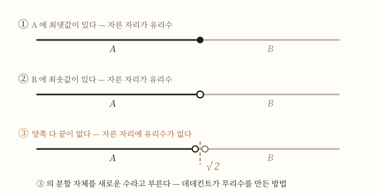

# 해석학의 엄밀화

> 실수가 무엇이냐고 물으면 교과서는 이렇게 답한다 — **유리수와 무리수를 합친 것.**
>
> 그런데 국내 수학백과가 같은 항목에서 이렇게 덧붙인다. 무리수란 **"실수에서 유리수가 아닌 수"**를 가리키므로, **"이런 식으로 정의하는 경우 실수가 무엇인지 알 수 없게 된다"**[1].
>
> 정의가 자기 자신을 쓰고 있다. 그리고 이것은 교과서가 게을러서가 아니다. **수학이 이 순환을 실제로 끊은 것은 1872년이고**, 그전까지 200년 동안 아무도 끊지 못한 채 미적분을 했다[1][5].

## TL;DR

- 교과서의 실수 정의는 **순환**이다 — 무리수를 실수로 정의하고 실수를 무리수로 정의한다[1].
- **코시도 같은 자리에 있었다.** 1821년에 극한을 앞세웠지만 실수는 **이미 아는 것으로 전제**했다[5].
- 200년 동안 문제가 안 된 이유는 **수직선이 대신 답해 줬기 때문**이다. 그림이 증명 노릇을 했다[9].
- **1817년 볼차노**가 그림을 빼고 증명해 보려다, 빠진 것이 무엇인지 드러냈다[7].
- 빠진 것에 붙은 이름이 **완비성**이다. 이것이 실수체를 유리수체와 갈라놓는다[4].
- **1858년 11월 24일**, 데데킨트가 미적분을 처음 가르칠 준비를 하다 **절단**을 착상한다[6].
- **1872년**, 데데킨트와 칸토어가 **전혀 다른 방법으로** 실수를 구성한다. 결과는 같은 것이었다[2][3].
- 그러자 **사잇값 정리를 증명할 수 있게 됐다.** 고등학교가 증명하지 않고 넘어가는 그 정리다[3][4].

## 1. 정의가 자기 자신을 쓰고 있다

교과서를 순서대로 따라가 보자.

- 유리수는 **분수로 쓸 수 있는 수**다. 이건 자기 완결적이다.
- 무리수는 **유리수가 아닌 실수**다.
- 실수는 **유리수와 무리수를 합친 것**이다.

세 번째를 알려면 두 번째가 필요하고, 두 번째를 알려면 세 번째가 필요하다. **원을 그리고 있다.**

이것을 지적하는 것은 트집이 아니다. 국내 수학백과가 「실수」 항목에서 스스로 적어 둔 말이다 — 이렇게 정의하면 **"실수가 무엇인지 알 수 없게 된다"**[1].

**그러면 실수란 무엇인가.** 이 문서는 그 물음이 언제 제기됐고 누가 어떻게 답했는지를 다룬다.

## 2. 소수로 도망쳐도 안 된다

첫 번째 탈출구는 소수다. **끝없이 이어지는 소수로 쓸 수 있는 수**를 실수라 하면 되지 않나. $\pi = 3.14159\cdots$ 처럼.

그런데 소수 전개가 무슨 뜻인지 풀어 쓰면 이렇다[1].

$$3.14159\cdots = 3 + \frac{1}{10} + \frac{4}{100} + \frac{1}{1000} + \frac{5}{10000} + \cdots$$

**무한히 더한 것**이다. 그러니 이 정의는 무한급수의 값, 곧 **극한**을 이미 쓰고 있다[1]. 같은 자료가 이렇게 적는다 — **"이들 합은 무한합이므로 실수 개념에는 극한 개념이 포함돼 있다"**[1].

여기서 문제가 뒤집힌다.

| 정의하려는 것 | 필요한 것 | 그런데 그것은 |
|---|---|---|
| 실수 | 극한 | 실수 위에서 정의된다 |
| 극한 | 실수 | 아직 정의되지 않았다 |

**두 번째 순환이다.** 첫 번째 순환보다 나쁘다 — 이번엔 해석학 전체가 걸려 있기 때문이다.

## 3. 코시도 같은 자리에 있었다

이 순환은 교과서만의 문제가 아니었다.

[[미분법 확장편]]에서 본 대로 **[[오귀스탱루이 코시]]가 1821년 『해석학 강의』에서 극한을 앞세워** 미적분을 다시 세웠다. 무한소를 기본으로 두는 대신 극한을 먼저 정의하고 나머지를 그 위에 올린 것이다.

그런데 그가 실수를 어떻게 다뤘는지 보면 이렇다. MacTutor 의 서술을 그대로 옮기면, 코시는 **실수의 정의를 그다지 신경 쓰지 않았고**, 실수란 유리수열의 극한이라고 말하기는 하지만 **"여기서 그는 실수가 이미 알려진 것으로 전제하고 있다"**[5].

즉 **극한을 엄밀하게 만든 사람이, 그 극한이 사는 집은 손대지 않았다.**

같은 자료가 한 걸음 더 나간다 — **코시 자신도, 그의 직계 후계자들도 '코시 수열' 판정이 실수를 정의하는 데 갖는 의미를 이해하지 못한 것으로 보인다**는 것이다[5]. 자기 손에 열쇠를 쥐고도 그것이 열쇠인 줄 몰랐다.

## 4. 그러면 200년 동안 왜 아무 일도 없었나

여기서 자연스러운 물음이 나온다. 바닥이 비어 있는데 어떻게 미적분이 굴러갔나.

**수직선이 대신 답해 줬기 때문이다.**

실수 하나하나는 수직선 위의 점과 일대일로 대응한다 — 수직선은 실수의 모델이다[1]. 그리고 직선에는 **틈이 없어 보인다.** 그러니 "$0$ 과 $1$ 사이에 반드시 어떤 수가 있다"는 주장은 그림을 보면 그만이었다.

클라인이 1895년 강연에서 이 시절을 이렇게 회고한다. 뉴턴과 라이프니츠, 그리고 **18세기 수학자 전부**가 자연을 관찰하는 데서 출발해 **연속성의 원리를 근본에 놓았다**는 것이다[9]. 그리고 그 뒤 사정이 어떻게 달라졌는지를 한 문장으로 요약한다.

> 예전에는 **그림 하나가 증명 노릇을 했는데**, 이제 [미적분 교과서를 펼치면] 어떤 작은 양보다도 작아지는 양에 대한 논의가 끝없이 이어진다[9].

**"그림 하나가 증명 노릇을 했다"** — 이것이 200년의 사정이다. 틀린 답이 나오지 않는 한 아무도 바닥을 묻지 않았다.

## 5. 볼차노 — 그림을 빼 보자 (1817)

처음으로 그림을 치운 사람은 **[[베른하르트 볼차노]]**다.

1817년 그는 『순수 해석적 증명』이라는 논문을 낸다. 제목이 곧 강령이다 — **순수하게 해석적으로**, 즉 그림 없이 증명하겠다는 것이다. MacTutor 는 이 논문(과 1816년의 짝 논문)이 **미적분에서 무한소 개념을 몰아내려는 시도**를 담고 있다고 적는다[7].

그가 겨눈 정리는 **중간값 정리**였다. 연속인 함수가 음수 값과 양수 값을 가지면 그 사이 어디선가 $0$ 이 된다는 것.

**그림으로는 자명하다.** 선을 그어 보면 그만이다. 그런데 그림을 빼면 갑자기 증명할 것이 생긴다 — **"그 지점이 존재한다"를 무엇으로 보장하는가?**

볼차노는 이 논문에서 오늘날 **코시 수열**이라 부르는 것을 정의한다[7]. 같은 개념이 **코시의 저작에 4년 뒤 나타나지만, 코시가 볼차노의 논문을 읽었을 가능성은 낮다**는 것이 MacTutor 의 판단이다[7].

## 5-1. 왜 볼차노의 이름이 안 남았나

읽히지 않았기 때문이다. 그리고 그 이유는 수학 바깥에 있다.

볼차노는 1819년 12월 오스트리아 정부의 압력으로 **정직됐다.** 교수직에서 정직된 데 더해 **가택연금에 처해졌고, 우편물이 검열됐으며, 출판이 금지됐다**[7]. 1821년부터 1825년까지 교회 재판을 받았고, 자기 견해를 철회하기를 거부해 결국 사임한다[7].

그의 저작 대부분은 원고 상태로 남았고, 상당수는 **1862년 이후에야** 출판됐다[7]. 무한을 다룬 『무한의 역설』은 그가 죽고 **3년 뒤인 1851년**에 제자가 냈다[7].

[[미분법 확장편]]이 같은 사람을 두고 "출판했는데도 읽히지 않아 이름을 잃을 뻔했다"고 적었다. **왜 읽히지 않았는지가 여기 있다 — 읽히지 않은 것이 아니라 읽힐 수 없게 막혔다.**

## 6. 빠진 것에 이름이 붙다 — 완비성

볼차노가 증명하려던 것을 정리해 보면, 결국 이런 모양이다.

> 어떤 조건을 만족하는 실수가 **존재한다.**

중간값 정리도, 최대·최소 정리도 그렇다. 국내 수학백과가 정확히 그렇게 적는다 — 이 정리들은 **"특정한 성질을 만족하는 실수가 존재한다는 것을 주장하는 정리"**이고, 그러므로 **"이를 증명하려면 먼저 실수가 '무엇'인지 규명해야 한다"**[3].

무엇이 빠져 있었나. 실수의 성질을 세 층으로 나누면 이렇게 된다[4].

| 층 | 내용 | 유리수도 만족하나 |
|---|---|---|
| 연산 | 사칙연산이 된다 (체) | **된다** |
| 순서 | 크기를 비교할 수 있다 (순서체) | **된다** |
| **완비성** | 위로 유계인 집합은 상한을 가진다 | **안 된다** |

**세 번째가 실수를 실수로 만든다.** 같은 자료의 표현으로, **"연산과 순서만으로 실수체와 유리수체 등 다른 순서체를 구별할 수는 없다"**[4].

유리수만으로는 왜 안 되는지가 한눈에 보인다. $x^2 < 2$ 인 유리수들을 모으면 위로 유계인데, **유리수 안에는 그 상한이 없다**[11]. $\sqrt{2}$ 가 유리수가 아니기 때문이다. 유리수의 수직선에는 **거기에 구멍이 뚫려 있다.**

## 7. 데데킨트 — 1858년 11월 24일

전환점은 강의 준비에서 왔다.

**[[리하르트 데데킨트]]**는 1858년 가을 취리히 공과대학에 부임한다[6]. 거기서 **미적분을 처음으로 가르치게 된다.**

MacTutor 의 서술은 이렇다 — **"미분적분학을 어떻게 가르칠지 궁리하던 중에, 그것도 그 과목을 처음 가르치던 때에, 데데킨트 절단이라는 착상이 떠올랐다."** 그리고 데데킨트 본인이 회고하기를, 그 착상이 온 날은 **1858년 11월 24일**이다[6].

**날짜가 남아 있다는 것이 이 이야기의 매력이다.** 그리고 그 계기가 연구가 아니라 **수업 준비**였다는 것도.

가르치려면 "왜"에 답해야 한다. 극한을 설명하려니 실수의 연속성을 써야 하고, 그것을 설명하려니 근거가 없다는 것이 드러난다. **학생에게 그림을 보여 주는 것으로 넘어갈 수 없다고 느낀 사람이 바닥을 팠다.**

착상은 1858년인데 **출판은 1872년이다**[5][6]. 14년을 묵혀 둔 셈이고, 왜 그때 꺼냈는지는 [[해석학의 엄밀화 확장편]]에서 다룬다.

## 8. 절단이란 무엇인가

발상은 한 문장이다 — **"한 실수는 그것보다 작은 유리수들에 의하여 정해진다"**[3].

유리수 전체를 크기 순으로 늘어놓고 어디선가 **자른다.** 왼쪽 집합 $A$ 와 오른쪽 집합 $B$ 로 갈린다. 가능한 경우는 셋뿐이다[2].

| 경우 | $A$ 의 최댓값 | $B$ 의 최솟값 | 자른 자리 |
|---|---|---|---|
| ① | 있다 | 없다 | 유리수 (왼쪽에 속함) |
| ② | 없다 | 있다 | 유리수 (오른쪽에 속함) |
| ③ | **없다** | **없다** | **유리수가 아니다** |

세 번째가 핵심이다. $\sqrt{2}$ 에서 자르면 그렇게 된다 — $\sqrt{2}$ 보다 작은 유리수 중에 **가장 큰 것이 없고**, 큰 유리수 중에 **가장 작은 것이 없다**[2].

$$A = \{\, r \in \mathbb{Q} \mid r < 0 \ \text{또는} \ r^2 < 2 \,\}$$

**여기서 결정적인 것은 이 집합을 적는 데 $\sqrt{2}$ 를 쓰지 않았다는 점이다**[3]. 유리수와 부등호만 썼다. 그러니 거꾸로 갈 수 있다 — **이 분할 자체를 새로운 수라고 부르자.**

데데킨트가 한 일이 그것이다. 왼쪽에 최댓값이 없는 분할 $(A, B)$ 를 **절단**이라 부르고, **이 분할 자체를 실수로 정의했다**[2].

**수를 찾아낸 것이 아니라 만들어 낸 것이다.** $\sqrt{2}$ 는 이제 "어딘가에 있는 것"이 아니라 **유리수들의 집합**이다.

### 이게 정말 수처럼 굴러가나

굴러간다. 덧셈이 특히 예쁘다[2].

$$A + B = \{\, a + b \mid a \in A, \ b \in B \,\}$$

$2$ 보다 작은 유리수와 $3$ 보다 작은 유리수를 전부 더해 모으면 **$5$ 보다 작은 유리수들의 집합**이 된다. 즉 $2 + 3 = 5$ 다[2]. 곱셈은 음수 때문에 손이 조금 더 가지만 같은 방식으로 정의된다[2].

이렇게 덧셈·곱셈·순서를 다 정의하고 나면 절단들의 집합이 **완비성까지 갖춘 순서체**가 된다. 그것이 실수다.

## 9. 칸토어 — 다른 길로 같은 곳에

같은 시기에 **[[게오르크 칸토어]]**가 전혀 다른 길로 갔다.

그가 이 문제에 들어온 경로가 흥미롭다. 할레의 선임 동료 **하이네가 그에게 숙제를 냈다** — 어떤 함수를 삼각급수로 나타내는 방법이 **유일한가**. 디리클레·립시츠·리만도 손댔다가 못 푼 문제였고, 칸토어는 1870년 4월에 유일성을 증명한다[8].

**[[함수 개념]]이 예고한 그 문제다.** 푸리에가 "무엇이든 삼각급수로 펼칠 수 있다"고 주장한 뒤 남은 물음이 여기까지 온 것이다.

그리고 1872년, 그 삼각급수 논문 안에서 칸토어는 **무리수를 수렴하는 유리수열로 정의한다**[8].

발상은 이렇다. $\sqrt{2}$ 를 직접 다룰 수 없다면, **그것으로 다가가는 수열을 대신 쓴다.**

$$1,\ 1.4,\ 1.41,\ 1.414,\ 1.4142,\ \ldots$$

**이 수열이 곧 그 수다.** 극한값을 가리키는 대신 수열 자체를 수로 삼는다[2].

다만 어려움이 있다. 유리수만으로 실수를 만들려는 것이므로, **수렴한다는 것도 유리수만으로 말해야 한다**[2]. "어디로 수렴하는지"를 쓸 수 없으니 "항들끼리 서로 가까워진다"로 바꿔 말해야 하고, 그것이 바로 볼차노와 코시가 정의해 둔 **코시 수열**이다.

**55년 전에 만들어진 도구가 여기서 쓰인다.**

## 10. 1872년 — 세 사람이 같은 해에

1872년에 무슨 일이 있었는지 늘어놓으면 이렇다.

| 사람 | 한 일 | 방법 |
|---|---|---|
| 칸토어 | 삼각급수 논문에서 무리수를 정의[8] | 수렴하는 유리수열 |
| [[에두아르트 하이네]] | 『함수론의 요소』에서 같은 취지의 정의[5] | 코시 수열의 동치류 |
| 데데킨트 | 『연속성과 무리수』 출판[5][6] | 절단 |

우연이 아니다. **데데킨트는 남들이 곧 발표하려는 것을 알고 14년 묵힌 원고를 꺼냈다**[5]. 그리고 그 1872년 논문에서 **칸토어가 보내 준 1872년 논문을 인용한다**[8]. 두 사람은 그해 스위스에서 만나 친교를 시작했다[8].

같은 해에 [[미분법 확장편]]이 다루는 사건 — [[카를 바이어슈트라스]]가 **연속이면서 어느 점에서도 미분되지 않는 함수**를 발견한 일 — 도 일어난다[10]. **바닥을 놓는 일과 직관을 무너뜨리는 일이 같은 해에 일어났다.**

## 11. 그래서 무엇이 달라졌나

두 구성은 **과정이 전혀 다른데 결과가 같다.** 국내 수학백과의 표현으로, **"그 과정은 전혀 다르지만 그 결과물은 완전히 같은 성질들을 공유하기 때문에 결과적으로는 같은 것"**이다[3].

실질적으로 달라진 것은 이것이다.

| | 1872년 이전 | 이후 |
|---|---|---|
| 실수란 | 수직선 위의 점 — 그림[9] | 유리수들로 만든 것[2][3] |
| 중간값 정리 | 그림으로 자명 | **증명 대상**[3] |
| 극한 | 실수를 전제하고 정의[5] | 실수 위에서 정의 |
| 미적분의 근거 | 없음 | **확립됨**[1] |

마지막 줄이 이 문서의 결론이다. 국내 수학백과가 「실수」 항목을 이렇게 맺는다 — **"실수가 엄밀히 정의되면서 미분과 적분에 대한 이론적 근거가 확립되었다"**[1].

**200년 동안 잘 쓰던 것의 근거가 그때 생겼다.** 순서가 거꾸로다. 그리고 수학사에서는 이 순서가 오히려 흔하다.

## 12. 교실에서 — "고등학교에서는 증명하지 않는다"의 정체

수업에서 이런 말을 한 적이 있을 것이다.

> 사잇값 정리는 **고등학교 과정에서는 증명하지 않는다.**

학생은 이것을 "어려워서 생략한다"로 듣는다. **그런데 사정이 다르다.**

국내 수학백과가 정확히 짚는다 — 고등학교 과정에서 증명하지 못하는 정리로 **사잇값 정리와 최대·최소 정리**를 들고, 이들이 **"특정 성질을 만족하는 실수가 존재한다는 주장을 하고 있다는 공통점"**이 있다고 적는다[4]. 그리고 **"실수가 무엇인지 명확하게 규명되지 않은 상태에서는 이러한 정리들을 증명하는 것이 불가능"**하다는 것이다[4].

**증명이 어려운 것이 아니라, 증명에 필요한 것을 아직 배우지 않은 것이다.**

| 학생이 듣는 말 | 실제 사정 |
|---|---|
| "어려워서 생략한다" | 완비성 공리를 배우지 않았다[4] |
| "그림 보면 당연하잖아" | **200년 동안 그렇게 넘어갔다**[9] |
| "실수는 유리수랑 무리수" | 그 정의로는 증명이 안 된다[1] |

두 번째 줄이 특히 쓸 만하다. 학생이 "그림 보면 당연하다"고 말할 때, 그건 틀린 생각이 아니라 **1817년 이전의 표준**이다. [[함수 개념]]에서 학생의 오해가 대개 옛 정의의 잔재였던 것과 같은 구조다.

## 13. 수업에서 쓸 만한 대목

- **정의를 세 줄로 따라가 보기** — 유리수 → 무리수 → 실수를 칠판에 순서대로 쓰면 학생들이 스스로 원을 발견한다. 수학백과가 같은 지적을 해 둔다는 것을 보여 주면 더 좋다[1].
- **$0.999\cdots = 1$ 이 왜 논쟁이 되나** — 소수 전개가 무한합이고, 무한합은 극한이며, 극한은 실수를 전제한다[1]. 이 논쟁이 끝나지 않는 이유는 대개 실수의 정의를 건너뛰기 때문이다.
- **1858년 11월 24일**[6] — **수업 준비를 하다가** 수학사가 바뀐 날. 가르치는 사람에게 이만한 이야기가 없다.
- **$\sqrt{2}$ 를 쓰지 않고 $\sqrt{2}$ 를 적기**[3] — $\{r \in \mathbb{Q} \mid r<0 \text{ 또는 } r^2<2\}$ 를 칠판에 쓰고 "여기 루트가 있나?"라고 묻는다. 없는 것을 있는 것으로 만드는 방법이 이것이다.
- **유리수 수직선의 구멍** — $x^2<2$ 인 유리수를 모으면 상한이 없다[11]. "직선에 구멍이 뚫려 있다"는 그림 하나로 완비성이 무엇인지 전달된다.
- **볼차노의 사정**[7] — 정직·가택연금·출판 금지. 수학의 우선권이 수학 바깥의 힘으로 갈린 사례다.

## 한눈 요약

| 연도 | 사람 | 무슨 일 |
|---|---|---|
| 17~18세기 | 뉴턴·라이프니츠 이후 | 연속성의 원리를 근본에 놓고 미적분을 세웠다[9] |
| **1817** | **볼차노** | 그림 없이 중간값 정리를 증명하려 했다. 코시 수열을 정의했다[7] |
| 1819 | — | 볼차노 정직·출판 금지. 그의 작업이 묻힌다[7] |
| **1821** | **코시** | 극한을 앞세웠으나 실수는 아는 것으로 전제했다[5] |
| **1858** | **데데킨트** | 11월 24일, 미적분 강의를 준비하다 절단을 착상[6] |
| 1863/64 또는 1865 | 바이어슈트라스 | 강의에서 자기 실수 이론을 폈다. 출판하지 않았다 — **연도는 출처가 갈린다**[5][10] |
| **1872** | **데데킨트·칸토어·하이네** | 세 방식의 실수 구성이 같은 해에 나온다[5][8] |
| 이후 | — | 사잇값 정리가 증명 가능해진다. 미적분의 근거가 선다[1][3] |

## 더 읽을 것

- [[해석학의 엄밀화 확장편]] — 두 구성의 실제 · 왜 하필 1872년이었나 · 산술화가 치른 값
- [[미분법 확장편]] — $\varepsilon$–$\delta$ 라는 도구. 이 문서가 다루는 바닥 위에 놓인 것이다
- [[함수 개념]] — 정의가 넓어져 이 청구서가 날아왔다
- [[무한급수 확장편]] — 코시가 급수에서 같은 문제에 부딪힌 이야기
- [[18세기]] — 빚을 내어 성장한 세기
- [[19세기]] — 그 빚을 갚은 세기의 전체 지도
- [[적분법 확장편]] — 적분에서 같은 일이 반복된다
