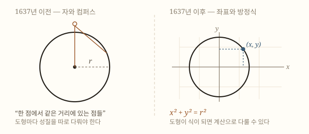

# 해석기하

> 도형에 주소를 붙인 사건이다. 점마다 두 개의 수를 매기는 순간 **기하 문제가 방정식 문제로 번역**되었고, 그 번역이 없었다면 미적분도 나올 수 없었다.

## TL;DR

- 1637년 [[르네 데카르트]]가 『방법서설』의 부록 『기하학』에서 곡선을 방정식으로 다루는 방법을 내놓았다[1].
- 같은 시기 [[피에르 드 페르마]]도 독자적으로 도달했으나 **출판하지 않았다**[5].
- 핵심은 좌표 자체가 아니라 **기하와 대수 사이의 번역 사전**을 만든 것이다[3].
- 이 번역 덕분에 문제를 **분류**할 수 있게 되었고, **작도 가능성**을 차수로 따질 수 있게 되었으며, 다룰 수 있는 곡선의 범위가 폭발적으로 넓어졌다[1][2].
- 오늘날의 좌표평면(직교 두 축·음수·사분면)은 데카르트의 것이 아니라 **후대가 다듬은 것**이다[2].
- 곡선이 식이 되자 **접선을 계산으로 구할 수 있게 되었다** — [[미분법]]의 전제 조건이다[8].

## 1. 그전에는 어떻게 했나

1600년의 기하학은 [[유클리드]]의 것이었다. 도형은 **자와 컴퍼스로 그리는 것**이고, 그 성질은 그림 위에서 논증으로 밝히는 것이었다.

이 방식에는 두 가지 한계가 있었다.

**첫째, 도형마다 따로였다.** 원의 성질을 다루는 정리와 포물선의 성질을 다루는 정리 사이에 공통의 언어가 없었다. 겉보기에 비슷한 두 문제가 실제로 같은 문제인지 알아볼 방법이 없었다[3].

**둘째, 다룰 수 있는 곡선이 제한적이었다.** 자와 컴퍼스로 그릴 수 있는 것, 그리고 원뿔을 잘라 얻는 것 정도가 전부였다. 그 밖의 곡선은 "기계적 곡선"이라 불리며 정통 기하학의 대상에서 밀려나 있었다[1].

## 2. 번역이라는 발상

데카르트가 한 일은 **사전을 만든 것**이다.

평면에 기준선을 하나 긋고, 어떤 점의 위치를 기준선까지의 거리 두 개로 나타낸다. 그러면 점은 두 수의 짝 $(x, y)$가 되고, **점들이 모여 만드는 곡선은 $x$와 $y$ 사이의 관계식**이 된다[4].

원을 예로 들면 이렇다.

| | 기하의 언어 | 대수의 언어 |
|---|---|---|
| 정의 | 한 점에서 같은 거리에 있는 점들의 모임 | $x^2 + y^2 = r^2$ |
| 성질을 밝히는 법 | 그림 위에서 논증 | 식을 변형 |
| 다른 도형과의 비교 | 어렵다 | **차수와 형태로 분류** |

오른쪽 열이 생긴 순간, 기하학은 **계산의 대상**이 되었다.

## 3. 무엇이 가능해졌나

데카르트 본인의 표현이 정확하다. 대수는 **"기하학의 옷을 입고 있을 때는 관련 없어 보이는 문제들을 한데 묶어"** 준다[6].

구체적으로 세 가지가 열렸다[1][3].

**분류가 가능해졌다.** 방정식의 차수로 곡선을 등급 지을 수 있다. 1차는 직선, 2차는 원뿔곡선, 3차 이상은 그 위의 등급. 겉모습이 아니라 구조로 나누는 기준이 처음 생긴 것이다.

**판정이 가능해졌다.** 어떤 도형을 자와 컴퍼스로 작도할 수 있는가 — 2천 년 동안 시도로만 답하던 질문이 **방정식의 성질을 따지는 문제**로 바뀌었다. 훗날 각의 삼등분과 배적 문제가 불가능함을 증명하는 길이 여기서 열린다.

**대상이 넓어졌다.** 그릴 수 있는 것만이 아니라 **식으로 쓸 수 있는 모든 것**이 기하학에 들어왔다. 곡선의 목록이 갑자기 무한해졌다.

## 4. 페르마도 거기 있었다

같은 시기 툴루즈의 법관 페르마도 좌표에 도달해 있었다. 경로는 달랐다 — 그는 아폴로니오스의 **잃어버린 저작 『평면 궤적』을 복원**하려다 1629년 무렵 이 방법에 이르렀다[5].

두 사람의 차이는 실력이 아니라 **출판**이었다. 페르마는 원고를 회람만 시켰고 데카르트는 책으로 냈다. 오늘날 좌표에 데카르트의 이름이 붙은 이유다.

두 사람은 **접선을 구하는 방법**을 두고 몇 해를 다퉜다. 페르마의 방법이 더 간결했는데 데카르트가 인정하려 하지 않았고, 결국 인정한 뒤에도 사적으로 그의 평판을 깎았다[6]. 자세한 것은 [[피에르 드 페르마]]에 있다.

## 5. 데카르트의 좌표는 우리 것과 달랐다

여기서 흔한 오해를 짚어야 한다. **『기하학』에 오늘날의 좌표평면은 나오지 않는다.**

| | 데카르트(1637) | 오늘날 |
|---|---|---|
| 축 | 기준선 하나. 둘째 축은 명시하지 않음 | $x$축·$y$축 둘 다 |
| 직교 | 반드시 직각일 필요 없음 | 직교가 표준 |
| 음수 | 음의 좌표를 다루지 않음 | 사분면 전부 |
| 목적 | **곡선을 식으로 바꾸는 것** | 점의 위치를 나타내는 것 |

마지막 줄이 핵심이다. 그의 관심은 **점의 위치 표시가 아니라 기하 문제의 번역**이었다. 좌표는 목적이 아니라 수단이었다.

오늘날의 형태는 데카르트 이후 여러 사람의 손을 거쳐 다듬어졌다[2]. 그런데도 그의 이름이 붙은 것은, **방향을 정한 사람이 그였기 때문**이다.

## 6. 원뿔곡선이 한 가족이 되다

번역이 낳은 결과 가운데 교실에서 가장 잘 보이는 것이 이것이다.

고대 그리스에서 원·타원·포물선·쌍곡선은 **원뿔을 자르는 각도**로 구분됐다. 아폴로니오스가 정리한 이 분류는 정교했지만, 네 곡선을 하나의 대상으로 볼 방법이 없었다. 각각의 성질을 각각의 방법으로 밝혀야 했다[7].

좌표로 옮기면 사정이 달라진다. 네 곡선이 전부 **$x$와 $y$에 관한 2차식** 하나로 쓰인다.

$$Ax^2 + Bxy + Cy^2 + Dx + Ey + F = 0$$

계수를 어떻게 잡느냐에 따라 원이 되고 타원이 되고 포물선이 되고 쌍곡선이 된다. **네 개의 도형이 아니라 하나의 식이 가진 네 가지 모습**이었던 것이다.

이 통합이 왜 중요한가. 첫째, **한 번 증명하면 네 경우에 다 쓸 수 있다.** 둘째, 어떤 곡선이 어느 종류인지를 계수만 보고 판정할 수 있다. 셋째, 원뿔을 자르는 그림 없이도 이야기가 진행된다 — 즉 **3차원 직관에 기대지 않고 평면 위의 계산만으로** 다룰 수 있다.

고등학교 교과에서 원뿔곡선 단원이 좌표 위에서 진행되는 것은 이 성과를 그대로 물려받은 것이다.

## 7. 좌표는 평면에만 있지 않다

데카르트의 발상에는 확장성이 있었다. 점을 두 수로 나타냈다면, **세 수로 나타내지 못할 이유가 없다.**

$(x, y, z)$로 공간의 점을 나타내면 3차원 도형도 방정식이 된다. 구는 $x^2+y^2+z^2=r^2$이 되고, 평면은 1차식이 된다. 기하학이 종이 밖으로 나가는 순간이다.

그리고 여기서 멈출 이유도 없다. **네 개, 다섯 개, $n$개의 수로 점을 나타내면 $n$차원 공간이 된다.** 그릴 수는 없지만 계산할 수는 있다. 우리가 상상할 수 없는 공간을 다룰 수 있게 된 것은 좌표가 도형을 **그림에서 식으로 옮겨 놓았기 때문**이다.

오늘날 데이터를 다루는 방식이 정확히 이것이다. 특성이 100개인 데이터는 100차원 공간의 한 점이고, 두 데이터가 얼마나 비슷한지는 그 공간에서의 거리로 잰다. **17세기에 기하 문제를 풀려고 만든 장치가 오늘날 기계학습의 기본 언어**가 되어 있다.

데카르트는 이런 쓰임을 예상하지 않았을 것이다. 그러나 그가 만든 것이 **도형과 수 사이의 다리**였기 때문에, 다리 저편에 무엇이 오든 건널 수 있었다.

## 8. 같은 세기의 다른 길 — 사영기하

17세기 기하학이 좌표 하나로만 간 것은 아니다. **두 갈래로 갈라졌다.**

한쪽은 데카르트의 길 — 도형을 **좌표로 옮겨 계산**한다. 다른 한쪽은 데자르그와 [[블레즈 파스칼]]의 길 — **변하지 않는 것이 무엇인가**를 묻는다[7].

사영기하학은 그림자를 드리워도 살아남는 성질을 다룬다. 원을 비스듬히 비추면 타원이 되고 더 기울이면 포물선이 되지만, 어떤 관계는 그대로다. 열여섯 살 파스칼이 내놓은 정리 — 원뿔곡선에 내접한 육각형의 세 교점이 한 직선 위에 있다 — 가 그런 성질이다.

| | 해석기하 | 사영기하 |
|---|---|---|
| 묻는 것 | 이 도형을 어떻게 계산하나 | 무엇이 변하지 않나 |
| 도구 | 좌표와 방정식 | 사영과 불변량 |
| 17세기 인물 | 데카르트, 페르마 | 데자르그, 파스칼 |
| 당대의 인기 | 곧바로 주류 | 거의 잊혔다가 19세기에 부활 |

**두 길 모두 오늘날까지 남았다.** 다만 학교 교과에 들어온 것은 앞의 길이고, 그래서 우리는 기하학이라 하면 자동으로 좌표를 떠올린다. 17세기에는 그것이 당연하지 않았다.

## 9. 표기가 함께 정리되었다

『기하학』이 남긴 또 하나는 **기호 관행**이다[9].

- 미지수는 알파벳 뒤쪽 $x, y, z$
- 이미 아는 값은 앞쪽 $a, b, c$
- 거듭제곱은 $x^3$ 형태의 지수 표기

사소해 보이지만 그렇지 않다. 그 이전에는 방정식을 문장으로 쓰거나 사람마다 다른 기호를 썼다. **아는 것과 모르는 것을 한눈에 구분하는 관행**이 정착하면서 식을 다루는 속도가 달라졌다.

17세기가 표기를 두 번 정리한 세기라는 점도 함께 기억할 만하다. 대수 쪽은 데카르트가, 미적분 쪽은 [[고트프리트 라이프니츠]]가 했다. **좋은 기호는 사고를 절약한다.**

## 10. 그리고 미적분이 가능해졌다

해석기하가 수학사에서 결정적인 진짜 이유는 여기 있다.

곡선이 방정식으로 주어지면 **그 곡선의 접선을 계산으로 구할 수 있다.** 그림을 그리고 눈대중으로 대는 것이 아니라, 식을 조작해서 답을 얻는다.

페르마의 극대·극소 방법이 바로 이 위에서 작동했다. $f(x+e)$와 $f(x)$를 비교하려면 애초에 $f$가 식으로 있어야 한다[8].

**순서가 우연이 아니다.**

| 순서 | 사건 | 연도 |
|---|---|---|
| 1 | 곡선을 식으로 쓰는 법 — 해석기하 | 1637 [1] |
| 2 | 식에서 접선을 뽑는 절차 — 페르마 | 1630년대 [5] |
| 3 | 절차를 체계로 — 뉴턴·라이프니츠 | 1665~1684 [8] |

해석기하가 1번이 아니었다면 2번도 3번도 없었다. [[17세기]]가 이 세 단계를 한 세기에 통과한 셈이다.

## 11. 아직 없었던 것 — 함수와 그래프

여기서 한 가지 더 짚어야 한다. 우리는 좌표평면을 떠올릴 때 자동으로 **함수의 그래프**를 생각한다. $y = f(x)$를 그리는 그 화면이다. 그런데 **데카르트에게는 함수 개념이 없었다.**

『기하학』에서 방정식은 **곡선을 규정하는 조건**이었다. $x^2+y^2=r^2$은 "이 조건을 만족하는 점들의 모임이 원이다"라는 뜻이지, "$x$를 넣으면 $y$가 나온다"는 뜻이 아니었다[3]. 입력과 출력이라는 관점 자체가 아직 없었다.

함수라는 말과 개념이 자리 잡는 것은 라이프니츠 이후이고, $y=f(x)$ 표기와 **그래프라는 사고방식**이 오늘날의 형태로 정착하는 것은 18세기 오일러에 이르러서다.

| 시기 | 좌표를 무엇으로 봤나 |
|---|---|
| 1637 데카르트 | 곡선을 규정하는 **조건식** [3] |
| 17세기 후반 | 곡선 위 점의 위치를 다루는 도구 |
| 18세기 오일러 | **함수의 그래프** — 입력에서 출력으로의 대응을 그린 것 |

**이 구분이 교실에서 은근히 중요하다.** 학생들은 방정식과 함수를 자주 뒤섞는다. $x^2+y^2=1$은 함수가 아닌데도 좌표평면에 그려지고, 그것이 왜 함수가 아닌지를 설명하려면 결국 "조건식으로서의 곡선"과 "대응으로서의 함수"를 나눠야 한다. **역사가 그 둘을 실제로 나눠서 발전시켰다**는 사실은 이 설명을 훨씬 자연스럽게 만들어 준다.

## 12. 이름이 데카르트에게 붙은 이유

정리해 보면 데카르트가 하지 않은 것이 꽤 많다. 두 축을 명시하지 않았고, 음수를 다루지 않았고, 함수 개념도 그래프 개념도 없었다[2][3].

그런데도 좌표에 그의 이름이 붙는다. 이유는 **그가 방향을 정했기 때문**이다.

수학사에서 이런 경우는 반복된다. 파스칼의 삼각형은 파스칼이 발견한 것이 아니고, 미적분의 기본정리는 뉴턴 이전에 [[아이작 배로]]가 증명했다. **이름이 붙는 기준은 "처음 한 사람"이 아니라 "그것으로 무엇을 할 수 있는지 보여준 사람"**에 가깝다.

발견과 정착 사이의 이 간격을 알아두면, 수학사를 위인들의 연표로 읽는 습관에서 조금 벗어날 수 있다.

## 13. 지금 교실에서

고등학교에서 좌표평면을 배울 때 이 역사가 거의 언급되지 않는다. 그래서 좌표는 **원래부터 있던 것**처럼 느껴진다.

실제로는 그렇지 않다. 좌표는 **기하 문제를 대수로 번역하려는 목적을 위해 만들어진 장치**이고, 오늘날의 형태를 갖추는 데 200년 가까이 걸렸다[2].

교과서가 좌표를 도입하는 방식도 역사와 반대다. 교과서는 **"평면 위의 점을 나타내는 방법"**으로 좌표를 소개한다. 위치 표시가 먼저고 도형이 나중이다. 데카르트는 정반대였다 — **도형을 다루기 위한 수단**으로 좌표를 끌어들였고, 위치 표시는 그 부산물이었다[3].

어느 쪽이 교육적으로 나은지는 별개 문제다. 다만 학생이 "좌표는 알겠는데 이걸 왜 배우나"라고 물을 때, **원래 목적이 무엇이었는지**를 알려주면 답이 된다. 좌표는 지도를 그리려고 만든 것이 아니라 **기하 문제를 계산으로 바꾸려고** 만든 것이다.

이 사실을 알면 달라지는 것이 있다. 좌표평면 단원에서 계속 나오는 질문 — 원의 방정식, 직선과 원의 위치 관계, 두 점 사이의 거리 — 이 전부 **"기하 문제를 식으로 푼다"는 하나의 방법론**의 사례라는 것이 보인다. 서로 무관한 공식의 나열이 아니다.

## 14. 수업에서 쓸 만한 대목

**"좌표는 왜 필요한가"**를 먼저 물어보는 것이 효과적이다. 좌표 없이 원을 정의해 보라고 하면 학생들은 "한 점에서 같은 거리"라고 답한다. 그다음 "그럼 그 원과 직선이 만나는지 어떻게 확인하나"를 물으면 곧바로 막힌다. **식이 있어야 계산이 된다**는 것을 스스로 느낀다.

**데카르트의 좌표가 오늘날과 달랐다는 사실**도 유용하다. 음수 좌표가 없었다는 것 — 완성된 형태로만 배우는 학생에게, 개념이 다듬어지는 과정이 있었다는 감각을 준다.

**페르마도 같은 시기에 도달했다**는 이야기는 우선권 주제로 이어진다. 출판하지 않으면 이름이 남지 않는다는 것, 그리고 그것이 공정한지 — 학생들과 이야기해 볼 만한 주제다.

**원뿔곡선 단원과 묶어 쓰면 효과가 크다.** 원·타원·포물선·쌍곡선을 따로 외우는 학생에게, 넷이 하나의 2차식에서 나온 형제라는 것을 보여주면 단원 전체가 다르게 보인다. 고대에는 원뿔을 자르는 각도로 구분하던 것을 좌표가 계수 하나로 통합했다는 이야기까지 붙이면, 왜 좌표로 다루는지가 설명된다.

## 한눈 요약

| 항목 | 내용 |
|---|---|
| 언제 | 1637년 (페르마는 1629년경 독자 도달, 미출판) |
| 누가 | 데카르트, 페르마 |
| 무엇을 | 곡선을 $x, y$의 관계식으로 번역 |
| 왜 중요한가 | 문제 분류·작도 판정·곡선 확장, 그리고 **미적분의 전제** |
| 오해 | 오늘날의 좌표평면은 데카르트의 것이 아니다 |

## 더 읽을 것

- [[르네 데카르트]] — 방향을 정한 사람
- [[피에르 드 페르마]] — 같은 곳에 먼저 도달했으나 출판하지 않은 사람
- [[미분법]] — 해석기하 위에서 벌어진 다음 사건
- [[17세기]] — 이 개념이 놓인 세기
- [[데카르트와 천장의 파리]] — 근거가 확인되지 않는 유명한 이야기
