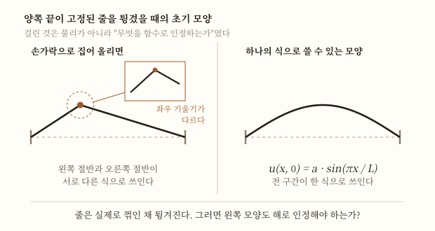

# 미분방정식 확장편

> [[미분방정식]] 이해편은 이 도구가 자연을 쓰는 문법이 되는 데까지 갔다.
>
> 이 문서는 그 문법이 **자기가 쓰는 말의 뜻을 몰랐다**는 것을 발견하는 이야기다. 진동하는 현 하나가 함수라는 개념을 바꿔 놓는다.

## TL;DR

- 1746년 달랑베르가 진동하는 현을 파동방정식으로 다뤘다[9]. 문제는 방정식이 아니라 **그 해가 무엇이어야 하는가**였다.
- 이 물음이 **달랑베르와 오일러의 다툼거리**가 됐다[10]. 함수의 본성과 표현을 둘러싼 문제였다.
- 오일러는 1748년에 함수를 **"해석적 표현"**으로 정의했다가[10], **1755년에 스스로 넓혔다** — 함께 변하면 함수라고[10].
- 1822년 **푸리에**가 판을 뒤집었다. 연속도 아니고 식으로 주어지지도 않은 함수를 급수로 쓸 수 있다고 주장했다[10].
- 루진의 진단 — 오해의 근원은 **함수와 그 해석적 표현을 같은 것으로 혼동한 데** 있었다[10].
- **1837년 디리클레**가 대응 관계만으로 함수를 정의한 것으로 **전통적으로 알려져 있다**[10]. 로바쳅스키(1834)와 공동으로 꼽히고, 라카토시의 반박도 함께 있다[10].
- 같은 세기에 **오일러-라그랑주 방정식**이 나온다. 최적화 문제를 미분방정식으로 바꾸는 장치다[11].
- **라플라스 변환**은 선형 상미분방정식을 대수방정식으로 바꾼다[5]. 어려운 문제를 쉬운 자리로 옮겨 푸는 방식이다.
- 19세기는 **해가 있기는 한가**를 묻는다. 립시츠 조건이 존재와 유일성을 보장한다[12].
- 1889년 **푸앵카레** — 3체 문제에는 더 이상 해석적 보존량이 없고, 대부분의 초기조건에서 계가 혼돈적이다[13].

## 1. 이해편이 남긴 다툼

이해편 §9는 이렇게 끝났다 — 진동하는 현의 해가 무엇이어야 하는가를 두고 달랑베르와 오일러가 갈렸고, 그 다툼이 함수라는 개념을 흔들었다고.

여기서 그것을 따라간다. 그리고 이 문서가 다루는 것은 셋이다.

| 물음 | 언제 답해지나 |
|---|---|
| **어떤 것이 해가 될 수 있는가** — 함수란 무엇인가 | 18세기 다툼 → 1837년 디리클레(§3~§9) |
| **어떻게 푸는가** — 최적화와 변환이라는 두 우회로 | 18~19세기(§10~§11) |
| **해가 있기는 한가, 있어도 알 수 있는가** | 19세기(§12~§13) |

셋 다 미분방정식을 **쓰다가** 생긴 물음이다. 미분방정식이 자연 현상을 식으로 옮겨 모델링하는 방법[1]으로 출발했다는 것을 생각하면 순서가 거꾸로다 — **응용에서 출발한 도구가 기초를 되묻게 만들었다.**

특히 첫째가 특이하다. **함수는 미분방정식보다 앞선 개념인데**, 미분방정식을 풀려다 그 정의가 바뀌었다.

## 2. 진동하는 현 — 문제 자체

양쪽 끝이 고정된 줄을 튕기면 어떻게 움직이는가.

줄의 각 지점이 위아래로 움직이므로, 미지 함수는 **위치와 시간 둘 다에 의존한다** — $u(x, t)$. 그러니 이것은 편미분방정식이고, 이해편 §3에서 갈라 둔 PDE 쪽이다.

줄의 한 점이 위로 얼마나 빨리 움직이는가는 **시간에 대한 변화율**이고, 그 점 근처에서 줄이 얼마나 휘어 있는가는 **위치에 대한 변화율**이다. 둘 다 필요하니 편도함수가 등장하고, 그래서 이것은 편미분방정식이 된다[4].

$$\frac{\partial^2 u}{\partial t^2} = c^2 \frac{\partial^2 u}{\partial x^2}$$

읽는 법은 이렇다 — **가속도(왼쪽)가 휘어진 정도(오른쪽)에 비례한다.** 많이 휜 자리일수록 세게 되돌아온다는 뜻이고, 팽팽한 줄이 실제로 그렇게 행동한다. 미분이 순간적인 움직임을 서술하는 도구라는 것[14]이 여기서 두 방향으로 쓰인 것이다.

**1746년 [[장 르 롱 달랑베르]]가 1차원 파동방정식을 얻었다**[9]. 그리고 진동하는 현의 운동은 달랑베르뿐 아니라 **오일러·다니엘 베르누이·라그랑주가 함께 연구한** 문제가 된다[9].

네 사람이 달라붙었다는 것 자체가 이 문제의 성격을 말해 준다. 방정식은 나왔는데 **답이 합의되지 않았다.**

## 3. 걸린 것은 "어떤 함수가 해가 될 수 있는가"

다툼의 뿌리는 물리가 아니라 수학이었다.

줄을 튕기는 방법을 생각해 보자. **손가락으로 한 점을 집어 올렸다 놓으면** 초기 모양은 **뾰족한 삼각형**이다. 그 점에서 꺾여 있다.

이런 모양이 **함수인가**. 오늘날에는 당연히 그렇다고 답한다. 그러나 18세기에는 그렇지 않았다.

이 물음 — 함수의 본성과 표현을 둘러싼 물음 — 이 **파동방정식의 해에서 비롯해 달랑베르와 오일러 사이의 다툼거리가 됐다**[10].

<figure>

<figcaption>왼쪽은 손가락으로 한 점을 집어 올린 모양이다. 그 점에서 <strong>좌우 기울기가 다르므로</strong> 왼쪽 절반과 오른쪽 절반이 서로 다른 식으로 쓰인다. 오른쪽은 전 구간이 한 식으로 쓰이는 모양이다. <strong>줄은 실제로 왼쪽처럼 튕겨진다.</strong> 그러면 그것도 해로 인정해야 하는가 — 이것이 걸린 물음이었다[10]. 인용한 자료는 누가 어느 쪽을 들었는지까지는 말하지 않는다[10].</figcaption>
</figure>

## 4. 오일러의 1748년 정의 — 식으로 쓸 수 있어야 함수다

무엇이 걸렸는지는 당시의 정의를 보면 안다. 오일러는 1748년 『무한해석 입문』에서 함수를 이렇게 정의했다.

> **"변수인 양과 수 또는 상수인 양으로 어떻게든 구성된 해석적 표현"**[10]

핵심은 **해석적 표현**이다. 하나의 식으로 쓸 수 있어야 함수라는 것이다. $\sin x$ 도 $x^2 + 3$ 도 함수다. 그런데 **꺾인 삼각형**은 어떤가. 왼쪽 절반과 오른쪽 절반을 서로 다른 식으로 써야 한다면, 그것은 **함수 하나인가 둘인가.**

여기가 다툼의 정확한 지점이다.

| 걸린 물음 | 왜 답이 갈리나 |
|---|---|
| 해는 하나의 해석적 표현이어야 하는가 | 그래야 미분해서 방정식에 넣을 수 있다 |
| 물리적으로 가능한 모양이면 해로 인정해야 하는가 | 줄은 실제로 꺾인 채 튕겨진다 |

**두 물음이 정면으로 부딪혔다.** 인용한 자료는 이 다툼이 달랑베르와 오일러 사이의 것이었다는 데까지 말하고, **누가 어느 쪽을 들었는지는 말하지 않는다**[10]. 그래서 이 문서도 귀속하지 않는다.

## 5. 오일러가 자기 정의를 고치다 — 1755

이 다툼의 흥미로운 결말은 **오일러가 자기 정의를 바꿨다**는 것이다.

1755년 저작에서 그는 이렇게 다시 쓴다.

> **"어떤 양들이 다른 양들에 의존해 그것들이 변할 때 함께 변한다면, 앞의 것을 뒤의 것의 함수라 부른다"**[10]

**해석적 표현이라는 말이 사라졌다.** 의존해서 함께 변하기만 하면 함수다. 오늘날의 정의에 한 걸음 다가선 것이고, 그 걸음을 밀어낸 것이 진동하는 현이었다.

**미분방정식을 풀려다 함수의 정의가 바뀐 것이다.** 도구를 쓰려다 도구를 쥔 손을 다시 만든 셈이다.

## 6. 삼각급수라는 세 번째 길

이 문제를 다룬 세 사람 — **오일러·달랑베르·다니엘 베르누이** — 은 뒤에 푸리에가 할 일의 예비적 연구를 한 셈이 됐다[15]. 실제로 **푸리에 이전에 비슷한 삼각급수를 쓴 사람으로 오일러·달랑베르·다니엘 베르누이·가우스가 꼽힌다**[15].

줄의 진동을 **여러 단순한 진동의 합**으로 보는 방식이다. 기본음과 배음을 겹쳐 놓는 것이고, 악기의 소리를 생각하면 물리적으로 자연스럽다.

그런데 이 방식은 §4의 물음을 더 날카롭게 만든다. **꺾인 삼각형을 매끄러운 삼각함수들의 합으로 쓸 수 있다면**, 각 항은 무한히 매끄러운데 합은 꺾이는 셈이다.

- 합이 각 항의 성질을 물려받지 않는다면, "해석적 표현"이라는 기준은 무엇을 걸러 내는가.
- 무한히 더한 결과를 하나의 표현으로 볼 것인가 아닌가.

**둘째 물음은 [[무한급수 확장편]]이 다룬 것과 같은 종류다** — 유한에서 참인 것이 무한으로 옮겨 갈 때 무엇이 보장되는가. 진동하는 현은 그 물음을 함수 개념 쪽에서 다시 물은 셈이다.

### 왜 하필 삼각함수였나 — 변수분리

삼각함수가 나온 것은 취향이 아니라 방법의 결과다.

이해편 §7의 **변수분리**를 편미분방정식에 쓰면 이렇게 된다. 해가 **위치만의 함수와 시간만의 함수의 곱** $u(x,t) = X(x)\,T(t)$ 이라고 놓고 파동방정식에 넣은 뒤 **양변을 $XT$ 로 나누면**, 좌변은 $t$ 만의 식이 되고 우변은 $x$ 만의 식이 된다. 서로 다른 변수의 식이 항상 같으려면 **둘 다 상수**여야 한다.

그러면 편미분방정식 하나가 **상미분방정식 두 개**로 쪼개진다. 그리고 양 끝이 고정됐다는 조건 아래 $X$ 에 대한 방정식이 내놓는 답이 **사인 함수들**이다.

$$X_n(x) = \sin\frac{n\pi x}{L}, \qquad n = 1, 2, 3, \dots$$

**$n$ 마다 하나씩, 답이 무한히 많다.** 그리고 방정식이 선형이므로[3] 이 해들을 더한 것도 해다. §6이 말한 "여러 단순한 진동의 합"이 여기서 나온다 — **자연스러운 발상이 아니라 방법이 강제한 형태**였다.

이해편에서 변수분리를 "가장 먼저 배우는 방법"[2]이라 적었는데, PDE 에서는 그 이상이다. **편미분방정식을 다루는 표준 전략**이고, 삼각급수가 해석학의 중심에 놓이게 된 통로다.

## 7. 푸리에가 판을 뒤집다 — 1822

반세기 뒤, 열의 흐름을 연구하던 **[[조제프 푸리에]]**가 같은 도구를 들고 나온다.

그는 열전도를 연구해 **1807년 『열의 해석적 이론』을 제출하고 1822년에 완성했으며**[6], 그 책이 담은 것이 **열방정식**이다[9].

그리고 훨씬 센 주장을 했다 — **임의의 함수를 삼각급수로 나타낼 수 있다**는 것이다[10]. 그는 **연속이지도 않고 해석적 표현으로 주어지지도 않은 함수까지 포함하는 일반적인 함수관**을 갖고 있었다[10].

§6에서 본 삼각급수 — 오일러·달랑베르·다니엘 베르누이가 진동하는 현에 이미 쓰고 있던 그 도구가[15] — 열에 대해 훨씬 강한 형태의 주장으로 돌아온 것이다.

## 8. 루진의 진단 — 두 개념을 혼동하고 있었다

18세기의 다툼이 왜 풀리지 않았는지에 대한 가장 명료한 진단은 후대에 나온다.

> 근대적인 함수 이해는 **푸리에의 발견 이후에야 나올 수 있었다.** 그의 발견은 오해의 대부분이 **겉보기에는 같아 보이지만 실은 전혀 다른 두 개념 — 함수, 그리고 그 함수의 해석적 표현 — 을 혼동한 결과**였음을 분명히 보여주었다[10].

이 한 문장이 §3~§6 전체를 설명한다.

- **함수**는 대응이다. 무엇이 무엇에 대응하는가.
- **해석적 표현**은 그 대응을 적는 방식이다.

18세기는 둘을 같은 것으로 봤다. 그래서 "꺾인 것도 함수인가"라는 물음이 **"꺾인 것을 하나의 식으로 쓸 수 있는가"**와 구별되지 않았다.

**두 물음을 갈라 놓자 다툼이 사라진다.** 꺾인 것도 함수이고(첫째 물음), 그것을 하나의 삼각급수로 쓸 수 있는지는 별개의 문제다(둘째 물음). 그리고 푸리에의 답은 "쓸 수 있다"였다.

이 구분이 왜 그렇게 늦게 왔는지도 짚어 둘 만하다. **18세기에는 함수를 만나는 통로가 식뿐이었다.** 곡선을 그려도 그것을 다루려면 식으로 옮겨야 했고, 식이 없으면 계산할 방법이 없었다. 표현이 곧 대상이었으니 둘을 구별할 이유가 없었던 것이다.

그것이 깨진 계기가 **물리에서 온 요구**였다는 점이 이 이야기의 핵심이다. 줄은 실제로 꺾인 모양으로 튕겨진다. 수학이 그것을 다룰 수 없다면 고쳐야 할 쪽은 줄이 아니라 수학이었다.

**개념이 안에서 정교해진 것이 아니라 밖에서 밀려 바뀌었다.**

## 9. 디리클레 — 오늘날의 정의

**1837년 [[페터 구스타프 르죈 디리클레]]**가 함수를 해석적 표현 없이 대응 관계만으로 정의한 것으로 **전통적으로 알려져 있다**[10].

다만 인용한 자료는 두 가지를 함께 적어 둔다. 하나는 같은 정의를 **로바쳅스키가 1834년에 독립적으로** 냈다는 것이고[10], 다른 하나는 **라카토시의 반박** — "디리클레의 저작에 그런 정의는 전혀 없다. 오히려 그가 이 개념을 갖고 있지 않았다는 증거가 충분하다"는 것이다[10]. 실제로 디리클레의 1837년 진술이 정의하는 것은 **연속함수**다[10].

**오늘날의 정의가 한 사람의 한 문장에서 튀어나온 것이 아니라는 뜻**이고, 그 점이 §3~§8이 그린 경로와 오히려 잘 맞는다. 그리고 이 정의가 나오기까지의 경로를 되짚으면 이렇게 된다.

| 시기 | 정의 | 밀어낸 것 |
|---|---|---|
| 1748 | 해석적 표현[10] | — |
| 1755 | 의존해서 함께 변하는 것[10] | 진동하는 현 |
| 1822 | (푸리에) 연속·해석적 표현 불요[10] | 열의 흐름 |
| **1837** | **대응 관계 — 로바쳅스키(1834)와 함께, 전통적 귀속**[10] | 위 전부 |

**함수라는 가장 기본적인 개념이 미분방정식을 푸는 과정에서 세 번 고쳐졌다.** 기초가 응용을 뒤따라온 것이고, [[무한급수 확장편]]과 [[확률론 확장편]]이 각각 다른 갈래에서 보인 것과 같은 구조다.

## 10. 최적화를 미분방정식으로 — 오일러-라그랑주

같은 세기에 다른 갈래가 하나 더 열린다.

**오일러-라그랑주 방정식**은 **주어진 작용 범함수의 정류점을 해로 갖는 2계 상미분방정식계**다[11]. 말을 풀면 이렇다 — 보통 미적분에서 도함수가 0인 곳을 찾아 최댓값·최솟값을 구하듯이, **함수 전체를 후보로 놓고 그중 최적인 것을 찾는** 문제를 미분방정식으로 바꾼다.

**1750년대에 오일러와 라그랑주가 등시곡선 문제를 연구하다 이 방정식에 이르렀다**[11]. 라그랑주가 **1755년에 그 문제를 풀어 오일러에게 보냈고**, 두 사람은 이 방법을 역학으로 확장해 라그랑주 역학을 만든다[11]. **'변분법'이라는 이름은 1766년 오일러가 붙였다**[11].

여기서 이해편 §9의 라그랑주가 설명된다. 『해석 역학』(1788)이 그림 없이 역학을 다시 쓸 수 있었던 것은, **역학 문제를 "무엇을 최소로 만드는 경로인가"로 바꿔 놓으면 나머지가 기계적으로 따라오기 때문**이다. 고전역학에서 **해밀턴의 정류작용 원리에 따르면 물리계의 전개는 그 계의 작용에 대한 오일러 방정식의 해로 서술된다**[11].

**"자연은 무언가를 최소로 만든다"는 원리 하나에서 운동방정식이 나온다.** 이것이 18세기가 물려준 물리학의 형식이다.

## 11. 라플라스 변환 — 어려운 자리를 쉬운 자리로 옮긴다

푸는 기술 쪽에서도 큰 것이 나온다.

**라플라스 변환은 선형 상미분방정식을 대수방정식으로 바꾼다**[5]. 그리고 절차는 이렇다 — **비교적 풀기 쉬운 대수방정식의 해를 구한 뒤 역변환으로 되돌리면 미분방정식의 해를 얻는다**[5].

발상이 흥미롭다. 문제를 **직접 풀지 않고 다른 세계로 옮겨** 푼다.

| | 원래 세계 | 옮긴 세계 |
|---|---|---|
| 대상 | 시간의 함수 | 변수 $s$ 의 함수 |
| 미분 | 어렵다 | **곱셈이 된다** |
| 푸는 법 | 미분방정식 | 대수방정식[5] |

미분이 곱셈으로 바뀐다는 것이 핵심이다. 로그가 곱셈을 덧셈으로 바꿔 계산을 쉽게 만든 것과 같은 종류의 이동이다.

**선형 상미분방정식에 대해 성립하는 성질**이라는 점도 함께 알아 둘 것이다[5]. 미분방정식이 선형이라는 것은 **미지 함수와 그 미분들에 대해 일차**라는 뜻이다[3].

### 선형이라는 조건이 왜 그렇게 자주 붙는가

이 문서에서 "선형"이 반복해서 나온 것을 눈치챘을 것이다. §6의 중첩, §11의 라플라스 변환이 모두 이 조건 아래 있다. 이유는 하나다.

**선형이면 해를 더할 수 있다.** 두 해를 더한 것도 해이고, 상수배 한 것도 해다. 그러면 이런 일이 가능해진다.

| 선형일 때 | 비선형일 때 |
|---|---|
| 단순한 해들을 찾아 **더해서** 일반해를 만든다 | 못 더한다 — 부분의 합이 전체가 아니다 |
| 변수분리 → 삼각급수(§6) | 이 통로가 막힌다 |
| 라플라스 변환으로 대수화[5] | 쓸 수 없다 |
| 겹쳐진 파동이 서로를 통과한다 | 서로를 바꿔 놓는다 |

**18~19세기가 이룬 것의 상당 부분이 선형 방정식의 성취다.** 파동·열·전자기 — 이 세기의 대표적 성공이 전부 선형이었고, 그래서 위의 도구들이 통했다.

그리고 여기가 §13으로 이어지는 자리다. **3체 문제는 비선형이다.** 중력은 거리의 제곱에 반비례하므로 위치에 대해 일차가 아니고, 그래서 더하기가 통하지 않는다. 두 물체 문제의 해를 아무리 잘 알아도 **세 물체 문제를 그 합으로 만들 수 없다.**

**선형 세계에서 쓰던 모든 도구가 문턱에서 멈춘다.** 그 문턱 너머가 다음 절이다.

## 12. 해가 있기는 한가 — 19세기의 물음

18세기는 방정식을 세우고 풀었다. 19세기는 그 앞의 물음을 묻는다. **애초에 해가 있는가. 있다면 하나뿐인가.**

이해편 §6에서 뉴턴이 이미 **해가 유일하지 않을 수 있다**는 것을 논의했다고 적었다[9]. 그 물음이 정리로 답해진다.

**초기값 문제 $y'(t) = f(t, y(t))$, $y(t_0) = y_0$ 에서, $f$ 가 $t$ 에 대해 연속이고 $y$ 에 대해 립시츠 연속이면 해가 존재하고 유일하다**[12]. 이 정리에는 **피카르·린델뢰프·립시츠·코시**의 이름이 함께 붙는다[12].

립시츠 조건이 왜 필요한지는 반례가 보여준다. $\dfrac{dy}{dt} = a y^{2/3}$, $y(0) = 0$ 을 보자. 이 방정식은 **해가 여럿이다** — $y(t) = 0$ 도 해이고, $t<0$ 에서 $(at/3)^3$ 이고 $t \ge 0$ 에서 0인 함수도 해다[12].

이유는 이렇다. $f(y) = y^{2/3}$ 의 도함수가 $y=0$ 근처에서 유계가 아니라 **립시츠 연속이 아니고**, 그래서 정리의 가정이 깨진다[12].

**미분방정식이 물리 법칙을 쓴다면, 이 정리는 그 법칙이 미래를 하나로 정하는지를 묻는다.** 조건이 깨지면 같은 현재에서 여러 미래가 갈라진다.

## 13. 유일해도 예측할 수 없다 — 1889

19세기 끝에 더 무거운 소식이 온다.

**3체 문제** — 세 점질량의 처음 위치와 속도를 주고, 뉴턴의 운동 법칙과 만유인력 법칙으로 이후 궤적을 계산하는 문제다[13]. 2체 문제와 달리 **일반적인 닫힌 꼴 해석적 해가 없다**[13].

**제한(restricted) 3체 문제**에서 브룬스가 대수적 보존량이 더 없음을, [[앙리 푸앵카레]]가 1889년에 해석적 보존량이 더 없음을 보였다 — 남은 것은 야코비 적분 하나뿐이다[13]. 보존량이 상태공간의 차원보다 적으니 **계는 정확히 풀리지 않고, 실제로 혼돈적이다**[13].

3체 문제 일반으로 보면, **대부분의 초기조건에서 계가 혼돈적으로 행동하고 운동을 예측하는 유일한 길은 수치적 방법으로 추정하는 것**이 된다[13].

여기서 §12와 나란히 놓아야 할 구분이 생긴다.

| | 무엇을 말하나 |
|---|---|
| 존재·유일성[12] | 조건이 맞으면 **미래는 하나로 정해진다** |
| 혼돈[13] | 정해져 있어도 **예측할 수는 없다** |

**결정돼 있다는 것과 알 수 있다는 것이 다르다.** 초기조건이 조금만 달라져도 결과가 크게 바뀌어 예측이 어렵다는 것[7]이 혼돈의 기본 전제이고, 기상학자 로렌츠가 나비효과라 부른 것이 이것이다[8].

[[피에르시몽 라플라스]] 노트가 "수학적 결정론의 절정"이라 부른 라플라스의 악마가 여기서 조용히 무너진다. 계는 여전히 결정돼 있는데, **그 결정을 읽어 내려면 초기조건을 무한한 정밀도로 알아야 한다.**

확률을 지식의 결함으로 본 그의 관점([[확률론 확장편]] §10)이 이번에는 **모르는 쪽이 아니라 잴 수 없는 쪽에서** 되돌아온 셈이다.

### 나비 한 마리

이 성질을 대중적으로 알린 것이 **나비효과**다. 기상학자 로렌츠가 제안한 것으로, **베이징에 있는 나비의 날갯짓이 다음 달 뉴욕에서 폭풍을 일으킬 수도 있다**는 표현으로 알려져 있다[8].

과장처럼 들리지만 §12·§13의 구조를 그대로 옮긴 말이다.

- 대기의 운동은 미분방정식으로 서술된다. 방정식이 있으니 **미래는 결정돼 있다.**
- 그런데 초기조건이 조금만 달라져도 결과가 크게 바뀐다[7]. 나비의 날갯짓만큼의 차이가 시간이 지나며 **증폭된다.**
- 초기조건을 정확히 잴 수 없으니 **예측 가능한 기간에 한계가 생긴다.**

여기서 실무적 결론이 하나 따라 나온다. **일기예보가 어느 시점 이후로 못 맞히는 것은 모형이 틀려서가 아니다.** 방정식을 더 잘 풀어도, 계산기를 더 빠르게 해도 그 벽은 남는다. 초기조건의 정밀도가 벽이기 때문이다.

**미분방정식이 자연을 쓰는 문법이 된 지 두 세기 만에, 그 문법이 자기 한계를 스스로 말한 셈이다.** 이해편 §8에서 "대부분은 풀리지 않는다"고 적은 것이 계산 기술의 문제였다면, 여기서 드러난 것은 **원리의 문제**다.

## 14. 오늘날

- **편미분방정식이 응용의 중심이다.** 이해편 §3이 든 목록 그대로다 — 흐름·열·초전도체·옵션 가격이 전부 이것으로 서술된다[4].
- **수치해가 표준이다.** 3체 문제가 보여준 대로, 예측이 필요한 자리에서는 수치적 추정이 유일한 길인 경우가 많다[13].
- **정성적 분석이 한 분야가 됐다.** 해를 정확히 계산하지 않고도 많은 성질을 알아낼 수 있다는 것[9]이 동역학계 이론으로 자랐다.
- **함수 개념은 다시 넓어지는 중이다.** 미분되지 않는 함수까지 해로 인정하는 약해(弱解) 개념으로 이어진다. §5에서 오일러가 정의를 넓힌 것과 같은 종류의 확장이다.

이 문서를 한 문장으로 줄이면 이렇다. **미분방정식은 자연을 서술하는 도구로 만들어졌는데, 그것을 쓰는 과정에서 수학 자체가 세 번 고쳐졌다** — 함수의 정의가 바뀌었고(§9), 해의 존재를 묻는 물음이 생겼으며(§12), 결정과 예측이 다른 것임이 드러났다(§13).

자연 현상을 식으로 표현해 모델링하는 방법[1]으로 출발한 것이 **모델을 쓰는 언어 자체를 다시 만들게 한 셈**이다.

### 세 확장편이 같은 말을 한다

이 아카이브의 18세기 확장편 셋을 나란히 놓으면 구조가 반복된다.

| 문서 | 무엇을 먼저 썼나 | 근거는 언제 왔나 |
|---|---|---|
| [[무한급수 확장편]] | 자격 없이 급수를 조작해 옳은 답을 얻었다 | 19세기가 수렴을 정의했다 |
| [[확률론 확장편]] | 확률이 무엇인지 모른 채 응용했다 | 20세기가 공리를 놓았다 |
| **이 문서** | **함수가 무엇인지 모른 채 미분방정식을 풀었다** | **19세기가 함수를 다시 정의했다** |

셋 다 **쓰임이 먼저였고 근거가 나중이었다.** 그리고 셋 다 근거를 세운 쪽이 다음 세기다.

이것을 "18세기가 게을렀다"로 읽으면 곤란하다. 오히려 반대다 — **정의를 기다렸다면 아무것도 못 했을 것이다.** 줄이 꺾인 채로 튕겨진다는 사실이 먼저 있었고, 그것을 다루려다 함수의 정의가 넓어졌다. 근거는 쓰임이 밀어낸 자리에 생긴다.

## 한눈 요약

| 시기 | 인물 | 무엇이 바뀌었나 |
|---|---|---|
| **1746** | **달랑베르** | **1차원 파동방정식 — 진동하는 현**[9] |
| 1748 | 오일러 | 함수 = 해석적 표현[10] |
| 1750년대 | 오일러·라그랑주 | 오일러-라그랑주 방정식 — 최적화를 미분방정식으로[11] |
| **1755** | **오일러** | **정의를 넓히다 — 함께 변하면 함수다**[10] |
| 1766 | 오일러 | '변분법'이라는 이름을 붙이다[11] |
| 1807·1822 | 푸리에 | 『열의 해석적 이론』[6], 열방정식[9], 임의의 함수를 급수로[10] |
| **1834·1837** | **로바쳅스키·디리클레** | **대응 관계만으로 함수를 정의한 것으로 전통적으로 알려진다**[10] |
| 19세기 | 피카르·린델뢰프 | 존재와 유일성 — 립시츠 조건[12] |
| **1889** | **푸앵카레** | **제한 3체 문제에 해석적 보존량이 더 없다 — 혼돈**[13] |

## 더 읽을 것

- [[미분방정식]] — 이해편. 답이 함수인 방정식
- [[레온하르트 오일러]] — 정의를 세우고 스스로 고친 사람
- [[조제프루이 라그랑주]] — 그림을 지운 사람
- [[무한급수 확장편]] — 같은 세기가 낸 다른 빚
- [[확률론 확장편]] — 라플라스의 결정론이 §13에서 무너진다
- [[18세기]] — 자연을 미분방정식으로 쓴 세기
