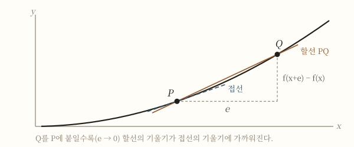
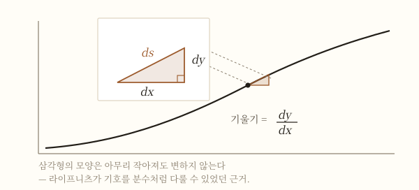

# 미분법

> 접선을 긋는 기하 문제와 순간속도를 구하는 물리 문제가 **같은 계산**이라는 것을 알아채기까지 반세기가 걸렸다. 그리고 그 계산이 **왜 옳은지** 설명하기까지는 다시 150년이 더 걸렸다. 미분법의 역사는 "답을 먼저 얻고 이유를 나중에 찾은" 드문 사례다.

## TL;DR

- 미분은 한 사람이 발명한 것이 아니라, **접선 문제**와 **운동 문제**라는 서로 다른 두 갈래가 17세기에 하나로 합쳐지면서 생겼다 [1][7].
- **페르마**는 1636년경 미소량 $e$를 더했다가 마지막에 $e=0$으로 두는 절차로 극대·극소와 접선을 처리했다. 극한 개념 없이 극한의 답을 얻었다 [5][6].
- **배로**는 미분과 적분이 역연산임을 기하학으로 증명해 놓고도, 그것을 계산 도구로 만들지 못했다 [8].
- **뉴턴**은 양이 흐른다고 보아 유율(fluxion)을, **라이프니츠**는 무한소의 대수로 보아 $dy/dx$를 만들었다. 살아남은 표기는 라이프니츠의 것이다 [9][10].
- 무한소의 논리적 결함은 **버클리**가 정확히 지적했고 [12], **코시**가 극한을 출발점으로 삼아 1821년에 봉합했다 [13]. 지금 교과서의 정의가 그것이다.

## 1. 17세기가 붙들고 있던 두 문제

17세기 중반 유럽의 수학자들은 겉으로는 무관해 보이는 두 문제를 각각 붙들고 있었다.

하나는 **기하 문제**였다. 곡선 위의 한 점에서 접선을 어떻게 긋는가. 원이라면 쉽다. 반지름에 수직인 직선을 그으면 된다. 그러나 [[해석기하]]가 등장하면서 다루어야 할 곡선이 갑자기 늘어났고, 유클리드적 정의 — "곡선과 한 점에서만 만나는 직선" — 은 일반 곡선에서 곧바로 무너졌다. 삼차곡선의 접선은 곡선을 다시 가로지를 수 있기 때문이다 [1].

다른 하나는 **물리 문제**였다. 갈릴레오 이후 낙하와 포물선 운동을 수로 다루기 시작하면서, 시시각각 변하는 물체의 **순간속도**를 정의해야 했다. 평균속도는 거리를 시간으로 나누면 되지만, "지금 이 순간의 속도"는 나눌 시간 간격이 0이라 정의부터 막혔다 [4].

두 문제가 같은 계산이라는 사실이 분명해지는 데 반세기가 걸린다.

## 2. 페르마 — 극한 없이 극한의 답을 얻다

[[페르마]]는 1636년 무렵 『극대와 극소를 찾는 방법』을 회람시켰다 [5]. 절차는 이렇다. 변수에 미소량 $e$를 더한 뒤, 원래 값과 새 값을 **거의 같다**고 놓고(adaequalitas — 그가 디오판토스에게서 빌려온 말이다 [6]), 정리한 다음, 마지막에 $e$를 0으로 만든다.

$f(x)=x^2$에 적용하면 이렇게 된다.

$$(x+e)^2 - x^2 = 2xe + e^2 \;\longrightarrow\; \frac{2xe+e^2}{e} = 2x+e \;\longrightarrow\; 2x$$

결과는 오늘날의 도함수와 정확히 같다. 그런데 절차를 다시 보면 이상한 데가 있다. **$e$로 나눌 때는 $e \ne 0$이어야 하고, 마지막에 버릴 때는 $e = 0$이어야 한다.** 같은 기호가 한 줄 안에서 두 가지로 취급된다.

페르마 자신은 [[무한소]]가 무엇인지 정의하지 않았다. 정의하지 않고도 답이 맞았기 때문이다. 이 미해결 상태가 이후 150년을 간다.

뉴턴은 훗날 자신의 초기 미적분 아이디어가 "페르마가 접선을 긋는 방식"에서 곧바로 왔다고 적었다 [5].

## 3. 접선과 순간속도가 같은 계산인 이유

두 문제가 하나로 보이려면 관점 하나가 필요했다. **거리–시간 그래프를 그리면, 순간속도는 그 그래프의 접선의 기울기다.**

| | 기하 문제 | 운동 문제 |
|---|---|---|
| 묻는 것 | 곡선 위 한 점의 접선 | 한 시각의 순간속도 |
| 다루는 양 | $x$의 증분과 $y$의 증분 | 시간의 증분과 거리의 증분 |
| 계산 | $\dfrac{f(x+e)-f(x)}{e}$에서 $e \to 0$ | 평균속도에서 시간 간격 $\to 0$ |
| 걸림돌 | 0으로 나눌 수 없다 | 0으로 나눌 수 없다 |

두 열이 사실상 같은 표라는 것이 17세기의 발견이다 [1][4]. 서로 다른 분야의 두 난제가 하나의 계산으로 환원되는 순간, 그 계산에 이름을 붙일 이유가 생긴다.

## 4. 배로 — 답을 손에 쥐고도 알아보지 못하다

뉴턴의 케임브리지 스승 **아이작 배로**는 『기하학 강의』(1670) 제10강 명제 11에서, 접선을 구하는 일과 넓이를 구하는 일이 **서로 역연산**이라는 사실을 기하학의 언어로 증명했다 [8]. 오늘날 [[미적분학의 기본정리]]라 부르는 것이다.

그런데도 배로를 미적분의 창시자로 부르지 않는다. 이유는 분명하다. 그는 그것을 **곡선에 관한 여러 정리 가운데 하나**로 다루었을 뿐, 아무 함수에나 기계적으로 적용할 수 있는 **계산 절차**로 승격시키지 않았다 [7][8].

수학사에서 반복되는 패턴이다. 정리를 아는 것과, 그 정리를 도구로 만드는 것은 다른 일이다.

## 5. 뉴턴의 유율 — 세상은 흐른다

뉴턴은 1665~66년 흑사병으로 케임브리지가 닫힌 동안 고향에서 이 계산에 도달했다 [7]. 그의 그림은 페르마와 달랐다.

뉴턴에게 양은 **시간에 따라 흐르는 것**이었다. 흐르는 양을 유량(fluent), 흐르는 속도를 **유율(fluxion)** 이라 부르고, 유율을 $\dot{x}$처럼 점을 찍어 나타냈다 [9]. 미분을 운동학과 묶은 이 관점이 훗날 『프린키피아』의 물리학을 떠받친다.

문제는 출판이었다. 『유율법』은 1671년에 집필됐으나 뉴턴 사후인 **1736년**에야 출판됐다 [9]. 그 사이에 라이프니츠가 독자적으로 도달해 먼저 발표했고, 이것이 [[우선권 논쟁]]으로 이어진다.

## 6. 라이프니츠의 d — 좋은 기호가 절반이다

라이프니츠는 1675년 10월 29일 원고에서 적분 기호 $\int$를 처음 썼고, 곧이어 미분에 $d$를 붙였다 [10]. 1684년 학술지 『Acta Eruditorum』에 실린 「Nova Methodus」가 미분법의 최초 출판이다 [11].

그의 그림은 **특성삼각형**이었다. 곡선 위 한 점에서 잘라낸 아주 작은 직각삼각형의 세 변을 $dx$, $dy$, $ds$로 두는 것이다.

핵심은 **이 삼각형의 모양이 아무리 작아져도 변하지 않는다**는 점이다. 그래서 $dy/dx$를 진짜 분수처럼 다룰 수 있었고, 미분이 기하학적 통찰이 아니라 **규칙을 따르는 대수 계산**이 되었다 [4][10].

## 7. 두 표기의 운명

| | 뉴턴 (유율법) | 라이프니츠 (미분법) |
|---|---|---|
| 표기 | $\dot{x}$, $\ddot{x}$ | $\dfrac{dy}{dx}$, $\dfrac{d^2y}{dx^2}$ |
| 발상 | 시간에 따라 흐르는 양 | 무한히 작은 증분의 비 |
| 발견 시점 | 1665~66년 (먼저) | 1675년경 |
| 출판 시점 | 1736년 (사후) | 1684년 (먼저) |
| 강점 | 물리적 직관, 운동과 직결 | 무엇에 대한 미분인지 표기에 드러남 |
| 오늘날 | 물리학의 시간 미분에 잔존 | 사실상 표준 |

라이프니츠 표기가 이긴 이유는 **연쇄법칙에서 드러난다.**

$$\frac{dy}{dx} = \frac{dy}{du}\cdot\frac{du}{dx}$$

약분처럼 보이고, 실제로 그렇게 다뤄도 맞는다. 반면 점 표기는 무엇에 대한 미분인지를 기호에 담지 못한다 [10]. 영국 수학계는 애국심으로 뉴턴 표기를 고수했고, 그 대가로 100년 넘게 대륙 해석학에 뒤처졌다 [7].

**기호는 사고를 절약한다.** 미분법의 역사가 남긴 가장 실용적인 교훈이다.

## 8. 버클리의 반격 — "사라진 양의 유령"

1734년 철학자 조지 버클리가 『해석학자』에서 미적분을 정면으로 공격했다. 그의 표적은 결과가 아니라 **절차의 논리**였다. 증분으로 나눌 때는 0이 아니라고 해놓고 마지막에는 0이라고 버리는 것이 어떻게 정당한가. 버클리는 이 사라지는 증분을 **"떠나간 양의 유령"** 이라 불렀다 [12].

수학적으로 그는 옳았다. 미적분은 100년 넘게 **답은 맞지만 이유를 대지 못하는 계산**이었다. 물리학에서 너무 잘 작동했기 때문에 아무도 멈추지 않았을 뿐이다.

## 9. 코시 — 150년 만의 봉합

1821년 코시는 에콜 폴리테크니크 강의록 『해석학 강의』를 출판하면서 순서를 뒤집었다 [13]. **무한소로 극한을 설명하는 대신, 극한을 먼저 정의하고 그 위에 나머지를 올렸다.**

> 같은 변수에 잇따라 부여되는 값들이 어떤 고정된 값에 한없이 가까워져, 결국 원하는 만큼 작게 차이나게 될 때, 그 고정된 값을 다른 값들의 극한이라 부른다. [13]

도함수는 이제 "무한히 작은 양의 비"가 아니라 **차분몫의 극한**으로 정의된다.

$$f'(x) = \lim_{h \to 0} \frac{f(x+h)-f(x)}{h}$$

$h$는 어느 단계에서도 0이 되지 않는다. 0으로 **가까워질** 뿐이다. 버클리의 비판이 겨눈 지점이 정확히 이렇게 제거된다. 이후 바이어슈트라스가 극한 자체를 부등식으로 재서술하면서(엡실론–델타) 마지막 모호함까지 걷힌다.

## 10. 지금 교실에서 쓰는 정의는 누구의 것인가

고등학교 교과서에서 도함수를 정의할 때 쓰는 식은 **코시의 것**이다 [3]. 그 식을 적을 때 쓰는 기호 $dy/dx$는 **라이프니츠의 것**이다 [10]. 그 계산을 물체의 속도에 연결짓는 관점은 **뉴턴의 것**이고 [9], 접선의 기울기로 읽는 관점은 **페르마까지** 거슬러 올라간다 [5].

한 줄짜리 정의 안에 네 사람의 200년이 겹쳐 있는 셈이다.

미분이 실제로 무엇을 할 수 있는지는 갈래마다 갈린다 — 변화율로 쓴 식을 풀어 시간 전체의 궤적을 얻는 일은 [[미분방정식]]이, 최적화와 근사는 [[미분법 확장편]]이 다룬다 [14]. 발견 과정의 인물 서사는 [[미적분의 발견]]에, 무한소의 결함과 19세기 엄밀화의 상세는 [[미적분의 엄밀화]]에 있다. 미분을 도구로 쓰는 첫 정리는 [[평균값 정리]]이고, 계산 연습이 가장 잘 되는 대상은 [[다항함수]]다.

## 11. 같은 문제, 두 방식으로 풀어보기

$f(x)=x^3-3x$의 극값을 구하는 문제를 페르마의 절차와 오늘날의 정의로 나란히 놓아 본다. 두 계산이 **문자 하나까지 같은 식을 거친다**는 것이 핵심이다.

**페르마 방식 (1636년경)**

극값에서는 $f(x+e)$와 $f(x)$가 "거의 같다"고 놓는다.

$$(x+e)^3 - 3(x+e) \;\approx\; x^3 - 3x$$

전개하고 양변에서 $x^3-3x$를 지우면

$$3x^2e + 3xe^2 + e^3 - 3e \;\approx\; 0$$

$e$로 나눈다 — 이 단계에서 $e \ne 0$이어야 한다.

$$3x^2 + 3xe + e^2 - 3 \;\approx\; 0$$

이제 $e$를 버린다 — 이 단계에서 $e = 0$이다.

$$3x^2 - 3 = 0 \;\Rightarrow\; x = \pm 1$$

**오늘날 방식 (코시 이후)**

$$f'(x)=\lim_{h\to 0}\frac{(x+h)^3-3(x+h)-(x^3-3x)}{h}=\lim_{h\to 0}\,(3x^2+3xh+h^2-3)=3x^2-3$$

$$f'(x)=0 \;\Rightarrow\; x=\pm 1$$

거쳐 가는 식이 같다. 다른 것은 **마지막 한 걸음**뿐이다. 페르마는 $e$를 *버렸고*, 코시는 $h$를 *0으로 보냈다*. 버리는 것은 논리적 근거가 없고, 보내는 것은 극한의 정의가 뒷받침한다. 미분법의 200년은 사실상 이 한 걸음을 정당화하는 데 쓰였다 [2][13].

## 12. 흔한 오해 셋

**"미분은 뉴턴이 발명했다."**
발명이라기보다 통합이다. 접선을 구하는 기법은 페르마·데카르트·배로가 이미 갖고 있었고, 넓이를 구하는 기법은 카발리에리와 월리스가 쌓아 두었다. 뉴턴과 라이프니츠가 한 일은 흩어진 기법들을 **아무 함수에나 적용되는 하나의 절차**로 묶은 것이다 [7]. 그리고 두 사람은 서로 다른 것을 만들었다 — 한 사람은 운동을, 다른 한 사람은 기호를 봤다.

**"$dy/dx$는 분수다."**
라이프니츠 본인은 분수로 다뤘고, 특성삼각형이 그 근거였다. 그러나 코시 이후의 정의에서 $dy/dx$는 **하나의 기호**이지 두 수의 몫이 아니다 [3]. 연쇄법칙에서 약분처럼 보이는 것은 우연이 아니라 정리가 보장하는 결과이지, 분수여서 그런 것이 아니다. 이 구분이 무너지면 다변수로 넘어갈 때 곧바로 틀린 계산이 나온다.

**"연속이면 미분가능하다."**
미분가능하면 연속이지만 역은 성립하지 않는다. $y=|x|$가 원점에서 그렇고, 바이어슈트라스는 1872년에 **모든 점에서 연속이면서 어느 점에서도 미분불가능한 함수**를 제시해 직관을 결정적으로 깨뜨렸다 [12]. 19세기 엄밀화가 필요했던 이유가 바로 이런 반례들이다.

## 13. 수업에서 쓸 만한 대목

역사를 알면 **학생이 걸려 넘어지는 지점이 왜 어려운지**가 설명된다. 세 대목이 특히 그렇다.

**"$h \to 0$인데 왜 $h$로 나눠도 되나요."**
이 질문은 학생이 헷갈리는 것이 아니라, **버클리가 1734년에 던진 것과 같은 질문**이다 [12]. 300년 전 최고의 지성이 물었고 100년 동안 답이 없었다고 말해주면, 질문이 창피한 것이 아니라 날카로운 것이 된다. 답은 "$h$는 0이 되지 않는다, 0으로 가까워질 뿐이고 나눗셈은 언제나 0 아닌 $h$에서 일어난다"이다.

**접선을 "한 점에서 만나는 직선"으로 기억하는 학생.**
중학교에서 원의 접선을 그렇게 배웠으니 자연스러운 오해다. 실제로 17세기 수학자들이 똑같은 정의에 막혔고, 삼차곡선에서 접선이 곡선을 다시 가로지르는 예가 그 정의를 깨뜨렸다 [1]. 반례를 하나 그려 보이면 정의를 바꿔야 하는 이유가 스스로 드러난다.

**기호를 왜 이렇게 쓰는지 묻는 학생.**
$dy/dx$는 라이프니츠가 특성삼각형에서 온 것이고, 물리에서 만나는 $\dot{x}$는 뉴턴에게서 온 것이다 [9][10]. 두 표기가 같은 것을 가리킨다는 사실을 한 번 짚어두면, 물리 시간에 처음 점 표기를 만났을 때 겪는 혼란이 줄어든다.

미분이 실제 문제에서 어떻게 쓰이는지의 사례는 [[미분방정식]] 쪽이 더 풍부하다 [14].

## 한눈 요약

| 시기 | 인물 | 무엇이 바뀌었나 | 남은 문제 |
|---|---|---|---|
| 1636년경 | 페르마 | 미소량 $e$로 극대·극소와 접선을 함께 처리 | $e$가 무엇인지 정의되지 않음 |
| 1670년 | 배로 | 미분과 적분이 역연산임을 기하로 증명 | 계산 도구로 승격 못 함 |
| 1665~66년 | 뉴턴 | 유율 — 흐르는 양의 속도, 운동학과 결합 | 출판이 70년 늦음 |
| 1675~84년 | 라이프니츠 | $dy/dx$ 표기, 미분을 대수 계산으로 | 무한소의 논리적 근거 없음 |
| 1734년 | 버클리 | 무한소의 결함을 정확히 지적 | 대안 없음 |
| 1821년 | 코시 | 극한을 먼저 정의하고 도함수를 그 위에 올림 | (엡실론–델타로 마무리) |

## 더 읽을 것

- 짝문서 — **미분법 (확장편)**: 무한소 해석학, 미분가능성과 연속성의 관계, 비표준해석학의 재해석
- [[미적분의 발견]] — 배로·뉴턴·라이프니츠 세 사람의 서사
- [[미적분의 엄밀화]] — 19세기 해석학의 재건
- [[개념_적분법]] — 반대편 절반
