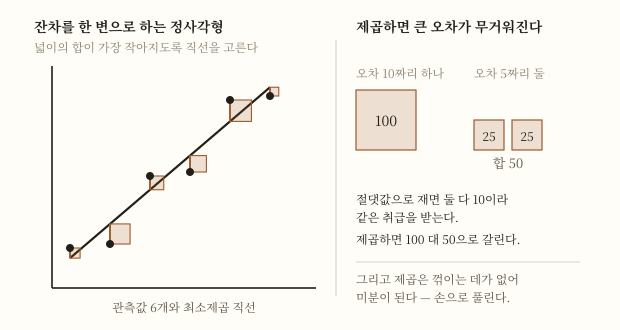
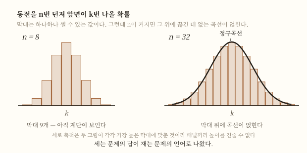

# 확률론 확장편

> [[확률론]] 이해편은 확률을 **세어서 나눈 것**으로 정의했다. 그 정의에는 구멍이 있었다.
>
> 이 문서는 그 구멍을 280년 가까이 메우려다 결국 **정의하기를 포기한** 이야기다.

## TL;DR

- 고전적 정의는 **동등가능성**과 **유한성**을 전제한다[1][2]. 둘 다 없는 대상이 훨씬 많다.
- "동등하게 일어남직하다"를 확률로 풀면 **순환**이다. 대칭으로 풀면 대칭 없는 대상에 못 쓴다.
- 빈도로 정의하면 순환은 피하지만 **몇 번 해야 충분한지** 말할 수 없다[3].
- 큰 수의 법칙은 이 둘을 잇지만 **정의가 아니라 정리**다[9]. 확률이 이미 정의돼 있어야 진술된다.
- 확률은 정의가 미결인 채로 **쓰이면서 자랐다** — 생명연금(1693)[14], 관측 오차(1805·1809)[12], 이항분포의 정규 근사(1738·1812)[13].
- **역확률** — 결과를 보고 원인을 거슬러 묻는 문제. 베이즈의 유고가 1763년에 낭독됐다[10][7].
- **정작 베이즈 자신은 오늘날 베이즈주의라 불리는 해석을 받아들이지 않았을 수 있다.** 그것을 개척하고 퍼뜨린 것은 라플라스다[10].
- 1933년 **콜모고로프**가 방향을 바꿨다 — 확률이 무엇인지 묻기를 그만두고 **무엇을 만족해야 하는지**를 적었다[11].

## 1. 이해편이 남긴 물음

이해편 §2에서 이렇게 적었다 — 고전적 정의의 "동등하게 일어남직하다"를 "확률이 같다"로 풀면 정의가 자기 자신을 딛고 선다고.

그 자리에서 답을 미뤘다. 여기서 갚는다.

물음은 셋으로 갈라진다.

1. **동등가능성을 무엇으로 판정하는가.** 대칭이 없는 대상에서는?
2. **무한한 표본공간에서는 어떻게 하는가.** 유한성 조건[2]이 걸린다.
3. **확률은 세상의 성질인가, 우리 지식의 상태인가.**

셋 다 18~19세기 내내 미결이었다. 그런데도 확률은 그 기간에 **가장 빠르게 쓰임을 넓혔다.**

## 2. 순환을 피해 빈도로 가면

가장 자연스러운 탈출구는 **빈도**다. 여러 번 해 보고 그 비율을 확률이라 부르면, 동등가능성을 미리 가정하지 않아도 된다.

교과서도 이 길을 인정한다. 모든 결과가 같은 가능성을 갖는다는 전제는 **대부분의 자연현상·사회현상에서 성립하지 않으므로**, 그런 경우 통계적 확률을 쓴다[3].

그런데 이 정의에도 구멍이 있다.

| 물음 | 고전적 정의 | 빈도 정의 |
|---|---|---|
| 근거 | 동등가능·유한[1][2] | 관측된 비율[3] |
| 순환 | **있다** — 동등을 확률로 푼다 | 없다 |
| 한계 | 대칭 없는 대상에 못 쓴다 | **몇 번이면 충분한가를 말 못 한다** |
| 한 번뿐인 사건 | 대칭이 있으면 가능 | **불가능** — 반복이 없다 |

마지막 행이 결정적이다. "내일 비가 올 확률 30%"에서 내일은 **한 번뿐**이다. 같은 내일을 백 번 반복할 수 없으니 빈도로는 뜻이 서지 않는다.

**두 정의는 서로의 사각지대를 덮지 못한다.** 한쪽이 순환이면 다른 쪽은 적용 범위가 없다.

## 3. 큰 수의 법칙은 다리이지 바닥이 아니다

이해편 §6에서 큰 수의 법칙을 "두 정의를 잇는 다리"라 불렀다. 정확히 하자.

이해편 §6이 인용한 진술을 그대로 다시 읽어 보자 — **시행을 늘릴수록 관측 결과가 이론적 확률에 다가간다**[9]. 교과서가 동전던지기의 횟수와 앞면 비율로 설명하는 것[4]도 같은 진술의 초등적 형태다.

이 책이 수학적 확률의 창립 저작으로 평가되는 것도[9], 이 진술이 확률을 **정의**했기 때문이 아니다. 실제로 베르누이는 확률을 경험적 의미로 정의한 **빈도주의 학파와 갈린다**[9] — 그는 관측으로 확률을 정의한 것이 아니라, 관측이 이미 정의된 확률에 다가간다는 것을 보였다.

여기서 주목할 것은 진술의 **모양**이다.

> 관측된 비율 → **이론적 확률**

화살표의 도착지에 이미 "이론적 확률"이 있다. **즉 이 정리는 확률이 무엇인지 이미 정해져 있어야 진술된다.** 정의를 대신할 수 없다.

**큰 수의 법칙은 두 정의를 잇는 다리이지, 어느 한쪽의 바닥이 아니다.** 다리는 양쪽에 땅이 있을 때만 놓인다.

## 4. 정의가 미결인 채로 쓰임이 넓어졌다

여기가 확률론의 특이한 점이다. 기초가 흔들리는 동안 응용은 폭발했다. [[18세기]] 노트가 확률을 "도박장에서 나와 국가와 시장으로 들어갔다"고 적은 그 이행이다.

세 갈래를 따라간다 — **사람이 몇 살까지 사는가**, **관측이 매번 다를 때 무엇을 믿을 것인가**, **결과를 보고 원인을 물을 수 있는가.**

## 5. 사람이 몇 살까지 사는가 — 1693

1693년 **[[에드먼드 핼리]]**가 생명연금에 관한 논문을 냈다. 카스파어 노이만이 제공한 **브레슬라우**의 통계로 사망 연령을 분석한 것이다[14].

이 논문이 한 일은 구체적이다. **영국 정부가 구매자의 나이에 따라 적정한 값으로 생명연금을 팔 수 있게 됐다**[14].

무엇이 새로운가.

- 나이별 사망률 표가 생기자 **"이 사람에게 앞으로 몇 년치를 지급하게 될 것인가"**를 기댓값으로 계산할 수 있게 됐다.
- 즉 이해편 §4의 기댓값이 **도박판을 떠나 국가 재정으로 들어갔다.**

핼리의 작업은 존 그랜트의 더 이른 작업을 이어받은 것이며, 계리학의 발전에 큰 영향을 주었고 **인구학사의 주요 사건**으로 평가된다[14].

### 왜 나이를 모르면 값을 매길 수 없나

생명연금은 **구매자가 죽을 때까지 매년 지급하는 계약**이다. 그러니 판매자가 치를 총액은 그 사람이 앞으로 몇 년을 더 사느냐에 달려 있고, 그것은 미리 알 수 없다.

알 수 없는 것에 값을 매기는 방법이 기댓값이다. 나이별 사망률 표가 있으면 **각 나이에서 앞으로 살 햇수의 기댓값**을 구할 수 있고, 거기에 연간 지급액을 곱하면 그 계약의 값이 나온다.

나이를 무시하고 한 가격으로 판다면 어떻게 되는지는 오늘날의 용어로 따져 볼 수 있다. 값이 평균 수명에 맞춰지므로 **오래 살 사람에게는 싸고 곧 죽을 사람에게는 비싸다.** 그러면 젊고 건강한 사람이 몰려 사고 늙고 병든 사람은 사지 않아, 판매자가 구조적으로 손해를 본다 — 오늘날 역선택이라 부르는 것이다.

[14]가 말하는 것은 핼리의 논문 덕에 **나이에 따른 적정가가 가능해졌다**는 데까지이고, 그 이전의 판매 관행이 실제로 어땠는지는 이 자료가 말하지 않는다. 위 문단은 자료가 말한 것이 아니라 **기댓값으로부터 따라 나오는 해설**이다.

**주목할 것은 이 계산이 확률의 정의를 필요로 하지 않았다는 점이다.** 표에 적힌 비율을 그대로 썼을 뿐이다. §2의 빈도 정의가 안고 있는 문제 — 몇 번이면 충분한가 — 는 묻지 않았고, 묻지 않아도 연금은 팔렸다.

## 6. 관측이 매번 다를 때 — 1805·1809

두 번째 갈래는 천문학에서 온다. 같은 별을 여러 번 재면 값이 매번 조금씩 다르다. **어느 값을 믿을 것인가.**

**최소제곱법**이 답이었다. 관측값과 이론값의 차이를 제곱해 더한 것이 가장 작아지도록 미지수를 정한다.

$$\min \sum_{i} \left(y_i - f(x_i)\right)^2$$

**왜 하필 제곱인가.** 세 가지가 한꺼번에 해결되기 때문이다.

- **부호가 사라진다.** 그냥 더하면 양의 오차와 음의 오차가 상쇄돼 "오차 없음"으로 보인다.
- **큰 오차에 더 무거운 벌점이 붙는다.** 절댓값을 쓰면 오차 10짜리 하나와 오차 5짜리 둘이 같은 취급을 받는데, 제곱하면 100 대 50으로 갈린다. 크게 어긋난 관측을 그냥 두지 않겠다는 선택이다.
- **미분이 된다.** 절댓값은 꺾이는 점에서 미분되지 않지만 제곱은 매끄럽다. 최솟값을 미분해서 찾을 수 있고, 그래서 **손으로 풀리는 연립방정식**이 나온다.

<figure>

<figcaption>이름 그대로다 — <strong>잔차를 한 변으로 하는 정사각형</strong>을 그리면, 최소제곱법은 그 넓이의 합이 가장 작아지는 직선을 고르는 일이다. 오른쪽이 두 번째 이유를 보여 준다 — 절댓값으로는 같은 10인데 제곱하면 100 대 50으로 갈린다.</figcaption>
</figure>

세 번째가 실무에서 컸다. 다만 **절댓값을 쓰는 길이 없었던 것은 아니다.** 관측을 결합하는 다른 방법으로 **최소절대편차법**이 있었고, 보스코비치가 1757년 지구의 모양을 연구하며, 라플라스가 1789년과 1799년에 같은 문제에 실제로 썼다[12].

그러니 제곱이 이긴 이유는 유일한 선택지여서가 아니다. **미분이 되어 손으로 풀리는 연립방정식으로 떨어진다**는 점이 손계산 시대에 결정적이었다.

이 방법을 처음으로 **명확하고 간결하게 서술한 것은 [[아드리앵마리 르장드르]]**이며, 1805년 『혜성 궤도 결정을 위한 새로운 방법』(Nouvelles méthodes pour la détermination des orbites des comètes)에서다[12].

그런데 **[[카를 프리드리히 가우스]]**가 1809년에 같은 방법을 공개하면서 **1795년부터 이 방법을 갖고 있었다**고 주장했고, 자연히 르장드르와 우선권 다툼이 벌어졌다[12].

| | 르장드르 | 가우스 |
|---|---|---|
| 공개 | **1805** — 첫 명확한 서술[12] | 1809[12] |
| 주장 | — | 1795년부터 보유[12] |
| 더 나아간 것 | — | **확률론·정규분포와 연결**[12] |

우선권과 별개로, 가우스가 한 걸음 더 간 것은 사실이다. **그는 이 방법을 확률론과 정규분포에 연결했다**[12]. 최소제곱이 왜 좋은 방법인지를 오차의 확률분포로 설명한 것이고, 이로써 **오차가 계산의 방해물이 아니라 계산의 대상**이 된다.

### 세레스 — 방법이 증명된 사건

1801년 1월 1일 주세페 피아치가 소행성 **세레스**를 발견했다. 천문학자들은 40일간 추적하다 놓쳤다[12].

다시 찾으려면 관측 40일치로 궤도를 추정해야 했다. 관측은 적고 오차는 있었다. **가우스의 최소제곱 분석이 세레스의 위치를 예측했고, 다른 방법들이 실패한 자리에서 성공했다**[12].

**우연을 다루는 계산이 하늘에서 물체를 찾아냈다.** 확률이 도박의 기술이 아니라는 것을 이보다 잘 보여준 사건이 드물다.

### 얼마나 빨리 퍼졌나

르장드르가 발표한 지 **10년 안에** 최소제곱법은 프랑스·이탈리아·프로이센에서 천문학과 측지학의 표준 도구가 됐다. 과학적 기법의 수용 속도로는 이례적인 것이었다[12].

이론적 뒷받침은 그 사이에 붙었다. **1810년, 라플라스는 가우스의 작업을 읽은 뒤 중심극한정리를 증명하고 그것으로 최소제곱법과 정규분포를 대표본에서 정당화했다**[12]. 다음 절이 다룰 곡선이 여기서 이 절과 이어진다.

## 7. 왜 하필 정규분포인가 — 1738·1812

§6에서 가우스가 연결한 그 "정규분포"는 어디서 왔는가.

**[[아브라암 드무아브르]]**의 『우연의 교리』 2판(1738)에 실린 결과가 시작이다 — **일정 조건에서 정규분포로 이항분포를 근사할 수 있다**[13].

이것이 왜 놀라운가. 이항분포는 동전던지기처럼 **띄엄띄엄한** 것을 센다. 그런데 그 근사로 나온 것은 **연속적인 곡선**이다. 세는 문제의 답이 재는 곡선으로 나온다.

<figure>

<figcaption>왼쪽은 동전을 8번, 오른쪽은 32번 던졌을 때 앞면이 <em>k</em>번 나올 확률이다. 막대는 하나하나 셀 수 있는 값인데, <strong>n이 커지면 그 위에 끊긴 데 없는 곡선이 얹힌다.</strong></figcaption>
</figure>

**라플라스가 1812년 『확률의 해석적 이론』에서 더 일반적인 결과를 발표했다**[13]. 특수한 근사가 일반 원리로 올라선 것이고, 오늘날 이 결과는 **중심극한정리의 특수경우**로 정리된다[13].

이 셋이 한 줄로 이어진다.

| 시기 | 무엇 | 의미 |
|---|---|---|
| 1738 | 드무아브르 — 이항분포의 정규 근사[13] | 띄엄띄엄한 것이 연속 곡선으로 |
| 1809 | 가우스 — 오차를 정규분포로[12] | 관측 오차가 계산 대상이 됨 |
| 1812 | 라플라스 — 일반화[13] | 근사가 원리로 |

**서로 다른 데서 온 세 갈래가 같은 곡선에서 만났다.** 정규분포가 통계의 중심에 놓인 것은 누가 정해서가 아니라 여러 길이 거기로 모였기 때문이다.

## 8. 역확률 — 결과에서 원인으로

세 번째 갈래가 가장 멀리 간다.

이해편 §8의 조건부확률은 **원인에서 결과로** 간다 — $A$ 가 일어났을 때 $B$ 가 일어날 확률[8]. 그런데 실제로 알고 싶은 것은 반대인 경우가 많다.

> 검사 결과가 양성이다. **그렇다면 실제로 병일 확률은?**

관측된 결과에서 보이지 않는 원인을 거슬러 묻는 것 — 이것을 **역확률**이라 한다. 베이즈 정리는 본래 이 역확률 문제를 풀기 위한 것이었다[7].

$$P(A|B) = \frac{P(B|A)\,P(A)}{P(B)}$$

이 식이 하는 일은 **구하기 쉬운 쪽으로 방향을 뒤집는 것**이다[6]. $P(B|A)$ 는 대개 알기 쉽고(병일 때 양성이 나올 확률, 곧 검사의 성능), $P(A|B)$ 는 알고 싶지만 직접 재기 어렵다.

**[[토마스 베이즈]]**는 18세기 영국의 목사이자 철학자였다[7]. 그의 글 「우연의 교리에 관한 한 문제를 풀기 위한 시론」은 그가 **1761년에 죽은 뒤 1763년 왕립학회에서 낭독됐다**[10].

이 글이 세상에 나온 것은 **리처드 프라이스** 덕이다. 그가 낭독과 이듬해 『철학회보』 게재를 주선했다[10].

### 뒤집으면 답이 뒤집힌다 — 숫자로

역확률이 왜 따로 다뤄져야 하는지는 숫자를 넣어 보면 즉시 드러난다.

어떤 병의 유병률이 **1%** 이고, 검사가 이렇다고 하자.

- 병이 있으면 **99%** 확률로 양성 (민감도)
- 병이 없으면 **5%** 확률로 양성 (오탐)

양성 판정을 받았다. 실제로 병일 확률은 얼마인가.

대개 "99% 정확한 검사이니 99% 근처"라고 답한다. 계산하면 다르다.

| 1만 명 기준 | 인원 | 양성 | 계산 |
|---|---|---|---|
| 병이 있는 사람 | 100 | **99** | $100 \times 0.99$ |
| 병이 없는 사람 | 9,900 | **495** | $9{,}900 \times 0.05$ |
| 양성 전체 | — | **594** | 99 + 495 |

$$P(\text{병} \mid \text{양성}) = \frac{99}{594} \approx 0.167$$

**약 17%다.** 양성 판정을 받은 594명 중 실제 환자는 99명뿐이다.

이유는 표의 두 번째 행에 있다. **병이 없는 사람이 압도적으로 많아서, 그들 중 5%만 잘못 걸려도 진짜 환자 수를 넘어선다.** 검사의 성능이 나빠서가 아니라 **바탕 비율**이 낮아서 생기는 일이다.

$P(\text{양성}|\text{병})$ 과 $P(\text{병}|\text{양성})$ 을 혼동하면 이 차이를 놓친다. 두 값은 0.99와 0.17로, **같은 검사에 대한 서로 다른 물음의 답**이다. 베이즈 정리는 앞의 값에서 뒤의 값으로 건너가는 다리이고[6], 건너갈 때 **$P(\text{병}) = 0.01$ 이라는 사전 정보가 반드시 들어간다.**

여기서 §13의 논쟁이 예고된다 — **그 사전 정보를 어디서 가져올 것인가.**

## 9. 베이즈는 베이즈주의자였는가

여기에 짚어야 할 대목이 있다.

오늘날 "베이즈주의"라 불리는 것은 확률을 **믿음의 정도**로 보고, 새 증거가 들어올 때마다 그 믿음을 갱신하는 입장이다. 그런데 **베이즈 자신은 이 넓은 해석을 받아들이지 않았을 수 있다**[10].

그것을 개척하고 대중화한 사람은 **라플라스**다[10].

이름이 붙은 사람과 그 이름이 뜻하게 된 입장이 어긋나는 셈이다. 수학사에서 드물지 않은 일이지만, 여기서는 그 어긋남이 **§10의 논쟁과 직접 맞물린다** — 확률을 믿음으로 볼 것인가 빈도로 볼 것인가라는 물음 자체가, 베이즈가 아니라 라플라스에게서 온 것이기 때문이다.

## 10. 확률은 세상의 성질인가, 우리 지식의 상태인가

라플라스가 확률을 다룬 방식은 [[피에르시몽 라플라스]] 노트가 서술한다. 여기서는 그것이 **정의 문제에 무엇을 했는지**만 본다.

그가 확률을 대한 방식은 한 문장으로 요약된다 — **확률을 지식의 결함을 메우는 도구로 삼았다**[15]. 세상 자체가 어떻게 되어 있든, 확률은 우리가 다 알지 못하는 자리에서 쓰인다는 것이다.

이 태도가 가장 분명하게 드러난 곳이 1814년 『확률에 관한 철학적 시론』이다. 그는 이 책에서 **확률에 기초한 귀납적 추론의 체계**를 세웠고, 오늘날 우리는 그것을 **베이즈적인 것**으로 알아본다[15].

§9에서 본 어긋남이 여기서 맞물린다. 베이즈의 이름이 붙은 입장을 실제로 세운 사람이 라플라스라는 것[10]과, 그가 확률을 지식의 결함으로 본 것[15]은 같은 이야기의 앞뒤다.

이 관점은 §2의 두 정의 어느 쪽도 아니다.

| 입장 | 확률이 재는 것 | 한 번뿐인 사건 |
|---|---|---|
| 고전적 | 대칭적 경우의 비율[1][2] | 대칭이 있으면 가능 |
| 빈도 | 반복에서의 비율[3] | **불가능** |
| 인식론적(라플라스) | **우리 지식의 결함**[15] | 가능 |

세 번째 입장은 §2의 마지막 행 — 한 번뿐인 사건 — 을 해결한다. 내일 비가 올 확률은 내일이 반복돼서가 아니라 **내가 모르기 때문에** 뜻이 있다.

그는 수를 매기는 규칙을 내놓기도 했다. **이유 불충분의 원리**다 — 우리가 아는 것이 "동시에 일어날 수 없는 결과가 모두 $n$ 개"라는 것뿐일 때, 각 결과에 $1/n$ 을 주는 것이 최선이라는 주장이다[2].

**그러나 이것은 정의가 아니라 해석이다.** 이 규칙은 결과를 **어떻게 쪼개느냐**에 따라 답이 달라진다. 같은 상황도 결과를 셋으로 나누면 각 $1/3$ 이고 넷으로 나누면 각 $1/4$ 이니, "아는 것이 없다"는 상태 자체가 분할에 의존한다. 두 사람이 같은 정보를 갖고도 다른 수를 댈 수 있고, 그때 누가 옳은지를 이 원리는 말해 주지 않는다.

**세 입장이 나란히 선 채로 19세기가 끝난다.**

## 11. 먼저, 무엇을 대상으로 삼을 것인가

공리로 넘어가기 전에 한 단계가 더 있다. **확률을 무엇에 매길 것인가.**

이해편은 "가능한 결과"라고만 했다. 그런데 어떤 사건이 일어날 확률을 정의하려면 **먼저 일어날 수 있는 사건이 전부 어떤 것인지 정확히 정의해야** 한다. 그래서 일어날 수 있는 모든 단순사건을 모아 **집합으로 표시**하는 데서 출발한다[5].

이 전환이 조용하지만 결정적이다.

| | 전환 전 | 전환 후 |
|---|---|---|
| 확률의 대상 | "일어날 일" — 말로 서술된 것 | **집합**[5] |
| 사건의 결합 | "또는", "그리고" | 합집합, 교집합 |
| 여사건 | "일어나지 않는다" | 여집합 |

**사건을 집합으로 놓는 순간, 확률은 집합에 수를 대응시키는 함수가 된다.** 그러면 물을 것이 달라진다 — "확률이 무엇인가"가 아니라 "이 함수가 어떤 성질을 가져야 하는가"가 된다.

§2의 세 입장이 다투던 자리에서 물음 자체가 옮겨간 것이다. 그리고 이 옮겨간 물음에 답한 것이 다음 절이다.

## 12. 콜모고로프 — 묻기를 그만두다

1933년 **[[안드레이 콜모고로프]]**가 방향을 바꿨다. 같은 시기 다른 분야에서 일어난 일들은 [[20세기]]에 있다.

그가 한 일은 확률이 무엇인지 **정의하지 않은 것**이다. 대신 확률이 **만족해야 할 성질**을 적었다[11].

1. 사건의 확률은 **음이 아닌 실수**다 — $P(E) \ge 0$[11].
2. 표본공간 전체의 확률은 **1**이다 — $P(\Omega) = 1$[11].
3. 서로 배타적인 사건들의 가산 열에 대해 **$P(\bigcup E_i) = \sum P(E_i)$** 가 성립한다[11].

이 셋을 만족하는 것은 무엇이든 확률이다. 동등가능성으로 얻었든, 빈도로 얻었든, 믿음의 정도로 매겼든 상관없다.

**이것이 왜 해결인가.** 세 입장이 다투던 것은 "확률의 정체"였는데, 수학이 필요로 한 것은 정체가 아니라 **계산 규칙**이었기 때문이다. 공리는 규칙만 고정하고 정체는 해석에 넘긴다.

이 공리들은 순수수학과 물리과학에 확률을 적용하기 위한 기본 가정을 제시하면서 **논리적 역설을 피하기 위한 것**이라고 정리된다[11].

세 번째 공리가 §2의 **유한성 조건**[2]도 함께 푼다. 가산 가법성을 요구함으로써 무한한 표본공간이 정당하게 다뤄진다. 이해편이 "유한개일 때만"이라고 적어 둔 제약이 여기서 풀린다.

## 13. 공리화가 남긴 것

공리화는 **수학의 문제를 해결하고 철학의 문제를 남겼다.**

- **해결된 것** — 확률을 계산하는 규칙, 무한 표본공간, 극한 정리들의 엄밀한 진술. 확률론이 측도론 위의 수학 분야가 된다.
- **남은 것** — 어떤 수를 확률로 삼을 것인가. 공리는 규칙을 검사할 뿐 값을 주지 않는다.

그래서 빈도주의와 베이즈주의의 논쟁은 **공리화 이후에도 계속된다.** 다만 논쟁의 성격이 바뀌었다 — 수학의 문제가 아니라 **통계적 추론의 방법론** 문제가 됐다.

두 입장이 실제로 갈리는 자리는 §8의 마지막 물음이다.

| | 빈도주의 | 베이즈주의 |
|---|---|---|
| 확률이 뜻하는 것 | **경험적 의미** — 관측된 빈도[9] | **인식적 확신의 정도** — 믿음·가설의 강도[10] |
| 반복이 필요한가 | 필요하다[9] | **필요 없다**[10] |
| 받는 비판 | 한 번뿐인 사건에 약하다 | **주관적 정의**라는 평가[10] |
| 공리를 무엇으로 정당화하나 | 빈도 | **콕스 정리·더치북 논변**[11] |

§8의 검사 예제에서 유병률 1%는 어디서 왔는가. 대규모 역학조사가 있었다면 그것은 빈도이고, 없다면 누군가의 추정이다. **같은 계산이 앞의 경우에는 객관적이고 뒤의 경우에는 주관적이 된다.** 정리는 그대로인데 지위가 달라진다.

이것이 공리화가 손대지 않은 자리다. 콜모고로프의 세 공리[11]는 $P(\text{병}) = 0.01$ 이 어디서 왔는지 묻지 않는다. **규칙만 검사하고 값은 통과시킨다.**

**§9에서 본 어긋남이 여기서 매듭지어진다.** 베이즈의 이름이 붙은 것은 정리이고, 그 정리는 세 입장 어디서든 참이다. 논쟁의 대상은 정리가 아니라 **사전확률을 어떻게 정할 것인가**, 즉 값을 어디서 가져오느냐다.

## 14. 오늘날

- **역확률은 기계학습의 기본 문법이 됐다.** 나이브 베이즈 분류기·베이지안 네트워크·베이지안 신경망으로 패턴 인식·의료·기상 등에 쓰인다[7]. 데이터를 보고 모형을 거슬러 추정하는 일이 §8의 구조 그대로다.
- **정규분포의 중심성**은 중심극한정리로 설명된다[13]. 왜 그렇게 많은 것이 종 모양인가에 대한 답이다.
- **오차를 계산 대상으로 삼는 태도**(§6)는 오늘날 모든 실험과학의 표준이다.
- **한 번뿐인 사건의 확률**(§2·§10)은 여전히 논쟁적이다. 기후·팬데믹·선거 예측이 그 자리에 있다.

이 문서를 한 문장으로 줄이면 이렇게 된다. **확률론은 정의를 완성해서 학문이 된 것이 아니라, 정의를 미결로 둔 채 쓰이면서 학문이 됐다.** 연금이 팔리고 소행성이 발견되고 오차가 계산되는 동안 "확률이 무엇인가"는 답을 얻지 못했고, 280년 가까이 지나 나온 답은 그 물음에 대한 답이 아니라 **물음을 바꾸는 것**이었다.

[[무한급수 확장편]]이 다룬 18세기 해석학과 구조가 같다. 그쪽은 자격 없이 계산해 옳은 답을 얻었고 19세기가 자격을 정의했다. 이쪽은 정의 없이 응용해 쓸모를 얻었고 20세기가 공리를 놓았다. **둘 다 근거가 쓰임을 뒤따라왔다.**

## 한눈 요약

| 시기 | 인물 | 무엇이 바뀌었나 |
|---|---|---|
| 1693 | 핼리 | 브레슬라우 통계로 사망 연령 분석 — 나이에 따른 연금 가격[14] |
| 1713 | 야코프 베르누이 | 큰 수의 법칙 — 다리를 놓았으나 바닥은 아니었다[9] |
| 1738 | 드무아브르 | 이항분포를 정규분포로 근사[13] |
| **1763·1764** | **베이즈·프라이스** | **역확률 — 유고가 낭독되고 이듬해 게재되다**[10] |
| 1801 | (세레스) | 피아치가 발견하고 40일 만에 놓친 소행성 — 뒤에 최소제곱이 찾아낸다[12] |
| 1805 | 르장드르 | 최소제곱법의 첫 명확한 서술[12] |
| 1809 | 가우스 | 공개와 우선권 다툼 — 정규분포와 연결해 한 걸음 더, 세레스를 찾아내다[12] |
| 1810 | 라플라스 | 중심극한정리로 최소제곱과 정규분포를 대표본에서 정당화[12] |
| 1812 | 라플라스 | 드무아브르의 결과를 일반화[13]. 베이즈적 해석을 개척·대중화[10] |
| **1933** | **콜모고로프** | **정의하기를 그만두고 공리를 적다 — 역설을 피하다**[11] |

## 더 읽을 것

- [[확률론]] — 이해편. 확률이 무엇을 재는가
- [[피에르시몽 라플라스]] — 확률을 지식의 이론으로 바꾼 사람
- [[파스칼–페르마 서신]] — 이 모든 것이 시작된 1654년 여름
- [[18세기]] — 확률이 도박장을 떠난 세기
- [[무한급수 확장편]] — 같은 세기가 낸 다른 빚과 그 청산
