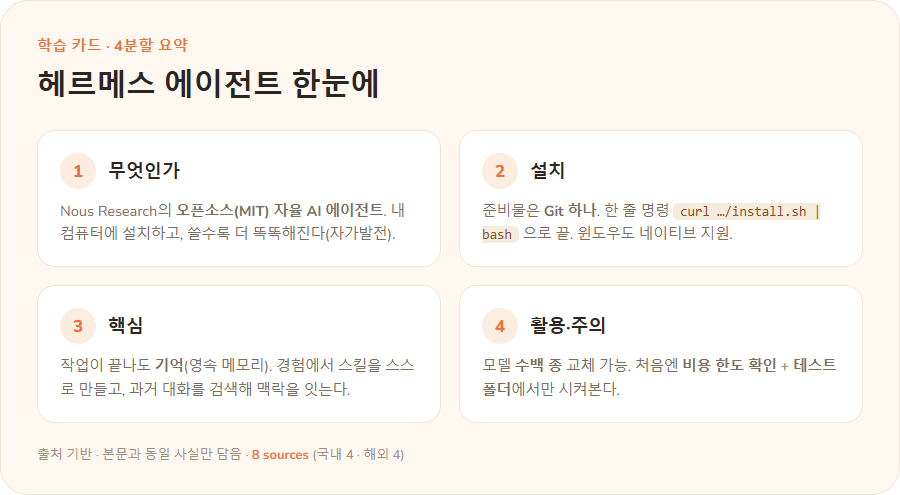

# 헤르메스 에이전트(Hermes Agent) — 심층 리서치

## TL;DR
- **헤르메스 에이전트**는 Nous Research가 만든 **오픈소스(MIT) 자율 AI 에이전트**(현재 v0.17.0). 내 인프라에 설치돼 학습한 것을 세션 간 기억하고, **오래 쓸수록 더 유능해지는 자가발전 루프**가 핵심이다 [1][3].
- 차별점 네 가지: **(1) 영속 메모리, (2) 경험에서 스킬 자동 생성, (3) 모델 무관(수백 종 교체), (4) 터미널·메신저(슬랙 등) 다중 진입점** [1][3].
- 흔한 혼동: **"헤르메스 에이전트"(하네스/실행체)** ≠ **"Hermes 3"(Llama 3.1 파인튜닝 LLM)**. 에이전트는 어떤 모델이든 얹어 쓴다 [3][9].
- 2026년, **하네스(harness) 최적화**가 동일 모델의 성능을 가른다는 인식 속에 헤르메스가 경쟁작 **오픈클로**를 트래픽·기여자에서 추월했고, 한 비교에서는 메모리·게이트웨이 안정성·토큰비용에서 우위가 보고됐다 [4][13].
- 설치는 OS별 한 줄, 과거 WSL2 권장이던 윈도우도 **네이티브 지원이 추가**됐다 [2][6]. 단, 일부 2차 자료의 "최소 64K 컨텍스트" 주장은 공식 문서에서 확인되지 않는다 [3][14].

## 핵심 포인트
1. **정체성**: "The Agent That Grows With You" — 상태(메모리·스킬)를 누적하는 지속형 실행체 [1][5].
2. **자가발전 루프**: 복잡한 작업 후 스킬을 자동 생성→사용 중 개선→저장하도록 스스로 nudge, 과거 대화 검색 [3].
3. **메모리 설계**: 한 분석에 따르면 **SQLite 기반 내장 메모리**로 아키텍처 단계부터 설계에 녹아 있다 [13].
4. **모델 무관 + 다중 백엔드**: 수백 종 LLM, local/Docker/SSH/Singularity/Modal/Daytona 실행, 내장 크론, 서브에이전트 병렬 [1][3].
5. **주권적(sovereign) AI**: 중앙집중형 한계 극복, 내 하드웨어에서 보안 걱정 없이 운용 [8].

## 학습 카드
> 본문을 초보자용으로 압축한 4분할 학습 카드입니다. (카드모드: auto — HTML 카드를 렌더링한 이미지, retail 스타일. 모든 내용은 본문·출처 범위 내)



## 본문

### 1. 무엇인가, 그리고 무엇이 아닌가
헤르메스 에이전트는 Nous Research가 공개한 오픈소스 자율 AI 에이전트로, MIT 라이선스, 현재 v0.17.0이다 [1]. GitHub 저장소는 "경험에서 스킬을 만들고, 사용 중 개선하며, 지식을 저장하도록 스스로를 자극하고, 과거 대화를 검색하며, 세션을 거치며 사용자에 대한 모델을 점점 깊게 만든다"고 설명한다 [3].

**중요한 구분**: 이름이 비슷한 **Hermes 3** 는 Nous Research의 *언어 모델*(Llama 3.1 기반 8B/70B/405B 파인튜닝, 함수 호출·JSON 출력에 강함)로, 에이전트(하네스)와는 별개다 [9]. 헤르메스 *에이전트* 는 특정 모델에 묶이지 않고 어떤 LLM이든 얹어 쓴다 [3]. 초보자가 가장 흔히 혼동하는 지점이다.

### 2. 아키텍처 심층
- **메모리**: "프로젝트를 학습하고, 스킬을 자동 생성하며, 문제를 해결한 방법을 잊지 않는다" [1]. 메모리는 주기적 nudge로 큐레이션된다 [3]. 한 국내 분석은 그 저장소를 **SQLite 기반 내장 메모리**로 설명하며 "아키텍처 단계부터 설계에 녹아 있다"고 평가했다 [13].
- **스킬 수명주기**: 복잡한 작업을 마치면 자율적으로 스킬을 생성하고, 이후 작업에서 재사용·개선한다 [3].
- **서브에이전트**: 각자 대화·터미널·Python RPC 스크립트를 가진 격리된 하위 에이전트로 병렬 워크스트림을 돌린다 [1][3].
- **실행 백엔드**: 로컬·Docker·SSH·Singularity·Modal·Daytona 등 다중 백엔드 + 컨테이너 하드닝으로 "노트북 밖"에서도 돈다 [1][3].
- **자동화·도구**: 내장 크론 스케줄러로 예약 자동화 [3]. 기본 도구로 웹 검색·브라우저 자동화·비전·이미지 생성·TTS·파일/터미널/코드 분석을 내장 [1].
- **TUI**: 멀티라인 편집, 슬래시 명령 자동완성, 대화 기록, interrupt-and-redirect, 스트리밍 출력 [3].

### 3. 설치와 시스템 요구사항
공식 문서 기준 OS별 설치 [2]:

```bash
# Linux / macOS / WSL2 / Android(Termux)
curl -fsSL https://hermes-agent.nousresearch.com/install.sh | bash

# Windows (네이티브 PowerShell)
iex (irm https://hermes-agent.nousresearch.com/install.ps1)

# macOS / Windows: Hermes Desktop 설치 파일을 받아 실행하는 방법도 권장됨
```

- **사전 준비물**: 모든 플랫폼에서 **Git**. 리눅스는 추가로 `curl`·`xz-utils`, 데스크톱 앱은 `g++`/`build-essential` [2]. 설치 프로그램이 Python 3.11·Node.js v22·ripgrep·ffmpeg를 자동 설치하고 저장소 클론·가상환경·전역 `hermes` 명령까지 구성한다 [2].
- **권장 사양(로컬 모델 구동 시, 한 가이드 기준)** [14]:

| 항목 | 최소 | 권장 |
|---|---|---|
| RAM | 8GB | 16GB |
| VRAM(GPU 모드) | 6GB (Q4_K_M) | 12GB+ |
| 저장공간 | 10GB | 20GB |
| Python | 3.11 | 3.12 |
| Ollama | 0.5.0+ | 0.5.4 |

> **출처 충돌 메모(무환각)**: ① 일부 한국어 가이드는 "윈도우 네이티브 미지원 → WSL2 권장"이라 적지만 [5], 이는 초기 상태이며 이후 **네이티브 윈도우 지원이 추가**되었다(엔비디아 협업·DGX 스파크 맥락, 2026-06) [6]. ② 설치 명령도 공식 도메인(`install.sh`)과 GitHub raw 스크립트 두 경로가 관찰된다 [2][8]. ③ "최소 64,000 토큰 컨텍스트 필요"는 일부 2차 요약에만 등장하며 공식 GitHub README·요구사항 가이드에서 확인되지 않는다 [3][14]. 설치 전 공식 문서의 최신 명령을 우선 확인할 것.

### 4. 첫 실행 워크스루 (초보자)
```bash
source ~/.bashrc            # 또는 ~/.zshrc — 전역 hermes 명령 활성화
hermes model               # 사용할 LLM 공급자 설정
hermes setup --portal      # (대안) Nous 포털 빠른 설정: 모델+기본 도구 한 번에
hermes --tui               # 모던 TUI로 시작 (권장). 'hermes'는 클래식 CLI
```
- **첫 태스크는 "구체적이고 검증하기 쉬운" 프롬프트로** 시작하라고 문서가 권한다. 예: `"이 저장소를 5줄로 요약하고 메인 진입점이 뭔지 알려줘."`, `"현재 디렉터리를 확인하고 메인 프로젝트 파일로 보이는 걸 알려줘."` [12]
- **슬래시 명령**: `/` 입력 시 `/help`, `/tools`, `/model`, `/save`, `/skills` 등 자동완성 [12][13].
- **멀티라인 입력**: `Alt+Enter` / `Ctrl+J` / `Shift+Enter` [12].
- **세션 이어가기**: `hermes --continue` [12].
- **도구 on/off**: `hermes tools` / 문제 진단: `hermes doctor` [2].

### 5. Slack 게이트웨이 연결 (실전)
헤르메스를 Slack에 붙이면 슬랙 메시지로 작업을 시키고 결과를 슬랙에서 받는다 [13]:
```bash
hermes gateway setup
```
설정 마법사에서 **Slack Bot Token, App Token, 허용 사용자 ID 목록**을 입력하면 연결된다 [13]. (동일 게이트웨이로 Telegram·Discord·WhatsApp·Signal·Email도 지원 [1][3].)

### 6. 모델 선택과 비용 고려
모델 무관 설계로 Nous Portal(300+)·OpenRouter(200+)·NVIDIA NIM·Kimi/Moonshot·z.ai/GLM·OpenAI·자체 엔드포인트를 붙일 수 있다 [1][3]. Hermes 3를 함수호출 에이전트로 쓸 땐 `apply_chat_template(tools=tools, add_generation_prompt=True)` 두 플래그가 모두 있어야 구조화된 함수 호출이 작동한다 [14].

> **검증 한정**: "최소 64K 컨텍스트" 요구는 미확정(§3 메모 참조). 멀티스텝 도구 호출에는 넉넉한 컨텍스트가 유리하다는 정도로만 이해할 것 [3][14].

### 7. 오픈클로(OpenClaw) vs 헤르메스 — 비교
"하네스"는 "AI가 도구를 활용하고 행동을 수행하도록 연결하는 소프트웨어 계층"으로, 동일 모델이라도 하네스 설계·최적화에 따라 에이전트 성능이 크게 달라진다 [4]. 한 비교 분석(risemoment, Imran 인용)은 다음을 제시한다 [13]:

| 항목 | 오픈클로(OpenClaw) | 헤르메스(Hermes) |
|---|---|---|
| 메모리 | 없음(반복 지시 필요) | SQLite 기반 내장 메모리 |
| 게이트웨이 안정성 | "한 시간마다 재시작" | 1주일 이상 무중단(주장) |
| 토큰 비용(5일) | 약 $130 | 약 $10 (≈90% 절감, 주장) |
| 성격 | 자율성 강조 | 통제성 강조 |

> 위 수치는 **단일 2차 자료의 주장**이므로 절대값으로 받아들이지 말 것. 다만 방향성(헤르메스=메모리·통제성·비용효율)은 국내 상용화 논의와도 일치한다 — 국내 '타임리'는 "오픈클로의 자율성과 헤르메스의 통제성을 결합한 클라우드 SaaS"로 소개됐다 [10].

### 8. 생태계와 채택 동향 (2026)
- **오픈클로 추월**: 5월 OpenRouter 글로벌 트래픽 1위에 이어, 최근 30일 신규 GitHub 기여자 수에서도 추월(디 인포메이션 6/18 보도 인용) [4].
- **하드웨어/플랫폼**: 엔비디아가 로컬 AI 가속 흐름에서 헤르메스의 네이티브 윈도우 지원을 추가하고 DGX 스파크에서 빠른 실행 환경을 제시 [6].
- **국내 상용화**: 업스테이지 컴퍼니/타임리 맥락에서 헤르메스의 통제성을 결합한 SaaS 시도가 보도됨 [10].

### 9. 비용·보안
- **비용**: 자율 에이전트는 검색·요약·재설명을 반복하고 수십~수백 하위 에이전트를 연쇄 호출하면 토큰 비용이 급증할 수 있다 [11]. 헤르메스는 메모리로 반복 지시를 줄여 비용을 낮춘다는 주장이 있다 [13]. 통제 방법: 작업 범위 명확화, 사용량 한도 확인, 샌드박스 [7].
- **보안**: 다중 실행 백엔드의 컨테이너 하드닝 [1], 그리고 로컬/주권적 실행으로 데이터를 내 환경에 두는 이점 [8]. 단, 터미널·파일·웹 도구를 가진 자율 에이전트인 만큼 권한 범위 통제가 필수다.

### 10. 한계·주의와 초보자 안전수칙
- 빠른 버전 변화(v0.17.0, 2026-06-19 릴리스): 설치 명령·지원 플랫폼·요구사항이 시점에 따라 달라질 수 있다 [1][3].
- 안전수칙(국내 가이드 공통) [7]: ① 지시는 구체적으로(범위·결과물) ② 모델 비용·한도 먼저 확인 ③ 처음엔 테스트 폴더에서만 ④ 자동 생성된 스킬 주기적 점검.

### 11. 재검증 시점
버전 변화가 잦으므로 이 보고서는 **분기별 또는 메이저 릴리스 시 재검증**을 권장한다(특히 §3 설치 명령·요구사항, §7 비교 수치).

## 출처(인용 링크)
- [1] Hermes Agent 공식 사이트 (MIT·v0.17.0·기능·게이트웨이·백엔드) — https://hermes-agent.nousresearch.com/ (해외)
- [2] Hermes Agent 공식 문서 · 설치 — https://hermes-agent.nousresearch.com/docs/getting-started/installation (해외)
- [3] GitHub · NousResearch/hermes-agent (자가발전 루프·모델목록·플랫폼·v0.17.0) — https://github.com/nousresearch/hermes-agent (해외)
- [4] AI타임스 「헤르메스, 신규 기여자 수에서 오픈클로 역전…'하네스' 최적화의 승리」 — https://www.aitimes.com/news/articleView.html?idxno=211931 (국내)
- [5] tilnote 「Hermes Agent란 설치 사용법 핵심 기능 정리」 — https://tilnote.io/pages/69dc5925df448d30aa398a63 (국내)
- [6] 이데일리 「엔비디아, 디퓨전젬마 가속화…헤르메스 에이전트 기본 윈도우 지원 추가」 — https://n.news.naver.com/mnews/article/018/0006303971 (국내)
- [7] elancer 「Hermes Agent 사용법, 설치부터 활용 노하우까지」 — https://www.elancer.co.kr/blog/detail/1086 (국내)
- [8] Daddy Makers 「헤르메스 에이전트 개발배경, 설치 및 사용방법」 — http://daddynkidsmakers.blogspot.com/2026/05/blog-post.html (국내)
- [9] Hermes 3 Technical Report, Nous Research (arXiv:2408.11857) — 모델 vs 에이전트 구분 — https://arxiv.org/pdf/2408.11857 (해외)
- [10] byline.network 「'AI 모델·에이전트·포털' 종합 AI 회사 '업스테이지 컴퍼니' 출범」 — https://byline.network/?p=9004111222607643 (국내)
- [11] 우먼경제 「샘 올트먼 '0.1나노초'로 가는데…」(에이전트 토큰 비용 지적) — https://www.womaneconomy.co.kr/news/articleView.html?idxno=254775 (국내)
- [12] Hermes Agent 공식 문서 · 퀵스타트(첫 실행·슬래시 명령) — https://hermes-agent.nousresearch.com/docs/getting-started/quickstart (해외)
- [13] risemoment 「에르메스 에이전트 뜻·실전 사용법·Slack 연결」(Slack 단계·오픈클로 비교) — https://blog.risemoment.ai/hermes-agent-installation-guide-openclaw-alternative/ (국내)
- [14] Markaicode 「Run Hermes Agent Locally / Requirements」(사양·64K 미명시 확인) — https://markaicode.com/hermes-agent-requirements/ (해외)

## 후속 질문·연결
- 헤르메스의 **자가발전 스킬**은 실제로 얼마나 재사용·이식되나? 독립 검증 사례는?
- 오픈클로 비교 수치($130→$10 등)는 단일 자료 주장 — **동일 모델·동일 작업으로 재현 벤치마크**가 있나?
- 토큰 비용 통제: 서브에이전트 연쇄 호출을 제한하는 설정/패턴은?
- 자율 에이전트 권한 범위(터미널·파일·웹)를 안전하게 가두는 모범 사례는?
- 연결: [[AI 에이전트]] · [[오픈소스 LLM]] · [[로컬 AI]] · [[Hermes 3]] · [[오픈클로(OpenClaw)]] · [[하네스 최적화]]
